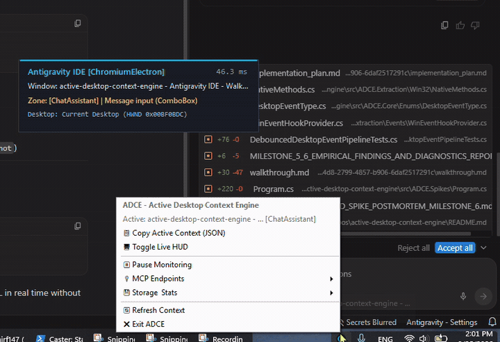
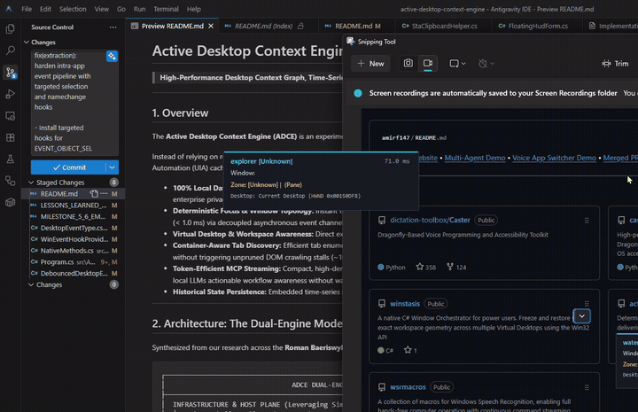
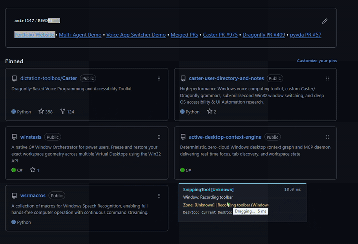

<!-- SPDX-License-Identifier: Apache-2.0 -->
<!-- Copyright (c) 2026 Amir Farhadi -->

# Active Desktop Context Engine (ADCE)

> **High-Performance Desktop Context Graph, Time-Series Persistence & MCP Provider for Local AI Agents and Voice Interfaces**

---

## 1. Overview

The **Active Desktop Context Engine (ADCE)** is a privacy-first Windows background daemon and [Model Context Protocol (MCP)](https://modelcontextprotocol.io/) server.

Instead of relying on resource-heavy screenshot OCR, periodic screen polling, or cloud telemetry, ADCE integrates directly with native Win32 `WinEvent` hooks and UI Automation (UIA) caching to maintain a live, structured model of the user's active desktop environment with minimal resource overhead.

### Key Capabilities:
* **100% Local Data Sovereignty:** Complete on-device execution. Active window titles, document contents, and application states never leave localhost—ensuring enterprise privacy and zero telemetry leakage.
* **Deterministic Focus & Window Topology:** Event-driven tracking of foreground application envelopes, process metadata, window hierarchies, and focused UI controls via decoupled asynchronous channels.
* **Virtual Desktop & Workspace Awareness:** Extraction of active Virtual Desktop GUIDs, friendly names, and desktop indices via native COM interop.
* **Container-Aware Tab Discovery:** Targeted tab enumeration across modern browsers (Waterfox, Firefox, Chrome, Edge) and code editors (VS Code, Antigravity) without triggering unpruned DOM crawling stalls.
* **Automated Credential & Privacy Sanitization:** Built-in security firewall (`ContextPrivacySanitizer`) that detects `IsPassword` controls to redact passwords (`[REDACTED_PASSWORD]`), masks sensitive file buffers (`.env`, `.pem`, `.kdbx`, `id_rsa`), and strips OAuth tokens/query strings from browser address bars before context envelopes leave the extraction plane.
* **Token-Efficient MCP Streaming:** Compact, high-density JSON context snapshots over local MCP endpoints (`get_desktop_context`, `desktop://current`), giving local LLMs actionable workflow awareness without wasting tokens on raw screen dumps.
* **Historical State Persistence:** Embedded time-series storage (SQLite WAL) tracking focus transitions and tab history for temporal agent reasoning.

---

## 2. Core Philosophy & Architectural Vision

ADCE was designed to bridge low-level Windows accessibility infrastructure with high-level agentic AI and voice interfaces:

1. **Unopinionated Accessibility Primitives (Core Vision):** Rather than imposing rigid application-specific workflows, ADCE aims to surface clean, structured desktop primitives (window identity, container tabs, active editor buffers, workspace IDs, focused control types). Downstream speech recognition engines (Caster, Dragonfly, Talon) and local AI agent loops can consume these primitives to drive window switching, contextual grammar activation, or dynamic tool execution.
2. **Dual-Consumer Architecture:** A single high-performance engine serves both real-time **local accessibility and voice tools** (via direct .NET / IPC bindings) and **local AI coding assistants** (via Model Context Protocol JSON-RPC endpoints).
3. **Non-Invasive Execution:** 100% out-of-process execution using official Windows accessibility (`FlaUI.UIA3`), Win32 hooks (`SetWinEventHook`), and Virtual Desktop COM interfaces, requiring zero DLL injection or kernel drivers.
4. **Targeted Zonal Anchoring:** By scoping extractions to target class names and container bounding boxes, ADCE avoids the classic pitfalls of blind recursive DOM walking across modern Chromium and Gecko applications.

> 🚀 **Verified Downstream Use Case:**
> ADCE has been empirically integrated into [Caster](https://github.com/dictation-toolbox/Caster) via [caster-user-directory-and-notes](https://github.com/amirf147/caster-user-directory-and-notes), powering **dynamic sub-window voice grammar activation** (e.g. automatically activating CLI/Git commands only when focused in VS Code / Antigravity IDE integrated terminals without audio stutter). See the full [First Real-World Use Case Guide](docs/guides/FIRST_REAL_WORLD_USE_CASE_CASTER_DYNAMIC_TERMINAL_GRAMMARS.md).

---


## 3. Live Telemetry & DevTools HUD Demos

| System Tray & Non-Activating Live HUD | Antigravity IDE (Monaco Editor & Zones) |
| :---: | :---: |
|  |  |

| Waterfox Browser (Gecko Tabs & Links) | SQLite Time-Series Transition Timeline |
| :---: | :---: |
|  | <pre>============================================================<br/>#   &#124; TIME (UTC)   &#124; PROCESS        &#124; SEMANTIC ZONE<br/>------------------------------------------------------------<br/>323 &#124; 13:34:19.604 &#124; Antigravity ID &#124; [ChatAssistant]<br/>324 &#124; 13:36:26.553 &#124; Antigravity ID &#124; [EditorCodeBuffer]<br/>329 &#124; 13:36:31.583 &#124; waterfox       &#124; [DocumentContent]<br/>336 &#124; 13:36:38.140 &#124; Antigravity ID &#124; [GitCommitBox]<br/>============================================================</pre> |

---

## 4. Architecture: Production Layered Model

ADCE is structured as a high-performance, unidirectional 4-tier pipeline designed for minimal resource overhead and zero cross-apartment COM deadlocks:

```
┌────────────────────────────────────────────────────────────────────────────────────────┐
│                              ADCE PRODUCTION ARCHITECTURE                              │
├────────────────────────────────────────────────────────────────────────────────────────┤
│  1. OS EVENT HOOK PLANE (Win32 Low-Level Event Hooks)                                  │
│  ├── SetWinEventHook listeners (EVENT_SYSTEM_FOREGROUND, EVENT_OBJECT_FOCUS)           │
│  └── Dedicated STA Message Pump Thread with Barrier Synchronization                     │
├────────────────────────────────────────────────────────────────────────────────────────┤
│  2. CONCURRENCY & EXTRACTION PLANE (FlaUI.UIA3 + Win32 Gating)                         │
│  ├── Win32 Shallow Filter (< 0.5 ms): Fast HWND, process & WS/WS_EX bitmask pre-gating │
│  ├── Async Channel Debouncer: 50ms trailing-edge window with 250ms burst delay clamp   │
│  ├── Monotonic Epoch Guard: Supersedes stale in-flight extractions                     │
│  ├── Scoped CacheRequest Batching: Single-roundtrip FlaUI.UIA3 COM queries (< 15 ms)   │
│  ├── Ancestor Chain Climber: Resolves leaf controls to typed DesktopSemanticZones      │
│  └── Privacy Sanitizer: Redacts passwords, secret files, and address bar tokens        │
├────────────────────────────────────────────────────────────────────────────────────────┤
│  3. PERSISTENCE & STORAGE PLANE (Dual-Tier In-Memory + SQLite WAL)                     │
│  ├── L1 In-Memory Atomic Cache: Lock-free instant query reads (< 15 ns)                │
│  └── L2 Time-Series WAL Store: Channel-decoupled asynchronous SQLite persistence       │
├────────────────────────────────────────────────────────────────────────────────────────┤
│  4. HOST DAEMON & CONSUMER INTERFACES (Tray Daemon & Model Context Protocol)           │
│  ├── System Tray Background Daemon: PerMonitorV2 DPI aware with dynamic status icon    │
│  ├── Non-Activating Live DevTools HUD: Floating diagnostic overlay (WS_EX_NOACTIVATE)  │
│  └── Model Context Protocol (MCP) Server: Universal JSON-RPC 2.0 (Stdio & HTTP/SSE)    │
└────────────────────────────────────────────────────────────────────────────────────────┘
```

---

## 5. Documentation Hub & Public Research Ledger

ADCE functions as both a production codebase and an evolving research ledger tracking low-level COM experiments, UI Automation benchmarks, and systems architecture.

> 📚 **Central Documentation Entrypoint:** Explore the full documentation suite in **[`docs/CONTEXT.md`](docs/CONTEXT.md)**.

### 🏛️ Architecture & System Specifications
| Document | Description |
| :--- | :--- |
| 🏗️ [Architecture & Modular Implementation Plan](docs/architecture/ARCHITECTURE_AND_MODULAR_IMPLEMENTATION_PLAN.md) | 5-project solution architecture, decoupled work packages, and phased execution milestones. |
| 📋 [Requirements & Dynamic Discovery Specification](docs/architecture/REQUIREMENTS_AND_DYNAMIC_DISCOVERY_SPEC.md) | 5 Desktop Framework Archetypes, dynamic heuristic discovery pipeline, and performance targets. |
| 🔌 [Model Context Protocol (MCP) Schema Spec](docs/architecture/MCP_SCHEMA_SPEC.md) | JSON schema specifications, decoupled envelope definitions, and MCP tool endpoints. |
| 📑 [UI Automation Structures Reference (SSOT)](docs/architecture/UI_AUTOMATION_STRUCTURES_REFERENCE.md) | Definitive structural map of UIA node hierarchies and target zones across major applications. |
| 📚 [Application Layout Hierarchies Catalog](docs/app_hierarchies/README.md) | Modular per-application empirical profiles, container anatomies, and visual telemetry evidence. |
| 🌐 [Waterfox Browser Profile (01)](docs/app_hierarchies/01_waterfox.md) | Verified Ground-Truth: Gecko chrome dissection, viewport boundary isolation, and 9-stop matrix. |
| ⚔️ [Gate 2 Hostile Architecture & Systems Review](docs/architecture/HOSTILE_ARCHITECTURE_REVIEW.md) | Adversarial systems review evaluating COM apartment deadlocks, GC churn, and UIPI boundaries. |

### 🧠 Subsystem Deep Dives
| Project / Subsystem | Deep Dive Reference | Focus Area |
| :--- | :--- | :--- |
| `ADCE.Core` | [ADCE.Core Deep-Dive](docs/deep_dives/ADCE_CORE_DEEP_DIVE.md) | Domain models, immutable state envelopes, sequence equality mechanics. |
| `ADCE.Extraction` | [ADCE.Extraction Deep-Dive](docs/deep_dives/ADCE_EXTRACTION_DEEP_DIVE.md) | Win32 shallow gating, UIPI filtering, single-roundtrip batch caching. |
| `ADCE.EventPipeline` | [ADCE Event Pipeline Deep-Dive](docs/deep_dives/ADCE_EVENT_PIPELINE_DEEP_DIVE.md) | Dedicated STA message pump, WinEvent hooks, trailing-edge debouncing. |
| `ADCE.Storage` | [ADCE.Storage Deep-Dive](docs/deep_dives/ADCE_STORAGE_DEEP_DIVE.md) | Dual-tier storage, L1 in-memory cache, channel-decoupled SQLite WAL store. |
| `ADCE.Mcp` | [ADCE.Mcp Deep-Dive](docs/deep_dives/ADCE_MCP_DEEP_DIVE.md) | JSON-RPC 2.0 protocol handlers, Stdio & SSE/HTTP transport layers. |
| `ADCE.Daemon` | [ADCE.Daemon Deep-Dive](docs/deep_dives/ADCE_DAEMON_DEEP_DIVE.md) | System tray hosting, non-activating DevTools HUD overlay, lifecycle management. |

### 📘 Educational Guides & Visual Walkthroughs
| Guide | Description |
| :--- | :--- |
| 📘 [Educational Refresher & Architecture Guide](docs/guides/EDUCATIONAL_GUIDE_AND_ARCHITECTURE_REFRESHER.md) | Plain-English walkthrough of UI Automation, Win32 systems programming, and FlaUI caching. |
| 🚀 [First Real-World Use Case: Caster Dynamic Terminal Grammars](docs/guides/FIRST_REAL_WORLD_USE_CASE_CASTER_DYNAMIC_TERMINAL_GRAMMARS.md) | Verified downstream integration: Dynamic sub-window grammar activation in VS Code / Antigravity IDE via low-latency SSE streaming. |
| 👁️ [ADCE Focus & Zone Detection Explained](docs/guides/ADCE_FOCUS_AND_ZONE_DETECTION_EXPLAINED.md) | Visual guide to Windows focus mechanics, parent-chain climbing, and semantic zone detection. |
| 🧪 [Educational Guide: Test Harness & Verification](docs/guides/EDUCATIONAL_GUIDE_TEST_HARNESS_AND_CLAIM_VERIFICATION.md) | Deep dive into stimulus-response testing, claim verification, and empirical measurement. |

### 🔬 Testing, Postmortems & Research Ledgers
| Category | Resources |
| :--- | :--- |
| **Testing & Roadmap** | • [Empirical Test Harness Spec](docs/testing/EMPIRICAL_TEST_HARNESS_AND_CLAIM_VERIFICATION_SPEC.md)<br/>• [Reviewer Observations & Hardening Roadmap](docs/testing/REVIEWER_OBSERVATIONS_AND_HARDENING_ROADMAP.md) |
| **Engineering Postmortems** | • [Master Postmortems & Retrospectives Index](docs/postmortems/README.md)<br/>• [Hardware Acceleration & UIA Immunity](docs/postmortems/LESSONS_LEARNED_HARDWARE_ACCELERATED_SCREENSHOTS_AND_UIA.md)<br/>• [Milestone 2 Postmortem (Extraction & Sessions)](docs/postmortems/LESSONS_LEARNED_AND_SPIKE_POSTMORTEM_MILESTONE_2.md)<br/>• [Milestone 4 Postmortem (Focus Bleeding & Child HWNDs)](docs/postmortems/LESSONS_LEARNED_AND_SPIKE_POSTMORTEM_MILESTONE_4.md)<br/>• [Milestone 4.5 Postmortem (Stimulus Test Harness)](docs/postmortems/LESSONS_LEARNED_AND_SPIKE_POSTMORTEM_MILESTONE_4_5.md)<br/>• [Milestone 6 Postmortem (Tray Daemon & DevTools HUD)](docs/postmortems/LESSONS_LEARNED_AND_SPIKE_POSTMORTEM_MILESTONE_6.md) |
| **Telemetry & Evidence** | • [Empirical Telemetry Benchmarks](docs/benchmarks/) ([FlaUI UIA3](docs/benchmarks/001_micro_spike_1_flaui_telemetry.md) / [Win32 Shallow](docs/benchmarks/002_micro_spike_2_python_shallow_telemetry.md))<br/>• [Canonical Ground-Truth Evidence Ledger](docs/reports/LATEST_CLAIM_VERIFICATION.md)<br/>• [Milestones 5 & 6 Diagnostic Report](docs/reports/MILESTONE_5_6_EMPIRICAL_FINDINGS_AND_DIAGNOSTICS_REPORT.md) |
| **External Research Audits** | • [External Research Hub](docs/external_research/README.md)<br/>• [Tree-sitter & Syntactic Scoping](docs/external_research/TreeSitter_And_Syntax_Scoping_Audit.md)<br/>• [TIRG-DLL & Text Geometry](docs/external_research/TirgDll_And_Text_Geometry_Audit.md)<br/>• [AccessKit & Accessibility Primitives](docs/external_research/AccessKit_And_Accessibility_Primitives_Audit.md)<br/>• [FlaUI & Roemer Deep Dive](docs/external_research/FlaUI_And_Roemer_Ecosystem.md)<br/>• [Wheel Reinvention Synthesis](docs/external_research/SYNTHESIS_AND_WHEEL_REINVENTION_AUDIT.md) |
| **Upstream Research Lineage** | • Foundational accessibility research documents (001–018) in [caster-user-directory-and-notes](https://github.com/amirf147/caster-user-directory-and-notes/tree/master/docs/accessibility_mcp). |


> 🧭 *Progressive Disclosure Navigation for AI Agents:* Do not attempt to parse all markdown files simultaneously. Start exclusively at **[`docs/CONTEXT.md`](docs/CONTEXT.md)**, which maps the entire repository into 6 strictly ordered epistemic tiers. Traverse to Tier 2/3 documents only when working on their specific subsystems.

---

## 6. Engineering Roadmap & Milestone Status

Following our **4-Gate Epistemic Protocol**, ADCE engineering is structured across clear progressive phases:

| Phase / Milestone | Description | Status | Deliverables & Artifacts |
| :--- | :--- | :--- | :--- |
| **Phase 1: Physical Observation** | Identify DOM traversal traps and latency bottlenecks across real-world apps. | `[x]` Complete | • [Doc 010: DOM Traversal Telemetry](https://github.com/amirf147/caster-user-directory-and-notes/blob/master/docs/accessibility_mcp/010_telemetry_benchmarks_and_live_findings.md)<br/>• Exposed 6,800-node DOM COM stall. |
| **Phase 2: Adversarial Evaluation & Spikes** | Gate 2 & Gate 3 empirical tests validating container targeting and Win32 gating. | `[x]` Complete | • [Micro-Spike 1 Telemetry (FlaUI UIA3)](docs/benchmarks/001_micro_spike_1_flaui_telemetry.md)<br/>• [Micro-Spike 2 Telemetry (Win32 Shallow)](docs/benchmarks/002_micro_spike_2_python_shallow_telemetry.md) |
| **Phase 3: Ecosystem Audit & Synthesis** | Deep-dive audits of leading open-source Windows/COM/UIA tooling catalogs. | `[x]` Complete | • [Simon Mourier Ecosystem Suite](docs/external_research/README.md)<br/>• [Roman Baeriswyl (Roemer / FlaUI) Deep Dive](docs/external_research/FlaUI_And_Roemer_Ecosystem.md)<br/>• [Synthesis & Wheel Reinvention Audit](docs/external_research/SYNTHESIS_AND_WHEEL_REINVENTION_AUDIT.md) |
| **Phase 4: Architectural Specs & SSOT** | Formalize ground-truth target zones, heuristic discovery archetypes, and MCP schemas. | `[x]` Complete | • [UI Automation SSOT Reference](docs/architecture/UI_AUTOMATION_STRUCTURES_REFERENCE.md)<br/>• [Dynamic Discovery & Requirements Spec](docs/architecture/REQUIREMENTS_AND_DYNAMIC_DISCOVERY_SPEC.md)<br/>• [MCP JSON Schema Specification](docs/architecture/MCP_SCHEMA_SPEC.md) |
| **Phase 5: Production Daemon Suite** | Build modular multi-project solution (`ADCE.slnx`), event pipeline, storage, and MCP server. | `[x]` Complete | • **Milestone 1:** `ADCE.Core` domain models, events & serialization (`[x]` Complete)<br/>• **Milestone 2:** `ADCE.Extraction` standalone context grabber (`[x]` Complete)<br/>• **Milestone 3:** Low-overhead event pipeline (`SetWinEventHook` + channel debouncer) (`[x]` Complete)<br/>• **Milestone 4:** SQLite WAL store & in-memory live cache (`[x]` Complete)<br/>• **Milestone 4.5:** Ground-Truth Stimulus Test Harness (`[x]` Complete)<br/>• **Milestone 5:** High-Performance MCP Server (Stdio & SSE/HTTP) (`[x]` Complete)<br/>• **Milestone 6:** Windows System Tray Daemon & Live DevTools HUD (`[x]` Complete) |
| **Phase 6: Application Layout Hierarchy Profiling & Viewport Boundary Hardening (Milestone 7)** | Build verified empirical ground-truth profiles across desktop application archetypes, tracing leaf-to-root ancestor chains, isolating window chrome from client document viewports, and generating annotated visual proof. | `[ ]` Active | • **WP 7.1:** Known Limitations & Technical Gaps specification (`[x]` Complete)<br/>• **WP 7.2:** Application Hierarchy Catalog (`docs/app_hierarchies/`) & Profile Specification (`[x]` Complete)<br/>• **WP 7.3:** Waterfox (`Gecko`) Empirical Profile & Viewport Boundary Lock (`01_waterfox.md`) (`[x]` Complete)<br/>• **WP 7.4:** Antigravity IDE / VS Code (`Monaco/Electron`) Profile (`02_antigravity_ide.md`) (`[ ]` Scheduled)<br/>• **WP 7.5:** Windows Terminal (`Cascadia`) & Shell Profiles (`[ ]` Scheduled) |
| **Phase 7: Declarative App Definitions & Telemetry Self-Healing (Milestone 8)** | Externalize layout rules into `app_definitions.json` and implement unmapped control logging to support dynamic voice and agent self-labeling overrides without modifying C# core code. | `[ ]` Scheduled | • **WP 8.1:** Declarative App Definitions Engine (`app_definitions.json` hot-reloader)<br/>• **WP 8.2:** Unmapped `[Unknown]` Subtree Telemetry Logger<br/>• **WP 8.3:** Dynamic Voice Labeling & Caster Semantic Alias Hooks |
| **Phase 8: Advanced Context Primitives (Milestone 9)** | Extract text selections, caret offsets, and on-demand full document buffers. | `[ ]` Scheduled | • **WP 9.1:** Caret position & active text selection extraction (`TextPattern`)<br/>• **WP 9.2:** Opt-in full document & editor buffer extraction (`get_document_text`)<br/>• **WP 9.3:** Multi-tier configurable privacy depth levels |
| **Phase 9: External Voice & Agent Bindings (Milestone 10)** | Connect Caster Dragonfly grammars and local AI assistants to live MCP streaming endpoints. | `[ ]` Deferred | • **WP 10.1:** Caster / Dragonfly dynamic voice grammar bindings<br/>• **WP 10.2:** Local AI coding assistant dynamic prompt injection loops |

---

## 7. Known Limitations & Technical Gaps

Transparency regarding physical OS boundaries and framework constraints is a foundational tenet of ADCE:

1. **Custom Canvas & Non-Accessible Toolkits:**
   Applications built using pure immediate-mode custom graphics engines (e.g. Flutter, raw WebGL/HTML5 canvas, legacy Java AWT, Blender, Figma) do not construct standard Windows UI Automation trees unless explicitly run with accessibility flags enabled by the vendor. For these applications, ADCE accurately captures the top-level window envelope, process identity, and bounding coordinates, but falls back to `DesktopSemanticZone.Unknown` for intra-canvas sub-widgets.
2. **Chromium AXTree Asynchronous IPC Latency:**
   Unlike native Win32/WinUI controls whose vtables live in local memory ($\approx 1\text{–}5\text{ ms}$ response), Chromium/Electron applications marshal accessibility nodes on an asynchronous internal thread (`AXTree`). Deep queries across large Electron DOMs incur physical cross-process IPC delays ($\approx 40\text{–}75\text{ ms}$). ADCE compensates for this via 50ms trailing-edge debouncing and scoped container bounding box pruning.
3. **Virtualized UI Element Trees:**
   Modern controls utilizing virtualization (e.g. large file lists, virtualized tables, or long chat message streams) only instantiate UIA nodes for elements currently visible in the viewport. ADCE cannot inspect items that have been virtualized out of the active visual subtree without programmatic scrolling.
4. **Single Global OS Keyboard Focus Pointer:**
   Windows maintains a single global keyboard focus point at the OS level (`GetFocus` / `GetGUIThreadInfo`). When the user shifts focus between multiple non-foreground windows, background windows reflect their last-known captured state until brought to the foreground.
5. **UIA3 vs. UIA2 Driver Boundary:**
   ADCE runs exclusively on `FlaUI.UIA3` over native Windows `UIAutomationCore.dll` (vtable COM). It does not maintain backwards compatibility shims for legacy `UIA2` (`UIAutomationClient.dll` / MSAA wrappers), as UIA2 lacks batch `CacheRequest` support and suffers from high cross-apartment STA marshalling overhead.

---

## 8. Technology Stack

* **Language & Framework:** C# 14 / .NET 10 (LTS) (`net10.0-windows`)
* **UI Automation Engine:** [FlaUI.UIA3](https://github.com/FlaUI/FlaUI) (v5.0.0+) over native `UIAutomationCore.dll`
* **Concurrency:** Native Win32 `WinEvent` hooks decoupled via `System.Threading.Channels` into MTA background workers
* **Persistence:** Embedded SQLite (WAL mode) with single-writer asynchronous queue & L1 cache
* **Protocol:** Model Context Protocol (MCP) JSON-RPC 2.0 (Stdio / SSE / HTTP Minimal API)
* **DevTools HUD:** WinForms Non-Activating overlay (`WS_EX_NOACTIVATE | WS_EX_TOPMOST`)

---

## 9. Building & Running

### Running the System Tray Daemon & Live HUD
```powershell
# Launch System Tray Daemon with live non-activating floating HUD overlay
dotnet run --project src/ADCE.Daemon -- --hud

# Launch System Tray Daemon with MCP server on HTTP/SSE port 8424
dotnet run --project src/ADCE.Daemon

# Launch as headless MCP server over Stdio (for IDE/Agent integration)
dotnet run --project src/ADCE.Daemon -- --stdio
```

### Inspecting SQLite Time-Series History
```powershell
# Visualize recent context transitions and application time distribution
dotnet run --project src/ADCE.Spikes -- --timeline 20
```

### Running Test Suite & Spikes
```powershell
# Run full automated unit test suite across all 5 projects (263 tests)
dotnet test --configuration Release

# Run Milestone 6 Daemon & End-to-End integration verification spike
dotnet run --project src/ADCE.Spikes -- --spike6

# Run Milestone 4 SQLite WAL store & L1 in-memory live cache verification spike
dotnet run --project src/ADCE.Spikes -- --storage

# Run Milestone 3 live event pipeline spike (listening for foreground & focus transitions)
dotnet run --project src/ADCE.Spikes -- --events -d 15

# Run Milestone 2 live standalone context grabber against active foreground window
dotnet run --project src/ADCE.Spikes -- --grab
```

## 10. Acknowledgments & Research Lineage

ADCE's technical architecture is informed by foundational research across the Windows systems and accessibility ecosystems:

* **[FlaUI](https://github.com/FlaUI/FlaUI)** by **Roman Baeriswyl (`Roemer`)** (MIT License): Powers ADCE's high-throughput UIA3 COM vtable automation and `CacheRequest` batch extraction.
* **Microsoft.Data.Sqlite** (MIT License) & **[SQLitePCLRaw](https://github.com/ericsink/SQLitePCL.raw)** by **Eric Sink** (Apache-2.0): Powers ADCE's embedded time-series state persistence.
* **[Simon Mourier (`smourier`)](https://github.com/smourier)**: Open-source systems tools (`HwndExplorer`, `UInspect`) audited during exploratory research for low-overhead Win32 filtering techniques.
* **[Caster Upstream Lineage](https://github.com/amirf147/caster-user-directory-and-notes/tree/master/docs/accessibility_mcp)**: Research documents 001–018 detailing the initial DOM traversal benchmarks and epistemic protocols that originated this engine.

---

## 11. License

Licensed under the Apache License, Version 2.0. See [LICENSE](LICENSE) for details.
