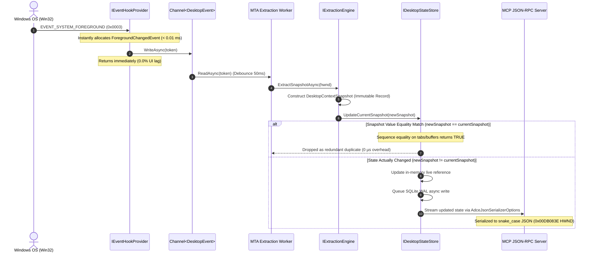

<!-- SPDX-License-Identifier: Apache-2.0 -->
<!-- Copyright (c) 2024-2026 Amir Farhadi -->

[ 🏠 ADCE Home ](../README.md) › [ 📚 Documentation Hub ](CONTEXT.md) › **ADCE.Core Deep-Dive & Architectural Reference**

---

# ADCE.Core Deep-Dive & Architectural Reference

> **Target Library:** `ADCE.Core` (.NET 10 / C# 14)
> **Purpose:** Plain-English architectural breakdown, end-to-end dataflow diagrams, file-by-file failure mode analysis, and value-equality mechanics.
> **Parent Context:** [`docs/CONTEXT.md`](CONTEXT.md) | [`docs/MCP_SCHEMA_SPEC.md`](MCP_SCHEMA_SPEC.md)

---

## 1. End-to-End Context Dataflow Architecture

The diagram below illustrates how an operating system event transitions through `ADCE.Core` data structures—from a raw Win32 event token all the way to an immutable MCP JSON snapshot, highlighting how **value equality deduplication** prevents unnecessary cache and database churn.



### ASCII Data Pipeline Representation:
```
┌────────────────────────────────────────────────────────────────────────────────────────────────────────┐
│                                       ADCE CONTEXT DATA PIPELINE                                       │
├────────────────────────────────────────────────────────────────────────────────────────────────────────┤
│                                                                                                        │
│   [Win32 Event Hook]  ──>  ForegroundChangedEvent (Lightweight Record Token)                           │
│                                    │                                                                   │
│                                    ▼                                                                   │
│   [Channel<DesktopEvent>] (Unbounded SingleReader Queue / Zero-CPU Idle Loop)                          │
│                                    │                                                                   │
│                                    ▼                                                                   │
│   [IExtractionEngine] ──>  DesktopContextSnapshot (Immutable Domain Record)                            │
│                            ├── WorkspaceEnvelope   (Virtual Desktop GUID, Index, Monitors)             │
│                            ├── WindowEnvelope      (HWND, ProcessName, Title, Class, Bounds)           │
│                            ├── FocusedControlInfo  (ControlType, ElementName, BoundingBox)             │
│                            └── IdeContext / BrowserContext (Tabs, Breadcrumbs, Active Buffer)          │
│                                    │                                                                   │
│                                    ▼                                                                   │
│   [IDesktopStateStore] ──> Deduplication Gate: (newSnapshot == currentSnapshot)                        │
│                            ├── IF MATCH: Drop instantly (no DB writes, no CPU churn)                   │
│                            └── IF CHANGED: Update memory cache & persist to SQLite                     │
│                                    │                                                                   │
│                                    ▼                                                                   │
│   [MCP Serialization] ──>  AdceJsonSerializerOptions + HwndJsonConverter                               │
│                            └── Strict snake_case JSON conforming to MCP JSON-RPC 2.0 Spec              │
│                                                                                                        │
└────────────────────────────────────────────────────────────────────────────────────────────────────────┘
```

---

## 2. File-by-File Failure Mode & Responsibility Matrix

Every file in `ADCE.Core` was introduced to solve a concrete systems failure mode.

| Directory | File | Core Responsibility | Failure Mode Prevented |
| :--- | :--- | :--- | :--- |
| **`Models/`** | [`DesktopContextSnapshot.cs`](../src/ADCE.Core/Models/DesktopContextSnapshot.cs) | Root immutable record holding the complete desktop context state at a point in time. | **Context Fragmentation & Race Conditions:** Prevents multi-threaded consumers (MCP, storage, voice grammar) from reading partially mutated state. |
| | [`WorkspaceEnvelope.cs`](../src/ADCE.Core/Models/WorkspaceEnvelope.cs) | Holds virtual desktop GUID, friendly name, workspace index, and monitor bounds. | **Workspace Blindness:** Prevents voice grammars and AI agents from confusing windows across different virtual desktops. |
| | [`WindowEnvelope.cs`](../src/ADCE.Core/Models/WindowEnvelope.cs) | Encapsulates process metadata, HWND, window title, Win32 class, and archetype. | **HWND Lifetime Ambiguity:** Captures process identity and bounds upfront so subsequent queries don't fail if the window closes. |
| | [`FocusedControlInfo.cs`](../src/ADCE.Core/Models/FocusedControlInfo.cs) | Stores focused control type, accessibility name, automation ID, and bounding rectangle. | **Target Drift:** Captures the exact active input target at the moment of focus without holding live COM proxy references. |
| | [`BoundingRectangle.cs`](../src/ADCE.Core/Models/BoundingRectangle.cs) | Lightweight `readonly record struct` for screen coordinates (`Left`, `Top`, `Width`, `Height`). | **Heap Allocation Bloat:** Eliminates GC pressure by allocating bounding geometry on the stack instead of heap objects. |
| | [`TabItemInfo.cs`](../src/ADCE.Core/Models/TabItemInfo.cs) | Represents open tab items with title, active state, pinned state, and dirty flag. | **Tab Parsing Inconsistency:** Provides a single unified model across IDEs, browsers, Explorer, and Terminal. |
| | [`IdeContext.cs`](../src/ADCE.Core/Models/IdeContext.cs) | Captures active file path, sidebar view, Monaco breadcrumbs, Git branch, and open editor tabs. | **IDE State Ambiguity:** Prevents AI coding assistants from needing expensive file tree scans by providing active buffers directly. |
| | [`BrowserContext.cs`](../src/ADCE.Core/Models/BrowserContext.cs) | Captures container type (TreeStyleTab / native), tab count, active tab title, and open tabs list. | **DOM Crawling Traps:** Replaces 6,800-node DOM crawls with isolated tab container extraction. |
| | [`ExplorerContext.cs`](../src/ADCE.Core/Models/ExplorerContext.cs) | Captures directory path, path breadcrumbs, selected items, and Win11 TabView tabs. | **Shell Navigation Blindness:** Gives voice engines instant awareness of active folders and selected files. |
| | [`TerminalContext.cs`](../src/ADCE.Core/Models/TerminalContext.cs) | Captures active terminal tab, shell title, and recent buffer text. | **Console Isolation:** Bridges terminal state into the unified desktop semantic graph. |
| **`Enums/`** | [`DesktopSemanticZone.cs`](../src/ADCE.Core/Enums/DesktopSemanticZone.cs) | Identifies functional UI zones (`EditorCodeBuffer`, `AddressBar`, `GitCommitBox`, `SidebarExplorer`). | **Raw Selector Fragility:** Downstream tools check semantic intent rather than fragile UI automation paths. |
| | [`DesktopAppArchetype.cs`](../src/ADCE.Core/Enums/DesktopAppArchetype.cs) | Categorizes apps into 5 universal desktop framework archetypes (`ChromiumElectron`, `Gecko`, `WinUI3Xaml`, `ClassicWin32`, `CanvasToolkit`). | **Hardcoded App Fragility:** Enables recipe-based dynamic discovery without hardcoding string rules per application. |
| | [`DesktopEventType.cs`](../src/ADCE.Core/Enums/DesktopEventType.cs) | Classifies OS events (`ForegroundChanged`, `FocusChanged`, `VirtualDesktopSwitched`, `StructureChanged`, `Heartbeat`). | **Event Type Ambiguity:** Provides strongly-typed dispatching inside Channel consumers. |
| **`Events/`** | [`DesktopEvent.cs`](../src/ADCE.Core/Events/DesktopEvent.cs) | Polymorphic hierarchy of lightweight event tokens. | **OS Message Loop Lag:** Allows WinEvent callbacks to post minimal structs to a channel and exit in $< 0.01\text{ ms}$, preventing UI stutter. |
| **`Interfaces/`**| [`IExtractionEngine.cs`](../src/ADCE.Core/Interfaces/IExtractionEngine.cs) | Interface for extracting `DesktopContextSnapshot` from HWND or foreground. | **Tight Coupling to FlaUI:** Allows extraction implementations to be swapped or mocked in unit tests without COM runtime. |
| | [`IDesktopStateStore.cs`](../src/ADCE.Core/Interfaces/IDesktopStateStore.cs) | Interface for in-memory cache and historical SQLite queries. | **Database Coupling:** Decouples storage persistence from MCP endpoints and daemon services. |
| | [`IWorkspaceManager.cs`](../src/ADCE.Core/Interfaces/IWorkspaceManager.cs) | Interface for virtual desktop discovery. | **COM Virtual Desktop Deadlocks:** Wraps desktop COM calls behind an asynchronous interface. |
| | [`IEventHookProvider.cs`](../src/ADCE.Core/Interfaces/IEventHookProvider.cs) | Interface for OS hook lifecycle and Channel exposure. | **Resource Leaks:** Ensures WinEvent hooks are cleanly disposed and unhooked on shutdown. |
| | [`IArchetypeClassifier.cs`](../src/ADCE.Core/Interfaces/IArchetypeClassifier.cs) | Interface for classifying HWNDs into archetypes. | **Hardcoded Routing:** Enables extensible rule-based and heuristic window classification. |
| **`Serialization/`**| [`HwndJsonConverter.cs`](../src/ADCE.Core/Serialization/HwndJsonConverter.cs) | Custom `JsonConverter<nint>` formatting HWND as hex strings (e.g. `0x00DB083E`). | **Signed Negative Signs & OverflowExceptions:** Prevents `-0x...` formatting and `Convert.ToInt64` crashes on high-bit addresses. |
| | [`AdceJsonSerializerOptions.cs`](../src/ADCE.Core/Serialization/AdceJsonSerializerOptions.cs) | Pre-configured `JsonSerializerOptions` enforcing `snake_case` naming and null omission. | **MCP Schema Non-Compliance:** Guarantees 100% byte-level compatibility with `docs/MCP_SCHEMA_SPEC.md`. |

---

## 3. Deep-Dive: How Sequence Equality Works on Application Contexts

### The C# Record Collection Trap
By default, C# `record` types synthesize an equality operator (`Equals`) that compares each property using `EqualityComparer<T>.Default`.

For standard value types and strings (`int`, `string`, `Guid`, `enum`), this performs value comparison. However, for collection types (`IReadOnlyList<T>`, `List<T>`, arrays), `EqualityComparer<T>.Default` performs **reference equality**!

```csharp
// ❌ WITHOUT CUSTOM EQUALITY:
var contextA = new IdeContext { OpenEditorTabs = new List<TabItemInfo> { new() { Title = "a.cs", IsActive = true } } };
var contextB = new IdeContext { OpenEditorTabs = new List<TabItemInfo> { new() { Title = "a.cs", IsActive = true } } };

bool naiveEquals = (contextA == contextB); // FALSE! (Different List<T> heap references)
```

If `contextA == contextB` evaluates to `false`, every time the user clicks inside an editor, `ADCE` would falsely assume the open tabs changed, writing duplicate records to SQLite and triggering unnecessary MCP notifications.

### The Solution: Explicit `IEquatable<T>` and `SequenceEqual`
In `ADCE.Core`, all context records containing collections implement explicit `IEquatable<T>`:

```csharp
public sealed record IdeContext : IEquatable<IdeContext>
{
    public string? ActiveFilePath { get; init; }
    public string? ActiveSidebarView { get; init; }
    public IReadOnlyList<TabItemInfo> OpenEditorTabs { get; init; } = [];
    public string? EditBuffer { get; init; }
    public string? GitBranch { get; init; }
    public IReadOnlyList<string> Breadcrumbs { get; init; } = [];

    public bool Equals(IdeContext? other)
    {
        if (other is null) return false;
        if (ReferenceEquals(this, other)) return true;

        return ActiveFilePath == other.ActiveFilePath &&
               ActiveSidebarView == other.ActiveSidebarView &&
               EditBuffer == other.EditBuffer &&
               GitBranch == other.GitBranch &&
               OpenEditorTabs.SequenceEqual(other.OpenEditorTabs) &&
               Breadcrumbs.SequenceEqual(other.Breadcrumbs);
    }

    public override int GetHashCode()
    {
        var hash = new HashCode();
        hash.Add(ActiveFilePath);
        hash.Add(ActiveSidebarView);
        hash.Add(EditBuffer);
        hash.Add(GitBranch);
        foreach (var tab in OpenEditorTabs) hash.Add(tab);
        foreach (var b in Breadcrumbs) hash.Add(b);
        return hash.ToHashCode();
    }
}
```

### Why This is Optimal:
1. **Element-by-Element Structural Check:** `OpenEditorTabs.SequenceEqual(...)` iterates both lists and compares each `TabItemInfo` by value.
2. **Order-Sensitive Integrity:** Tab ordering matters in desktop context (e.g. Tab 1 vs Tab 2); `SequenceEqual` guarantees order is preserved.
3. **Composite HashCode Consistency:** Combining individual item hashes with `System.HashCode` ensures that equal records always produce identical hash codes, maintaining dictionary and hash set safety.

---

## 4. Verification Harness

To empirically verify and visualize these models in action, execute the dedicated verification harness in `src/ADCE.Spikes`:

```powershell
dotnet run --project src/ADCE.Spikes -- --demo-models
```
