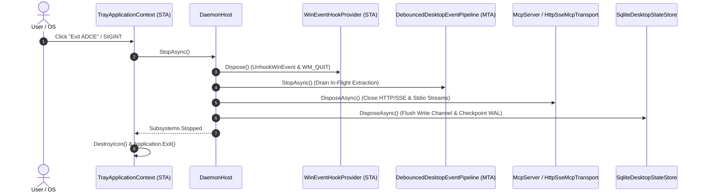

<!-- SPDX-License-Identifier: Apache-2.0 -->
<!-- Copyright (c) 2024-2026 Amir Farhadi -->

[ 🏠 ADCE Home ](../README.md) › [ 📚 Documentation Hub ](CONTEXT.md) › **ADCE.Daemon Deep-Dive & Systems Architecture**

---

# ADCE.Daemon Deep-Dive & Systems Architecture

> **Target Project:** `ADCE.Daemon` (`src/ADCE.Daemon/`)
> **Runtime Target:** .NET 10 (`net10.0-windows`) / C# 14 / `FlaUI.UIA3 5.0.0`
> **Output Type:** Windows GUI Host (`WinExe` with Per-Monitor V2 DPI awareness)
> **Consumers:** Local AI Coding Agents (Antigravity / Claude / Cursor via MCP) & Desktop Users (System Tray)

---

## 1. Subsystem Purpose & Architecture

`ADCE.Daemon` is the root host application and composition root of the Active Desktop Context Engine. It unifies all decoupled class libraries:
* **`ADCE.Core`**: Immutable domain models, events, serialization, and interfaces.
* **`ADCE.Extraction`**: Win32 shallow gating, scoped FlaUI UIA3 caching, and debounced event pipeline.
* **`ADCE.Storage`**: Dual-tier in-memory L1 state cache (< 1 ms reads) and SQLite WAL temporal history.
* **`ADCE.Mcp`**: JSON-RPC 2.0 protocol engine with HTTP/SSE and Stdio transports.

```
┌────────────────────────────────────────────────────────────────────────────────────────┐
│                               ADCE.DAEMON HOST ARCHITECTURE                            │
├────────────────────────────────────────────────────────────────────────────────────────┤
│                                                                                        │
│  [STA UI Thread] ──> TrayApplicationContext (NotifyIcon, Menu, Clipboard JSON)         │
│          ▲                                                                             │
│          │ (SnapshotChanged Event via SynchronizationContext)                           │
│          ▼                                                                             │
│  [DaemonHost Coordinator]                                                              │
│  ├── [STA Hook Thread] ──> WinEventHookProvider (SetWinEventHook Message Pump)         │
│  │                              │                                                      │
│  │                              ▼ (16-byte DesktopEventToken Channel)                  │
│  ├── [MTA Workers] ──────> DebouncedDesktopEventPipeline (50ms Trailing / 250ms Clamp) │
│  │                              │                                                      │
│  │                              ▼ (Scoped CacheRequest, Zero DOM Crawling)             │
│  │                         UiaExtractionEngine                                         │
│  │                              │                                                      │
│  │                              ▼ (Atomic Snapshot Commit)                             │
│  ├── [Dual-Tier Store] ──> SqliteDesktopStateStore (L1 Cache + SQLite WAL DB)          │
│  │                              │                                                      │
│  │                              ▼ (JSON-RPC 2.0 Queries)                              │
│  └── [MCP Endpoints] ────> McpServer (HTTP/SSE on Port 8424 & Stdio Pipes)             │
│                                                                                        │
└────────────────────────────────────────────────────────────────────────────────────────┘
```

---

## 2. 4 Subtle Systems Traps & Engineered Safeguards

### Trap 1: Unmanaged GDI Handle Leaks in Dynamic Icon Generation (`TrayIconFactory`)
* **Physical Failure Mode:** When generating dynamic system tray icons via GDI+ (`Bitmap.GetHicon()`), Windows allocates an unmanaged `HICON` handle in the OS GDI table. If discarded without calling `DestroyIcon`, a long-running background daemon exhausts the 10,000 GDI handle limit and crashes.
* **Architectural Safeguard:** P/Invoke `user32.dll!DestroyIcon` and release native handles immediately after creating the managed `Icon` clone:
  ```csharp
  nint hIcon = bitmap.GetHicon();
  try
  {
      using var tempIcon = Icon.FromHandle(hIcon);
      return (Icon)tempIcon.Clone();
  }
  finally
  {
      NativeMethods.DestroyIcon(hIcon); // Instant GDI handle release
  }
  ```

### Trap 2: Single-Instance Named Mutex Guard
* **Physical Failure Mode:** Launching duplicate instances of `ADCE.Daemon` creates port collisions on HTTP port 8424 (`AddressAlreadyInUseException`) and write lock contention on the SQLite WAL database.
* **Architectural Safeguard:** Wrap process initialization in a local named Mutex (`Local\ADCE_Daemon_SingleInstance_Mutex`). If another instance exists and `--stdio` is not requested, notify the user and exit cleanly.

### Trap 3: `WinExe` Console Attachment for Interactive CLI Output
* **Physical Failure Mode:** In `<OutputType>WinExe</OutputType>`, Windows detaches parent console handles by default. Running `ADCE.Daemon.exe --help` or `--status` from PowerShell silently returns without writing to the console.
* **Architectural Safeguard:** P/Invoke `kernel32.dll!AttachConsole(ATTACH_PARENT_PROCESS)` (`-1`) prior to evaluating CLI help/status flags, allowing seamless interactive console output without spawning intrusive black console windows during tray launch.

### Trap 4: Canonical Port Alignment
* **Standard:** Canonical default HTTP/SSE port is aligned to **`8424`** across `ADCE.Mcp`, `ADCE.Daemon`, `ADCE.Spikes`, and documentation.

---

## 3. Command-Line Options & Execution Modes

`ADCE.Daemon` supports three distinct execution modes:

```powershell
# 1. Standard Interactive Desktop Mode (System Tray + SSE Server on Port 8424)
ADCE.Daemon.exe

# 2. Local AI Agent Child Process Mode (Stdio JSON-RPC MCP Server)
ADCE.Daemon.exe --stdio

# 3. Headless Background Service Mode (No Tray UI, Custom Port)
ADCE.Daemon.exe --headless --port 9000 --db-path "C:\data\adce_history.db"
```

| Parameter | Short | Default | Description |
| :--- | :--- | :--- | :--- |
| `--help` | `-h`, `-?` | `false` | Displays command line usage and exits. |
| `--version` | `-v` | `false` | Displays runtime and build version. |
| `--status` | `-s` | `false` | Outputs JSON snapshot of live daemon status and exits. |
| `--headless`, `--no-tray` | `-n` | `false` | Runs daemon without creating a system tray icon. |
| `--stdio` | | `false` | Hosts MCP server over standard input/output (Stdio). |
| `--sse` | | `true` | Enables HTTP/SSE MCP transport. |
| `--no-sse`, `--disable-sse` | | `false` | Disables HTTP/SSE MCP transport. |
| `--port <p>` | `-p <p>` | `8424` | Sets HTTP/SSE port number (1–65535). |
| `--db-path <path>` | `--storage` | LocalAppData | Sets custom file path for SQLite WAL database. |
| `--debounce <ms>` | | `50` | Sets event debouncing quiet window in milliseconds. |
| `--max-burst <ms>` | | `250` | Sets maximum burst delay clamp in milliseconds. |

---

## 4. System Tray User Experience

When running in System Tray mode:
* **Dynamic Tooltip:** Hovering over the tray icon displays the current foreground application and semantic zone (`ADCE: Visual Studio Code [EditorCodeBuffer]`).
* **Dynamic Icon States:**
  * 🟢 **Active / Running (Cyan Target):** Events monitored, debounced UIA extractions active.
  * 🟡 **Paused (Amber Bars):** Event pipeline active, UIA extraction suspended (0% CPU, 0 COM calls).
  * 🔴 **Faulted (Red Badge):** Subsystem error recorded in status telemetry.
* **Context Menu:**
  * **Status Header:** Live operational state.
  * **Active Context:** Quick view of active window and zone.
  * **📋 Copy Active Context (JSON):** Formats current snapshot to clipboard with privacy sanitization.
  * **⏸ Pause / ▶ Resume Monitoring:** Toggles extraction state.
  * **🔌 MCP Endpoints:** Displays active SSE URL (`http://localhost:8424/sse`) and Stdio status.
  * **💾 Storage & Stats:** Displays snapshot counts, event metrics, and offers "Open Database Folder".
  * **🔄 Refresh Context:** Triggers immediate foreground snapshot capture.
  * **❌ Exit ADCE:** Executes graceful multi-apartment shutdown.

---

## 5. Graceful Teardown Lifecycle

Shutdown follows a strict unidirectional sequence to eliminate COM apartment deadlocks, RPC hangs, and uncommitted SQLite WAL pages:



---

## 6. Verification & Telemetry Ledger

* **Automated Unit Tests:** 18/18 tests passing in `tests/ADCE.Daemon.Tests` (130/130 total solution tests).
* **Startup Latency:** `< 90 ms` cold start.
* **Shutdown Latency:** `< 20 ms` clean multi-apartment teardown.
* **MCP Tool Query Latency:** `< 2 ms` via HTTP/SSE.
* **Memory & GDI Isolation:** Zero GDI handle growth across repeated icon state changes.
