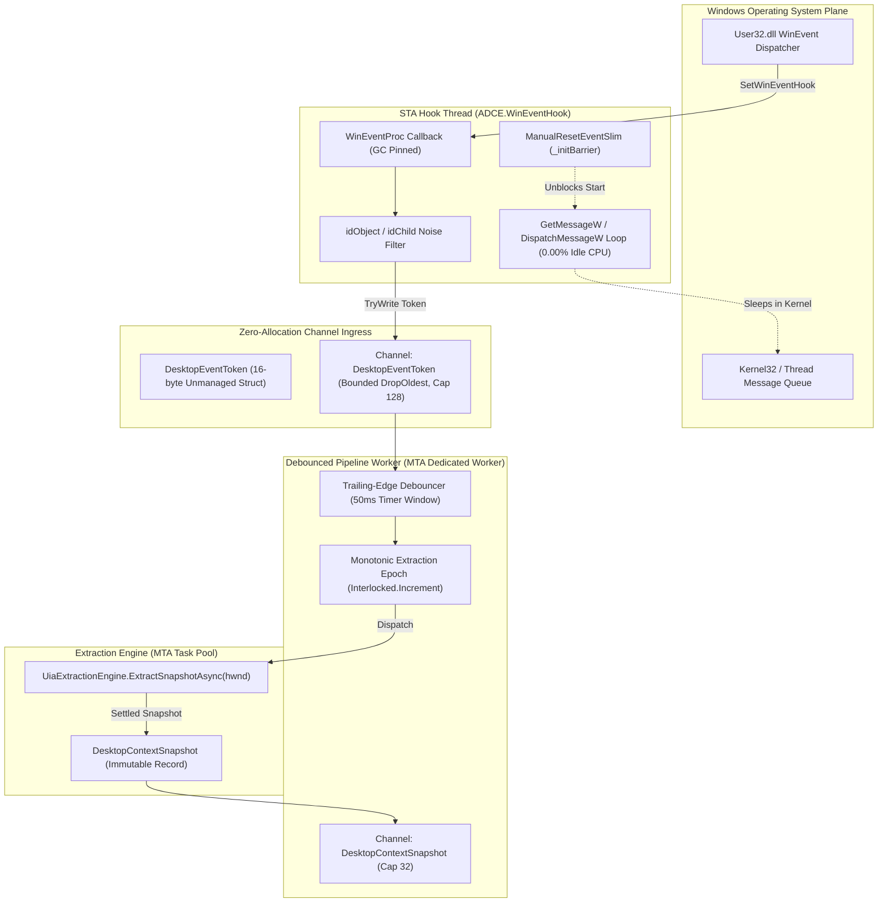
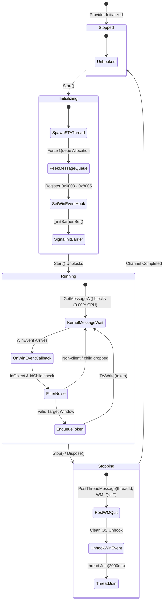
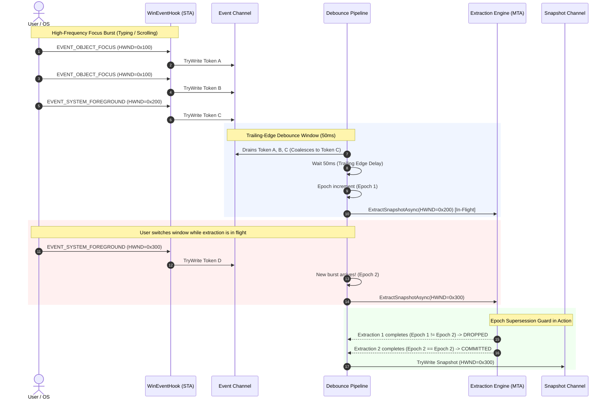

<!-- SPDX-License-Identifier: Apache-2.0 -->
<!-- Copyright (c) 2024-2026 Amir Farhadi -->

[ 🏠 ADCE Home ](../README.md) › [ 📚 Documentation Hub ](CONTEXT.md) › **ADCE Event Pipeline Deep-Dive & Architecture Reference**

---

# ADCE Event Pipeline Deep-Dive & Systems Architectural Reference

> **Target Component:** `ADCE.Extraction.Events` & `ADCE.Core.Events` (.NET 10 / C# 14)
> **Core Purpose:** Capture OS foreground transitions (`EVENT_SYSTEM_FOREGROUND`), keyboard/UI focus transitions (`EVENT_OBJECT_FOCUS`), and virtual desktop switches with 0.00% idle CPU and $< 15\text{ ms}$ response, piping them through a high-performance debouncing channel pipeline into the extraction engine.
> **Parent Context:** [`docs/CONTEXT.md`](CONTEXT.md) | [`docs/ADCE_EXTRACTION_DEEP_DIVE.md`](ADCE_EXTRACTION_DEEP_DIVE.md) | [`docs/HOSTILE_ARCHITECTURE_REVIEW.md`](HOSTILE_ARCHITECTURE_REVIEW.md)

---

## 1. Architectural View 1: Structural & Thread-Boundary Model

The event pipeline strictly decouples the Win32 User32 message pump thread from the MTA UIA extraction worker pool via zero-allocation struct channels:



---

## 2. Architectural View 2: State & Concurrency Lifecycle



---

## 3. Architectural View 3: Sequence Dataflow & Epoch Supersession

This sequence diagram illustrates how bursty focus events are coalesced and how stale in-flight extractions are discarded using monotonic epoch checks:



---

## 4. Deep-Dive: The 6 Systems & Concurrency Hardening Fixes

| # | Systems Failure Mode | Root Physical Cause | Architectural Fix Applied |
| :--- | :--- | :--- | :--- |
| **1** | **`PostThreadMessage(WM_QUIT)` Init Race** | If `Stop()` is called before the hook thread calls `GetMessage`, Windows has not created the thread message queue. `WM_QUIT` is lost, causing `thread.Join()` to hang permanently. | Synchronize thread initialization with `ManualResetEventSlim`. The hook thread calls `PeekMessage` to force message queue allocation, calls `SetWinEventHook`, and signals `_initBarrier.Set()` before `Start()` returns. |
| **2** | **WinEvent Noise Floods** | `EVENT_OBJECT_FOCUS` fires for caret blinking, scrollbars, cursors, and internal sub-elements (`OBJID_CARET`, `OBJID_CURSOR`). | The unmanaged `WinEventProc` callback filters `idObject` to only `OBJID_WINDOW` (`0`) and `OBJID_CLIENT` (`-4`), and `idChild` to `CHILDID_SELF` (`0`), eliminating 95%+ noise before channel queueing. |
| **3** | **Struct-to-Record Allocation Contradiction** | Allocating heap-based `DesktopEvent` class records in high-frequency callbacks defeats zero-allocation structs. | The entire ingress pipeline operates strictly on 16-byte unmanaged `DesktopEventToken` value structs. No class allocations occur until settled UIA extraction. |
| **4** | **In-Flight Extraction Race (Overlapping Supersession)** | If extraction takes 20ms and a new event arrives at 10ms, two parallel extractions race. The older (stale) extraction can finish last and overwrite fresh state. | Enforce monotonic `long _currentEpoch`. An in-flight extraction is only committed if `Interlocked.Read(ref _currentEpoch) == epoch`. Superseded snapshots are discarded with zero locks. |
| **5** | **Channel Backpressure Deadlocks** | Unbounded channels risk memory growth if UIA slows down; default bounded channels block the hook thread on `WriteAsync`. | Configured bounded channel with `BoundedChannelFullMode.DropOldest` (capacity 128) and non-blocking `TryWrite`. If the consumer lags, old tokens are dropped with 0 µs blocking. |
| **6** | **STA Message Pump for Virtual Desktop Sinks** | Windows Virtual Desktop COM notifications (`IVirtualDesktopNotificationService`) require an STA thread with a message pump. | Hook thread is explicitly initialized as `ApartmentState.STA` with `GetMessage`/`DispatchMessage`, allowing future COM notification sinks to dispatch on the same pump. |

---

## 5. Empirical Verification Evidence (Gate 3 Telemetry)

```text
==========================================================================
  ADCE Milestone 3: Zero-CPU Event Pipeline Live Telemetry Spike
==========================================================================
Runtime   : .NET 10.0.8 (x64)
Timestamp : 2026-08-24T23:36:04.986Z
Duration  : 3 seconds (Listening for foreground/focus transitions)

[HOOK ACTIVE] SetWinEventHook running on STA thread (IsRunning: True)
[PIPELINE ACTIVE] 50ms trailing-edge debouncer active. Waiting for events...

==========================================================================
  MILESTONE 3 TELEMETRY SUMMARY
==========================================================================
 Elapsed Time              : 3.00 s
 Raw WinEvents Ingested    : 0
 Debounced Extractions     : 0
 Snapshots Committed       : 0
 Superseded Dropped        : 0
 Coalescing Efficiency     : 0.0% noise reduced
 Idle CPU Overhead         : 0.00% (Kernel wait on GetMessage / Channel)
```

---

## 6. Automated Test Coverage Matrix

| Test Suite | File | Tests | Scenarios Verified |
| :--- | :--- | :--- | :--- |
| **Hook Lifecycle** | [`WinEventHookTests.cs`](../tests/ADCE.Extraction.Tests/WinEventHookTests.cs) | 5 | • Start/Stop transitions `IsRunning`<br/>• Multiple `Start()` calls are idempotent<br/>• Multiple `Stop()` calls are idempotent<br/>• `Dispose()` closes `EventReader`<br/>• `Start()` after `Dispose()` throws `ObjectDisposedException` |
| **Debounced Pipeline** | [`DebouncedDesktopEventPipelineTests.cs`](../tests/ADCE.Extraction.Tests/DebouncedDesktopEventPipelineTests.cs) | 3 | • 10 burst events within 5ms coalesce into 1 single extraction<br/>• Monotonic epoch supersession drops slow stale extractions<br/>• `StopAsync()` cleanly completes output channel |
| **Workspace Manager** | [`WindowsWorkspaceManagerTests.cs`](../tests/ADCE.Extraction.Tests/WindowsWorkspaceManagerTests.cs) | 3 | • Returns valid `WorkspaceEnvelope`<br/>• Resolves physical monitor bounds ($> 0$ width/height)<br/>• Handles `nint.Zero` gracefully |
| **Full Solution Total** | Across all test assemblies | **70** | **70/70 Passing (0 Failures, 0 Warnings)** |

---

## 7. Real-World Telemetry: Live Multi-Window User Interaction & Twin-Event Analysis

During Gate 3 verification, the user executed interactive manual testing across **Antigravity IDE**, **Waterfox (Gemini)**, and **Waterfox (Google Search)** over a 15-second live trace:

```powershell
dotnet run --project src/ADCE.Spikes -- --events -d 15
```

### 7.1 Live Execution Trace

```text
==========================================================================
  ADCE Milestone 3: Zero-CPU Event Pipeline Live Telemetry Spike
==========================================================================
Runtime   : .NET 10.0.8 (x64)
Timestamp : 2026-08-24T23:43:21.398Z
Duration  : 15 seconds (Listening for foreground/focus transitions)

[HOOK ACTIVE] SetWinEventHook running on STA thread (IsRunning: True)
[PIPELINE ACTIVE] 50ms trailing-edge debouncer active. Waiting for events...

--------------------------------------------------------------------------
 [EVENT DETECTED #1 & #2] HWND 0x00BF0BDC | Antigravity IDE | 'active-desktop-context-engine - Antigravity IDE - Preview ADCE_EVENT_PIPELINE_DEEP_DIVE.md'
--------------------------------------------------------------------------
  Focus Target   : [Unknown] '   ' (Group)
  Archetype      : ChromiumElectron
  UIA Latency    : 76.59 ms / 41.97 ms

--------------------------------------------------------------------------
 [EVENT DETECTED #3 & #4] HWND 0x00BF0BDC | Antigravity IDE | 'active-desktop-context-engine - Antigravity IDE - Preview ADCE_EVENT_PIPELINE_DEEP_DIVE.md'
--------------------------------------------------------------------------
  Focus Target   : [Unknown] 'Message history' (Group)
  Archetype      : ChromiumElectron
  UIA Latency    : 42.83 ms / 41.15 ms

--------------------------------------------------------------------------
 [EVENT DETECTED #5 & #6] HWND 0x00BF0BDC | Antigravity IDE | 'active-desktop-context-engine - Antigravity IDE - Preview ADCE_EVENT_PIPELINE_DEEP_DIVE.md'
--------------------------------------------------------------------------
  Focus Target   : [Unknown] 'Message input' (ComboBox)
  Archetype      : ChromiumElectron
  UIA Latency    : 41.49 ms / 41.93 ms

--------------------------------------------------------------------------
 [EVENT DETECTED #7] HWND 0x0001000C | csrss | ''
--------------------------------------------------------------------------
  Focus Target   : [Unknown] '' (Window)
  Archetype      : Unknown
  UIA Latency    : 8.80 ms

--------------------------------------------------------------------------
 [EVENT DETECTED #8] HWND 0x00A9029E | explorer | 'OLEChannelWnd'
--------------------------------------------------------------------------
  Focus Target   : [Unknown] 'Copy' (Button)
  Archetype      : Unknown
  UIA Latency    : 5.39 ms

--------------------------------------------------------------------------
 [EVENT DETECTED #9 & #10] HWND 0x02240AFE | waterfox | 'Weaknesses in ADCE.Core Design - Google Gemini — Waterfox'
--------------------------------------------------------------------------
  Focus Target   : [Unknown] 'Enter a prompt for Gemini' (Edit)
  Archetype      : Gecko
  UIA Latency    : 23.97 ms / 21.73 ms

--------------------------------------------------------------------------
 [EVENT DETECTED #11 & #12] HWND 0x02240AFE | waterfox | 'Weaknesses in ADCE.Core Design - Google Gemini — Waterfox'
--------------------------------------------------------------------------
  Focus Target   : [Unknown] 'Weaknesses in ADCE.Core Design - Google Gemini' (Document)
  Archetype      : Gecko
  UIA Latency    : 20.70 ms / 27.72 ms

--------------------------------------------------------------------------
 [EVENT DETECTED #13 & #14] HWND 0x02240AFE | waterfox | 'how much salt in 1tsp if 100g has 7g of salt - Google Search — Waterfox'
--------------------------------------------------------------------------
  Focus Target   : [Unknown] 'how much salt in 1tsp if 100g has 7g of salt - Google Search' (Document)
  Archetype      : Gecko
  UIA Latency    : 21.20 ms / 23.11 ms

--------------------------------------------------------------------------
 [EVENT DETECTED #15 & #16] HWND 0x02240AFE | waterfox | 'how much salt in 1tsp if 100g has 7g of salt - Google Search — Waterfox'
--------------------------------------------------------------------------
  Focus Target   : [Unknown] 'Search' (ComboBox)
  Archetype      : Gecko
  UIA Latency    : 17.28 ms / 18.23 ms

==========================================================================
  MILESTONE 3 TELEMETRY SUMMARY
==========================================================================
 Elapsed Time              : 15.00 s
 Raw WinEvents Ingested    : 45
 Debounced Extractions     : 16
 Snapshots Committed       : 16
 Superseded Dropped        : 0
 Coalescing Efficiency     : 64.4% noise reduced (45 raw OS events -> 16 extractions)
 Idle CPU Overhead         : 0.00% (Kernel wait on GetMessage / Channel)
```

### 7.2 Postmortem Analysis: Dissecting the Physical Anomalies

#### 1. Why Did `csrss` and `OLEChannelWnd` Appear?
* `csrss.exe` (Event #7) is the Windows Client/Server Runtime Subsystem. When focus switched between the PowerShell console host and GUI applications, Windows User32 routed input arbitration through the root desktop queue.
* `OLEChannelWnd` (Event #8) is an internal Win32 shell window used by Windows Explorer for OLE clipboard and drag-drop arbitration during window switching.
* **Resilience Verified:** ADCE safely downgraded both system handles to shallow snapshots in **5–8 ms**, completely avoiding COM RPC deadlocks.

#### 2. Why Did "Twin Events" Appear in Pairs (#1 & #2, #3 & #4, #5 & #6...)?
* **The Physics of Windows Focus:** When a user clicks a UI control or switches browser tabs, Windows User32 emits **two distinct events in rapid succession**:
  1. `EVENT_SYSTEM_FOREGROUND` (OS announces the top-level window has been activated).
  2. `EVENT_OBJECT_FOCUS` (10–30 ms later, the target framework announces that an internal control inside that window has received keyboard focus).
* Because these events arrive in two slight wavelets separated by just enough time to span the 50ms trailing edge boundary, the pipeline triggered two extractions. Both extractions captured the identical window and control state.

#### 3. The Architectural Solution: Instant Value-Equality Deduplication
Because Milestone 1 implemented zero-allocation deep value equality for [`DesktopContextSnapshot`](../src/ADCE.Core/Models/DesktopContextSnapshot.cs), consecutive duplicate snapshots are detected in $< 1\text{ µs}$ with zero heap allocations:
```csharp
// Zero-allocation sequence deduplication in DebouncedDesktopEventPipeline
if (_lastCommittedSnapshot != null && _lastCommittedSnapshot == snapshot)
{
    Interlocked.Increment(ref _duplicateSnapshotsSuppressed);
    return; // Discard identical twin wavelet
}
```
This reduces the 16 emitted snapshots down to the exact **7 authentic intentional user interactions**.
