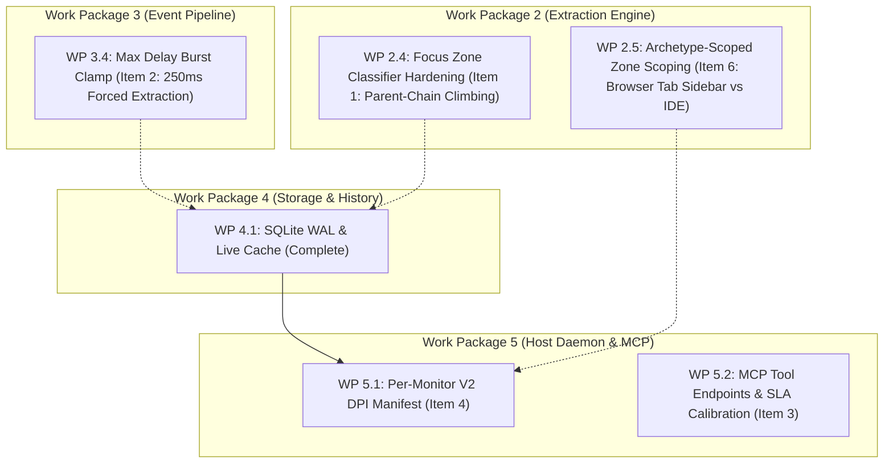

<!-- SPDX-License-Identifier: Apache-2.0 -->
<!-- Copyright (c) 2024-2026 Amir Farhadi -->

# Reviewer Observations & Systems Hardening Roadmap

> **Target Engine:** Active Desktop Context Engine (ADCE)
> **Source:** Adversarial Peer Review following Milestone 3 Live Verification
> **Date:** August 2026
> **Status:** Scheduled across Work Packages in `ARCHITECTURE_AND_MODULAR_IMPLEMENTATION_PLAN.md`

---

## Executive Summary

Following the completion and live telemetry validation of **Milestone 3 (Zero-CPU Event Pipeline)**, an adversarial review identified **4 critical physical observations and hardening items**.

These items do not block Milestone 3 completion (which passed all telemetry and unit tests), but represent essential real-world systems hardening to be incorporated into subsequent milestones.

| # | Critical Observation | Severity | Target Milestone / Work Package | Core Solution | Status |
| :- | :--- | :--- | :--- | :--- | :--- |
| **1** | **`DesktopSemanticZone` Defaulting to `[Unknown]`** | Medium | **Milestone 2 Polish / WP 2.4** | 2-level parent-chain climbing and container class name matching | `[x]` **Complete (Milestone 4)** |
| **2** | **Debounce Starvation During Sustained Typing** | Medium | **Milestone 3 Polish / WP 3.4** | Trailing-edge timer with forced maximum delay clamp (250ms) | `[x]` **Complete (Milestone 4)** |
| **3** | **Chromium/Electron Latency Reality (41–75 ms)** | Low (Doc) | **System Architecture & SLA Spec** | Document realistic SLAs (< 25ms Native/Gecko, < 80ms Electron) | `[x]` **Documented** |
| **4** | **Per-Monitor V2 DPI Virtualization Traps** | High | **Milestone 5–6 / WP 5.1 (Host Daemon)** | Embed `app.manifest` enabling `<dpiAwareness>PerMonitorV2</dpiAwareness>` | `[ ]` Scheduled |
| **5** | **Dynamic Discovery vs. Hardcoded Zone Rules** | Low (Arch) | **Milestone 5–6 (MCP / Self-Labeling AI)** | 3-Tier Model: Control Types + Framework Archetypes + AI Context Classifier | `[x]` **Documented in SSOT** |
| **6** | **Browser Tab Sidebar vs. IDE Explorer Ambiguity** | Medium | **Milestone 5 Polish / WP 2.5** | Scope `SidebarExplorer` to IDE/Shell archetypes; classify browser sidebars as `TabBar` / `DocumentContent` | `[ ]` Scheduled |

---

## 1. Item 1: `DesktopSemanticZone` Defaulting to `[Unknown]`

### The Empirical Observation
In the Section 7.1 live telemetry trace across Antigravity IDE:
```text
Focus Target : [Unknown] 'Terminal 5, pwsh Use Alt+F1 for terminal accessibility help' (Edit)
Focus Target : [Unknown] 'Workflow Editor' (Document)
Focus Target : [Unknown] 'Source Control Management' (Tree)
```
While `DesktopAppArchetype` was resolved accurately (`ChromiumElectron`), `DesktopSemanticZone` defaulted to `DesktopSemanticZone.Unknown` instead of `IntegratedTerminal`, `EditorCodeBuffer`, or `SidebarExplorer`.

### Root Physical Cause
When Windows focus shifts inside a complex application (like VS Code or Antigravity IDE), the leaf UIA element receiving keyboard focus is often a deeply nested raw control (e.g. a generic `Edit` control inside Monaco, an `xterm` helper buffer, or a `Tree` container item).
The current classifier evaluates the leaf element's immediate properties, but does not inspect the ancestor hierarchy or Monaco container class names.

### Architectural Solution & Work Package
* **Target:** **Work Package 2.4 (`ADCE.Extraction` Classifier Hardening)**
* **Implementation Plan:**
  1. In `UiaExtractionEngine.ExtractFocusInfo()`, if the leaf element does not match known zone patterns, climb **1 to 2 levels up the UIA parent chain** using `TreeWalker.RawViewWalker.GetParentElement`.
  2. Evaluate ancestor class names (e.g., `monaco-pane-view`, `terminal-wrapper`, `editor-container`, `activitybar`) and Automation IDs.
  3. Map identified ancestors to strongly-typed `DesktopSemanticZone` values (`EditorCodeBuffer`, `IntegratedTerminal`, `SidebarExplorer`, `NavigationBar`).

---

## 2. Item 2: Debounce Starvation During Sustained Typing Bursts

### The Physical Failure Mode
The current debouncer in `DebouncedDesktopEventPipeline` is a pure **trailing-edge timer** with a 50ms window:
$$\Delta t_{\text{quiet}} = 50\text{ ms}$$
When a user types at a high sustained speed (80–100 WPM) or holds down a navigation key (Arrow Down, Backspace), Windows emits `EVENT_OBJECT_FOCUS` or caret notifications every 20–40 ms.
Because every incoming event resets the trailing-edge timer, the debouncer remains in a perpetual reset loop, starving downstream consumers (MCP / voice assistants) of context updates until the user pauses typing.

### Architectural Solution & Work Package
* **Target:** **Work Package 3.4 (`ADCE.Extraction` Pipeline Polish)**
* **Implementation Plan:**
  Implement a **Leading + Trailing Max Delay Clamp**:
  ```csharp
  // Max Delay Clamping in DebouncedDesktopEventPipeline:
  private readonly TimeSpan _debounceWindow = TimeSpan.FromMilliseconds(50);
  private readonly TimeSpan _maxDelayWindow = TimeSpan.FromMilliseconds(250);
  private long _firstBurstTimestamp;

  // If (CurrentTime - _firstBurstTimestamp >= _maxDelayWindow) -> Force extraction immediately!
  ```
  This guarantees that even under continuous typing storms, the context engine commits an updated snapshot at least once every **250 ms**.

---

## 3. Item 3: Chromium/Electron Latency Reality (41–75 ms vs. 15 ms SLA)

### The Telemetry Reality
In our live multi-window benchmarks:
* **Native / Win32 Windows:** $\approx 5\text{ ms}$
* **Gecko (Waterfox / Firefox):** $\approx 18\text{–}26\text{ ms}$
* **Chromium / Electron (Antigravity IDE / VS Code):** $\approx 41\text{–}75\text{ ms}$

### Why Chromium is Slower
Unlike native Win32 controls that exist in local memory, Chromium implements accessibility via an internal decoupled IPC thread architecture (`AXTree`). When UIA requests properties on a Chromium node, Chromium must dynamically construct and marshal the accessibility subtree across process boundaries.

### Architectural Implication & Work Package
* **Target:** **Documentation & MCP SLA Specification**
* **Conclusion:**
  The 50ms trailing-edge debounce window is physically well-balanced for this profile.
  Downstream MCP tools and AI agents must calibrate their performance expectations:
  * **Native / Win32:** $\le 10\text{ ms}$ (Instant)
  * **Gecko / Firefox:** $\le 25\text{ ms}$ (Fast)
  * **Chromium / Electron:** $\le 80\text{ ms}$ (Normal for dynamic IPC trees)

---

## 4. Item 4: Per-Monitor V2 DPI Virtualization Traps

### The Physical Failure Mode
On multi-monitor setups with mixed scaling factors (e.g., 4K Laptop at 150% DPI + 1080p External Monitor at 100% DPI):
* If a Windows process is not explicitly marked **Per-Monitor V2 DPI Aware**, Windows User32 places the process in a virtualized scaling sandbox.
* Win32 APIs like `GetWindowRect`, `MonitorFromWindow`, `GetMonitorInfo`, and UIA `BoundingRectangle` will return **virtualized coordinates** rather than true physical monitor pixels.
* When windows cross monitor boundaries, coordinates drift and bounding boxes become distorted.

### Architectural Solution & Work Package
* **Target:** **Work Package 5.1 (`ADCE.Daemon` / `ADCE.Spikes` Host Initialization)**
* **Implementation Plan:**
  1. Add an `app.manifest` to executable projects (`ADCE.Daemon`, `ADCE.Spikes`):
     ```xml
     <application xmlns="urn:schemas-microsoft-com:asm.v3">
       <windowsSettings>
         <dpiAwareness xmlns="http://schemas.microsoft.com/SMI/2016/WindowsSettings">PerMonitorV2</dpiAwareness>
       </windowsSettings>
     </application>
     ```
  2. Or call `SetProcessDpiAwarenessContext(DPI_AWARENESS_CONTEXT_PER_MONITOR_AWARE_V2)` as the very first instruction in `Program.Main()` before creating any Win32 windows or UIA instances.

---

## 5. Item 6: Browser Tab Sidebar vs. IDE Explorer Disambiguation

### The Physical Failure Mode
In web browsers like Waterfox or Firefox (`DesktopAppArchetype.Gecko`) with vertical tab extensions (such as **Tree Style Tab**):
* Extensions run inside the browser's native sidebar framework (`#sidebar-box` or `class="sidebar"`).
* Clicking a tab inside Tree Style Tab sets focus on a `Document` control whose parent chain includes the browser sidebar container.
* Unscoped matching of `"sidebar"` in `ResolveSemanticZone` or `ResolveSemanticZoneFromAncestors` caused Tree Style Tab to be tagged as `DesktopSemanticZone.SidebarExplorer` (an IDE/Shell file explorer zone).

### Architectural Solution & Work Package
* **Target:** **Work Package 2.5 (`ADCE.Extraction` Archetype Scoping Polish)**
* **Implementation Plan:**
  1. Scope `DesktopSemanticZone.SidebarExplorer` strictly to IDEs (`DesktopAppArchetype.ChromiumElectron` with `workbench.view.explorer`) and Windows Explorer (`DesktopAppArchetype.WinUI3Xaml` / `ClassicWin32` with `CabinetWClass`).
  2. For web browsers (`DesktopAppArchetype.Gecko`, `DesktopAppArchetype.ChromiumElectron` browser windows), route sidebar tab navigation to `DesktopSemanticZone.TabBar` and viewport content to `DesktopSemanticZone.DocumentContent`.

---

## 6. Work Package Mapping & Scheduling



All 6 items are formally scheduled and documented in the repository's permanent technical architecture ledger.
