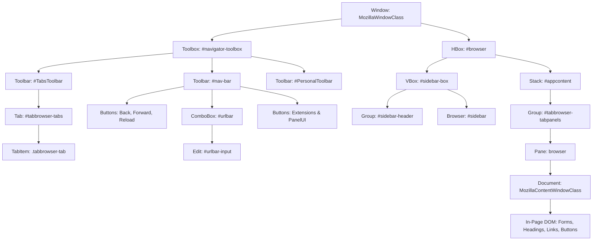

<!-- SPDX-License-Identifier: Apache-2.0 -->
<!-- Copyright (c) 2026 Amir Farhadi -->

[ 🏠 ADCE Home ](../../README.md) › [ 📚 App Hierarchies ](./README.md) › **01. Waterfox Browser Profile**

---

# Waterfox Browser (Gecko Engine) UI Automation Hierarchy & Semantic Mapping Profile

> **Document Status:** Active / Verified Ground Truth Specification
> **Target Engine:** Mozilla Gecko (`MozillaWindowClass`)
> **Verification Date:** 2026-09-05 06:05:12 UTC
> **Target HWND:** `0x000205B0` | **PID:** `12136` | **Window Title:** `Cloud Infrastructure Console — Waterfox`

---

## 1. Physical Window & Process Specification

| Property | Physical Telemetry Value | Architectural Significance |
| :--- | :--- | :--- |
| **Process Name** | `waterfox` | Gecko multi-process rendering architecture |
| **PID** | `12136` | Host main UI process |
| **Window HWND** | `0x000205B0` | Win32 top-level desktop window handle |
| **Window Class** | `MozillaWindowClass` | Standard Mozilla desktop chrome root class |
| **Window Title** | `Cloud Infrastructure Console — Waterfox` | Active document or tab title |
| **Window Bounds** | `[X=1, Y=-8, W=958, H=1167]` | Full desktop window client envelope |

---

## 2. Structural Container Anatomy

The Waterfox interface is organized as a hierarchical XUL/HTML shell containing two distinct zones:
1. **Host Window Chrome (`#navigator-toolbox` and `#sidebar-box`):** Desktop application controls for tabs, navigation, bookmarks, and sidebars.
2. **Client Document Viewport (`#appcontent` -> `Document`):** Rendered web content canvas hosted in an out-of-process tab.

> [!TIP]
> **Wide Diagram View:** For fluid zooming, panning, and fullscreen exploration, open the [Interactive HTML Diagram](../diagrams/waterfox_hierarchy_diagram.html).



---

## 3. Empirical Telemetry Matrix

| Step | Zone Tag | Stimulus | Physical UIA Control | Bounds `[X, Y, W, H]` | ADCE Prediction | Correct? | Screenshot |
| :---: | :--- | :--- | :--- | :--- | :--- | :---: | :---: |
| 1 | **AddressBar** | `Find #urlbar-input & Focus` | [ComboBox] `urlbar-input` (Search or enter web address) | `[182, 27, 298, 18]` | Zone: `AddressBar`<br>Pane: `TopBar`<br>Path: `[TopBar, NavigationBar]` | ✅ | [`step_01_address_bar.png`](../media/waterfox_telemetry/step_01_address_bar.png) |
| 2 | **NavToolButton** | `Focus Back/Action Button` | [Button] `back-button` (Back) | `[39, 19, 32, 34]` | Zone: `NavigationPanel`<br>Pane: `TopBar`<br>Path: `[TopBar, NavigationBar]` | ✅ | [`step_02_nav_button.png`](../media/waterfox_telemetry/step_02_nav_button.png) |
| 3 | **TabStrip** | `Focus Active Tab Item` | [TabItem] `tabbrowser-tab` (Technical Documentation & Reference Manual) | `[1, 75, 222, 38]` | Zone: `TabBar`<br>Pane: `TopBar`<br>Path: `[TopBar, TabStrip]` | ✅ | [`step_03_tabstrip.png`](../media/waterfox_telemetry/step_03_tabstrip.png) |
| 4 | **BookmarksBar** | `Focus PersonalToolbar Button` | [Button] `import-button` (Import bookmarks…) | `[4, 55, 134, 18]` | Zone: `NavigationPanel`<br>Pane: `TopBar`<br>Path: `[TopBar, BookmarksToolbar]` | ✅ | [`step_04_bookmarks_bar.png`](../media/waterfox_telemetry/step_04_bookmarks_bar.png) |
| 5 | **SidebarBox** | `Focus Sidebar Container/Item` | [Menu] `sidebar-context-menu` () | `[0, 0, 0, 0]` | Zone: `SidebarExplorer`<br>Pane: `PrimarySidebar`<br>Path: `[PrimarySidebar, Explorer]` | ✅ | [`step_05_sidebar_box.png`](../media/waterfox_telemetry/step_05_sidebar_box.png) |
| 6 | **DocumentViewport** | `Focus ControlType.Document` | [Document] `` (Cloud Architecture & System Overview) | `[223, 75, 1850, 1133]` | Zone: `WebDocument`<br>Pane: `MainContent`<br>Path: `[MainContent, WebDocument]` | ✅ | [`step_06_document_viewport.png`](../media/waterfox_telemetry/step_06_document_viewport.png) |
| 7 | **InPageElement_1** | `Focus In-Page DOM Control #1` | [Hyperlink] `o_skip_to_content btn btn-primary rounded-0 visually-hidden-focusable position-absolute start-0` (Skip to Main Content) | `[222, 74, 1, 1]` | Zone: `WebDocument`<br>Pane: `MainContent`<br>Path: `[MainContent, WebDocument]` | ✅ | [`step_07a_inpage_element.png`](../media/waterfox_telemetry/step_07a_inpage_element.png) |
| 8 | **InPageElement_2** | `Focus In-Page DOM Control #2` | [Hyperlink] `navbar-brand logo me-4` (Company Brand Logo) | `[319, 99, 103, 40]` | Zone: `WebDocument`<br>Pane: `MainContent`<br>Path: `[MainContent, WebDocument]` | ✅ | [`step_07b_inpage_element.png`](../media/waterfox_telemetry/step_07b_inpage_element.png) |
| 9 | **InPageElement_3** | `Focus In-Page DOM Control #3` | [Hyperlink] `nav-link o_nav_link_btn border px-3` (Sign in) | `[1894, 100, 83, 38]` | Zone: `WebDocument`<br>Pane: `MainContent`<br>Path: `[MainContent, WebDocument]` | ✅ | [`step_07c_inpage_element.png`](../media/waterfox_telemetry/step_07c_inpage_element.png) |

---

## 4. Ancestor Hierarchy Traces & Physical Dissection

### Step 1: AddressBar — Browser Address / URL Input Box

- **Stimulus:** `Find #urlbar-input & Focus`
- **Physical Focus:** `[ComboBox]` Name='`Search or enter web address`' AutoId='`urlbar-input`' Class='`urlbar-input textbox-input`'
- **Bounds:** `[X=182, Y=27, Width=298, Height=18]`
- **ADCE Output:** Zone: `AddressBar`, Pane: `TopBar`, ActiveView: `NavigationBar`, Section: `null`

#### Physical Ancestor Chain (Leaf -> Root)
```text
[0] [ComboBox] Name='Search or enter web address' AutoId='urlbar-input' Cls='urlbar-input textbox-input'
[1] [Group] Name='' AutoId='' Cls='urlbar-input-container'
[2] [Group] Name='' AutoId='urlbar' Cls='urlbar'
[3] [ToolBar] Name='Navigation' AutoId='nav-bar' Cls='browser-toolbar chromeclass-location browser-titlebar'
[4] [Window] Name='Cloud Infrastructure Console — Waterfox' AutoId='' Cls='MozillaWindowClass'
```

#### Visual Evidence


### Step 2: NavToolButton — Navigation Toolbar Action Button

- **Stimulus:** `Focus Back/Action Button`
- **Physical Focus:** `[Button]` Name='`Back`' AutoId='`back-button`' Class='`toolbarbutton-1 chromeclass-toolbar-additional`'
- **Bounds:** `[X=39, Y=19, Width=32, Height=34]`
- **ADCE Output:** Zone: `NavigationPanel`, Pane: `TopBar`, ActiveView: `NavigationBar`, Section: `null`

#### Physical Ancestor Chain (Leaf -> Root)
```text
[0] [Button] Name='Back' AutoId='back-button' Cls='toolbarbutton-1 chromeclass-toolbar-additional'
[1] [ToolBar] Name='Navigation' AutoId='nav-bar' Cls='browser-toolbar chromeclass-location browser-titlebar'
[2] [Window] Name='Cloud Infrastructure Console — Waterfox' AutoId='' Cls='MozillaWindowClass'
```

#### Visual Evidence


### Step 3: TabStrip — Tabstrip Container / Tab Item

- **Stimulus:** `Focus Active Tab Item`
- **Physical Focus:** `[TabItem]` Name='`Technical Documentation & Reference Manual`' AutoId='``' Class='`tabbrowser-tab`'
- **Bounds:** `[X=1, Y=75, Width=222, Height=38]`
- **ADCE Output:** Zone: `TabBar`, Pane: `TopBar`, ActiveView: `TabStrip`, Section: `null`

#### Physical Ancestor Chain (Leaf -> Root)
```text
[0] [TabItem] Name='Technical Documentation & Reference Manual' AutoId='' Cls='tabbrowser-tab'
[1] [Tab] Name='' AutoId='tabbrowser-tabs' Cls=''
[2] [Group] Name='' AutoId='' Cls=''
[3] [Window] Name='Cloud Infrastructure Console — Waterfox' AutoId='' Cls='MozillaWindowClass'
```

#### Visual Evidence


### Step 4: BookmarksBar — Bookmarks Toolbar Item

- **Stimulus:** `Focus PersonalToolbar Button`
- **Physical Focus:** `[Button]` Name='`Import bookmarks…`' AutoId='`import-button`' Class='`chromeclass-toolbar-additional bookmark-item`'
- **Bounds:** `[X=4, Y=55, Width=134, Height=18]`
- **ADCE Output:** Zone: `NavigationPanel`, Pane: `TopBar`, ActiveView: `BookmarksToolbar`, Section: `null`

#### Physical Ancestor Chain (Leaf -> Root)
```text
[0] [Button] Name='Import bookmarks…' AutoId='import-button' Cls='chromeclass-toolbar-additional bookmark-item'
[1] [ToolBar] Name='Bookmarks' AutoId='PersonalToolbar' Cls='browser-toolbar chromeclass-directories customization-target'
[2] [Window] Name='Cloud Infrastructure Console — Waterfox' AutoId='' Cls='MozillaWindowClass'
```

#### Visual Evidence


### Step 5: SidebarBox — Sidebar Drawer (Bookmarks/History/Tabs)

- **Stimulus:** `Focus Sidebar Container/Item`
- **Physical Focus:** `[Menu]` Name='``' AutoId='`sidebar-context-menu`' Class='``'
- **Bounds:** `[X=0, Y=0, Width=0, Height=0]`
- **ADCE Output:** Zone: `SidebarExplorer`, Pane: `PrimarySidebar`, ActiveView: `Explorer`, Section: `null`

#### Physical Ancestor Chain (Leaf -> Root)
```text
[0] [Menu] Name='' AutoId='sidebar-context-menu' Cls=''
[1] [Window] Name='Cloud Infrastructure Console — Waterfox' AutoId='' Cls='MozillaWindowClass'
```

#### Visual Evidence


### Step 6: DocumentViewport — Rendered Web Document Root Viewport

- **Stimulus:** `Focus ControlType.Document`
- **Physical Focus:** `[Document]` Name='`Cloud Architecture & System Overview`' AutoId='``' Class='``'
- **Bounds:** `[X=223, Y=75, Width=1850, Height=1133]`
- **ADCE Output:** Zone: `WebDocument`, Pane: `MainContent`, ActiveView: `WebDocument`, Section: `null`

#### Physical Ancestor Chain (Leaf -> Root)
```text
[0] [Document] Name='Cloud Architecture & System Overview' AutoId='' Cls=''
[1] [Pane] Name='' AutoId='' Cls=''
[2] [Pane] Name='' AutoId='panel-15-3' Cls='browserSidebarContainer'
[3] [Pane] Name='' AutoId='tabbrowser-tabpanels' Cls=''
[4] [Window] Name='Cloud Infrastructure Console — Waterfox' AutoId='' Cls='MozillaWindowClass'
```

#### Visual Evidence


### Step 7: InPageElement_1 — First In-Page Interactive Web Element

- **Stimulus:** `Focus In-Page DOM Control #1`
- **Physical Focus:** `[Hyperlink]` Name='`Skip to Main Content`' AutoId='``' Class='`o_skip_to_content btn btn-primary rounded-0 visually-hidden-focusable position-absolute start-0`'
- **Bounds:** `[X=222, Y=74, Width=1, Height=1]`
- **ADCE Output:** Zone: `WebDocument`, Pane: `MainContent`, ActiveView: `WebDocument`, Section: `null`

#### Physical Ancestor Chain (Leaf -> Root)
```text
[0] [Hyperlink] Name='Skip to Main Content' AutoId='' Cls='o_skip_to_content btn btn-primary rounded-0 visually-hidden-focusable position-absolute start-0'
[1] [Group] Name='' AutoId='wrapwrap' Cls=''
[2] [Document] Name='Cloud Architecture & System Overview' AutoId='' Cls=''
[3] [Pane] Name='' AutoId='' Cls=''
[4] [Pane] Name='' AutoId='panel-15-3' Cls='browserSidebarContainer'
[5] [Pane] Name='' AutoId='tabbrowser-tabpanels' Cls=''
[6] [Window] Name='Cloud Infrastructure Console — Waterfox' AutoId='' Cls='MozillaWindowClass'
```

#### Visual Evidence


### Step 8: InPageElement_2 — Second In-Page Interactive Web Element

- **Stimulus:** `Focus In-Page DOM Control #2`
- **Physical Focus:** `[Hyperlink]` Name='`Company Brand Logo`' AutoId='``' Class='`navbar-brand logo me-4`'
- **Bounds:** `[X=319, Y=99, Width=103, Height=40]`
- **ADCE Output:** Zone: `WebDocument`, Pane: `MainContent`, ActiveView: `WebDocument`, Section: `null`

#### Physical Ancestor Chain (Leaf -> Root)
```text
[0] [Hyperlink] Name='Company Brand Logo' AutoId='' Cls='navbar-brand logo me-4'
[1] [Group] Name='' AutoId='o_main_nav' Cls='o_main_nav container'
[2] [Group] Name='Main' AutoId='' Cls='navbar navbar-expand-lg navbar-light o_colored_level o_cc o_full_border d-none d-lg-block rounded-pill py-2 px-3 shadow-sm'
[3] [Group] Name='' AutoId='top' Cls='o_header_fixed o_top_fixed_element'
[4] [Group] Name='' AutoId='wrapwrap' Cls=''
[5] [Document] Name='Cloud Architecture & System Overview' AutoId='' Cls=''
[6] [Pane] Name='' AutoId='' Cls=''
[7] [Pane] Name='' AutoId='panel-15-3' Cls='browserSidebarContainer'
[8] [Pane] Name='' AutoId='tabbrowser-tabpanels' Cls=''
[9] [Window] Name='Cloud Infrastructure Console — Waterfox' AutoId='' Cls='MozillaWindowClass'
```

#### Visual Evidence


### Step 9: InPageElement_3 — Third In-Page Interactive Web Element

- **Stimulus:** `Focus In-Page DOM Control #3`
- **Physical Focus:** `[Hyperlink]` Name='`Sign in`' AutoId='``' Class='`nav-link o_nav_link_btn border px-3`'
- **Bounds:** `[X=1894, Y=100, Width=83, Height=38]`
- **ADCE Output:** Zone: `WebDocument`, Pane: `MainContent`, ActiveView: `WebDocument`, Section: `null`

#### Physical Ancestor Chain (Leaf -> Root)
```text
[0] [Hyperlink] Name='Sign in' AutoId='' Cls='nav-link o_nav_link_btn border px-3'
[1] [ListItem] Name='Sign in' AutoId='' Cls='o_no_autohide_item'
[2] [List] Name='' AutoId='' Cls='navbar-nav align-items-center gap-1 flex-wrap flex-shrink-0 justify-content-end ps-3'
[3] [Group] Name='' AutoId='o_main_nav' Cls='o_main_nav container'
[4] [Group] Name='Main' AutoId='' Cls='navbar navbar-expand-lg navbar-light o_colored_level o_cc o_full_border d-none d-lg-block rounded-pill py-2 px-3 shadow-sm'
[5] [Group] Name='' AutoId='top' Cls='o_header_fixed o_top_fixed_element'
[6] [Group] Name='' AutoId='wrapwrap' Cls=''
[7] [Document] Name='Cloud Architecture & System Overview' AutoId='' Cls=''
[8] [Pane] Name='' AutoId='' Cls=''
[9] [Pane] Name='' AutoId='panel-15-3' Cls='browserSidebarContainer'
[10] [Pane] Name='' AutoId='tabbrowser-tabpanels' Cls=''
[11] [Window] Name='Cloud Infrastructure Console — Waterfox' AutoId='' Cls='MozillaWindowClass'
```

#### Visual Evidence


---

## 5. Epistemic Critique & Root-Cause Analysis

### 5.1 In-Page DOM Elements Leaking into Desktop Chrome
**Observed Discrepancy:** When tabbing through interactive elements inside a web page (Steps 7, 8, 9), if an element sits in the left 25% or bottom 25% of the display, ADCE's fallback geometry (`InferPaneFromGeometry`) erroneously classified them as `PrimarySidebar` or `BottomPanel`.

**Root Cause:** `InferPaneFromGeometry` was invoked whenever an element's container chain did not match explicit desktop rules. In web pages, DOM controls have empty or arbitrary `AutomationId` values and generic ARIA roles, causing the rule engine to exhaust its rules and trigger spatial geometry.

**Architectural Rule (The Viewport Boundary):**
> Once a control's ancestor chain includes `ControlType.Document` or `ClassName == "MozillaContentWindowClass"`, **window chrome layout rules are strictly disabled**.
> The element's `PaneLocation` MUST be locked to `WindowPaneLocation.MainContent`, and its `SemanticZone` MUST be locked to `DesktopSemanticZone.WebDocument`.

### 5.2 Sidebar Box Isolation
**Observed Behavior:** Waterfox sidebars (Bookmarks, History, Synced Tabs, Tree Style Tab) sit inside `#sidebar-box`.
- When `#sidebar-box` is expanded, its bounds are typically `[X=0..350, Y=56..1140]`.
- Any element having `#sidebar-box` in its ancestor chain is strictly `WindowPaneLocation.PrimarySidebar`.

### 5.3 Top Chrome (`#navigator-toolbox`)
- Any element inside `#TabsToolbar` or `#tabbrowser-tabs` is strictly `WindowPaneLocation.TopBar` and `DesktopSemanticZone.TabBar`.
- Any element inside `#urlbar` or with `AutomationId == "urlbar-input"` is strictly `WindowPaneLocation.TopBar` and `DesktopSemanticZone.AddressBar`.

---

## 6. Actionable Implementation Changes for `ADCE.Extraction`

The following changes will be applied to `UiaExtractionEngine.cs` in Gate 4:

```csharp
// 1. Strict Gecko Document Boundary Isolation
bool isInsideWebDocument = containerClasses.Any(c => c.Contains("MozillaContentWindowClass", StringComparison.OrdinalIgnoreCase)) ||
                           containerPath.Any(p => p.Equals("Document", StringComparison.OrdinalIgnoreCase));

if (isInsideWebDocument)
{
    pane = WindowPaneLocation.MainContent;
    zone = DesktopSemanticZone.WebDocument;
    activeView = "WebDocument";
    sectionName = null;
    // Inhibit spatial bounding box fallbacks from overriding PaneLocation
}
```
