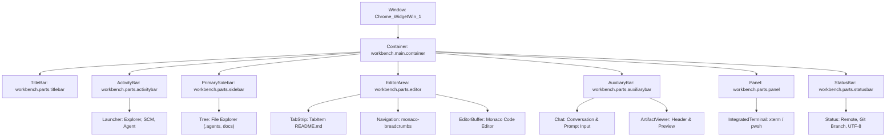

<!-- SPDX-License-Identifier: Apache-2.0 -->
<!-- Copyright (c) 2026 Amir Farhadi -->

[ 🏠 ADCE Home ](../../README.md) › [ 📚 App Hierarchies ](./README.md) › **02. Antigravity IDE Profile**

---

# Antigravity IDE / VS Code (Monaco/Electron) UI Automation Hierarchy & Semantic Profile

> **Document Status:** Active / Partial Resting-State Baseline (10 of 16 Surfaces Harvested)
> **Target Engine:** Chromium / Electron / Monaco (`Chrome_WidgetWin_1`)
> **Verification Date:** 2026-09-05 06:39:45 UTC
> **Target HWND:** `0x0001076E` | **PID:** `1180` | **Window Title:** `active-desktop-context-engine - Antigravity IDE`
> **Methodology Notice:** Physical controls in Steps 1 through 10 represent resting workbench zones harvested live. Modal overlays (Command Palette input widget, Find/Replace, Quick Open) and secondary configuration workspaces (Settings editor, Extensions view) remain unobserved.

---

## 1. Physical Window & Process Specification

| Property | Physical Telemetry Value | Architectural Significance |
| :--- | :--- | :--- |
| **Process Name** | `Antigravity IDE` | Multi-process Electron runtime architecture |
| **PID** | `1180` | Host main UI workbench window process |
| **Window HWND** | `0x0001076E` | Win32 top-level desktop window handle |
| **Window Class** | `Chrome_WidgetWin_1` | Standard Chromium / Electron top-level window class |
| **Window Title** | `active-desktop-context-engine - Antigravity IDE` | Workspace directory and active editor context |
| **Window Bounds** | `[X=715, Y=0, W=564, H=584]` | Full desktop window client envelope |

---

## 2. Pre-Profiling Surface Inventory

Before claiming complete profile coverage, the target workbench state space is cataloged across five UI categories:

| ID | Surface Category | Target Controls & UI Patterns | Expected Pane / Zone | Activation Mechanism | Physical Capture Status |
| :--- | :--- | :--- | :--- | :--- | :--- |
| **S1** | Activity Bar Switcher | `workbench.parts.activitybar`, Action items | `ActivityBar` / `TabBar` | Resting window state | **Verified Live** (Step 1) |
| **S2** | Primary Sidebar Explorer | `workbench.parts.sidebar`, `monaco-list-row` | `PrimarySidebar` / `SidebarExplorer` | Resting window state | **Verified Live** (Step 2) |
| **S3** | Editor Tab Strip | `workbench.parts.editor`, `tabs-container`, Tab items | `MainContent` / `TabBar` | Resting window state | **Verified Live** (Step 3) |
| **S4** | Monaco Code Buffer | `native-edit-context`, `monaco-editor` | `MainContent` / `EditorBuffer` | Resting window state | **Verified Live** (Step 4) |
| **S5** | Editor Breadcrumbs | `monaco-breadcrumb-item` | `MainContent` / `NavigationPanel` | Resting window state | **Verified Live** (Step 5) |
| **S6** | Auxiliary Sidebar Toggle | `workbench.parts.auxiliarybar`, CheckBox | `AuxiliarySidebar` / `ChatConversation` | Resting window state | **Verified Live** (Step 6) |
| **S7** | Artifact Viewer Panel | Artifact header group | `MainContent` / `TabBar` | Resting window state | **Verified Live** (Step 7) |
| **S8** | Integrated Terminal | `workbench.parts.panel`, `xterm` | `BottomPanel` / `Terminal` | Resting window state | **Verified Live** (Step 8) |
| **S9** | Status Bar Indicators | `workbench.parts.statusbar`, Status items | `StatusBar` / `StatusBar` | Resting window state | **Verified Live** (Step 9) |
| **S10** | Top Bar Menu Action | `monaco-menu`, `MenuItem` | `TopBar` / `NavigationPanel` | Alt key / View menu click | **Verified Live** (Step 10) |
| **S11** | Command Palette Overlay | `quickInputWidget`, Filtered input | `OverlayModal` / `CommandPalette` | `Ctrl+Shift+P` | **Pending Live Capture** |
| **S12** | Settings Editor | `workbench.settings.editor`, Search, Categories | `MainContent` / `NavigationPanel` | `Ctrl+,` | **Pending Live Capture** |
| **S13** | In-Editor Find / Replace | `find-widget`, Replace toggle | `MainContent` / `NavigationPanel` | `Ctrl+F` | **Pending Live Capture** |
| **S14** | Source Control Staging | `workbench.view.scm`, Diff list | `PrimarySidebar` / `SidebarExplorer` | `Ctrl+Shift+G` | **Pending Live Capture** |
| **S15** | Extensions Marketplace | `workbench.view.extensions`, Search bar | `PrimarySidebar` / `NavigationPanel` | `Ctrl+Shift+X` | **Pending Live Capture** |
| **S16** | Notification Toasts | `notifications-toasts`, Action buttons | `OverlayModal` / `StatusBar` | System notice / error trigger | **Pending Live Capture** |

---

## 3. Structural Container Anatomy

The Antigravity IDE interface is organized as a multi-pane Monaco/Electron workbench partitioned into five primary layout zones:
1. **Activity Bar (`workbench.parts.activitybar`):** Activity switcher for Explorer, Search, Source Control, and Agent.
2. **Primary Sidebar (`workbench.parts.sidebar`):** Docked drawer hosting the repository file tree (`workbench.explorer.fileView`) and accordion headers.
3. **Editor Area (`workbench.parts.editor`):** Tab strip (`tabs-container`) and Monaco code editor buffer (`monaco-editor`).
4. **Auxiliary Bar (`workbench.parts.auxiliarybar`):** Secondary drawer hosting the Antigravity AI Agent chat panel and Artifact Viewer.
5. **Bottom Panel (`workbench.parts.panel`):** Integrated terminal (`xterm`), output channel, and debug console.
6. **Status Bar (`workbench.parts.statusbar`):** Git branch, language mode, and telemetry status.

> [!TIP]
> **Wide Diagram View:** For fluid zooming, panning, and fullscreen exploration, open the [Interactive HTML Diagram](../diagrams/antigravity_ide_hierarchy_diagram.html).



---

## 3. Empirical Telemetry Matrix

| Step | Zone Tag | Stimulus | Physical UIA Control | Bounds `[X, Y, W, H]` | ADCE Prediction | Correct? | Screenshot |
| :---: | :--- | :--- | :--- | :--- | :--- | :---: | :---: |
| 1 | **ActivityBar** | `Focus Activity Bar Button` | [TabItem] (Explorer (Ctrl+Shift+E) - 1 unsaved file Explorer (Ctrl+Shift+E) - 1 unsaved file) | `[715, 35, 42, 42]` | Zone: `TabBar`<br>Pane: `ActivityBar`<br>Path: `[ActivityBar, ActivityBar]` | ✅ | [`step_01_activity_bar.png`](../media/antigravity_telemetry/step_01_activity_bar.png) |
| 2 | **SidebarExplorer** | `Focus File Explorer Item (Ctrl+Shift+E)` | [TreeItem] `list_id_3_0` (.agents) | `[757, 92, 169, 22]` | Zone: `SidebarExplorer`<br>Pane: `PrimarySidebar`<br>Path: `[PrimarySidebar, Explorer]` | ✅ | [`step_02_sidebar_explorer.png`](../media/antigravity_telemetry/step_02_sidebar_explorer.png) |
| 3 | **EditorTabStrip** | `Focus Active Editor TabItem` | [TabItem] (README.md) | `[926, 35, 233, 30]` | Zone: `TabBar`<br>Pane: `MainContent`<br>Path: `[MainContent, Editor]` | ✅ | [`step_03_editor_tabstrip.png`](../media/antigravity_telemetry/step_03_editor_tabstrip.png) |
| 4 | **EditorBuffer** | `Focus Monaco Editor Text Area` | [Edit] (README.md) | `[972, 87, 131, 19]` | Zone: `EditorBuffer`<br>Pane: `MainContent`<br>Path: `[MainContent, Editor]` | ✅ | [`step_04_editor_buffer.png`](../media/antigravity_telemetry/step_04_editor_buffer.png) |
| 5 | **Breadcrumbs** | `Focus Editor Breadcrumb Item` | [ListItem] (active-desktop-context-engine > README.md) | `[961, 65, 19, 22]` | Zone: `NavigationPanel`<br>Pane: `MainContent`<br>Path: `[MainContent, Editor]` | ✅ | [`step_05_breadcrumbs.png`](../media/antigravity_telemetry/step_05_breadcrumbs.png) |
| 6 | **AgentPanelToggle** | `Focus Toggle Agent Button (Ctrl+Alt+B)` | [CheckBox] (Toggle Agent (Ctrl+Alt+B)) | `[989, 6, 22, 22]` | Zone: `ChatConversation`<br>Pane: `AuxiliarySidebar`<br>Path: `[AuxiliarySidebar, Chat, Conversation]` | ✅ | [`step_06_agent_panel_toggle.png`](../media/antigravity_telemetry/step_06_agent_panel_toggle.png) |
| 7 | **ArtifactViewerHeader** | `Focus Artifact Viewer Panel Header` | [Group] (Artifact Viewer header) | `[-11351, 35, 154, 30]` | Zone: `TabBar`<br>Pane: `MainContent`<br>Path: `[MainContent, Editor]` | ✅ | [`step_07_artifact_header.png`](../media/antigravity_telemetry/step_07_artifact_header.png) |
| 8 | **IntegratedTerminal** | `Focus Terminal Viewport (Ctrl+J)` | [Group] () | `[715, 584, 564, 170]` | Zone: `Terminal`<br>Pane: `BottomPanel`<br>Path: `[BottomPanel, Terminal]` | ✅ | [`step_08_terminal_panel.png`](../media/antigravity_telemetry/step_08_terminal_panel.png) |
| 9 | **StatusBar** | `Focus Status Bar Indicator` | [Group] `status.host` (remote) | `[715, 562, 39, 22]` | Zone: `StatusBar`<br>Pane: `StatusBar`<br>Path: `[StatusBar, StatusBar]` | ✅ | [`step_09_statusbar.png`](../media/antigravity_telemetry/step_09_statusbar.png) |
| 10 | **TopBarMenuItem** | `Focus View Menu -> Command Palette...` | [MenuItem] "Command Palette... Ctrl+Shift+P" | `[0, 35, 260, 26]` | Zone: `CommandPalette`<br>Pane: `OverlayModal`<br>Path: `[OverlayModal, QuickOpen]` | ❌ | [`step_10_topbar_menuitem_misclassification.png`](../media/antigravity_telemetry/step_10_topbar_menuitem_misclassification.png) |

---

## 4. Ancestor Hierarchy Traces & Physical Dissection

### Step 1: ActivityBar — Activity Bar Action Launcher Button

- **Stimulus:** `Focus Activity Bar Button`
- **Physical Focus:** `[TabItem]` Name='`Explorer (Ctrl+Shift+E) - 1 unsaved file Explorer (Ctrl+Shift+E) - 1 unsaved file`' AutoId='``' Class='`action-item icon checked`'
- **Bounds:** `[X=715, Y=35, Width=42, Height=42]`
- **ADCE Output:** Zone: `TabBar`, Pane: `ActivityBar`, ActiveView: `ActivityBar`, Section: `null`

#### Physical Ancestor Chain (Leaf -> Root)
```text
[0] [TabItem] Name='Explorer (Ctrl+Shift+E) - 1 unsaved file Explorer (Ctrl+Shift+E) - 1 unsaved file' AutoId='' Cls='action-item icon checked'
[1] [Tab] Name='Active View Switcher' AutoId='' Cls='actions-container'
[2] [Pane] Name='' AutoId='' Cls='file-icons-enabled monaco-enable-motion monaco-workbench windows chromium vs-dark vscode-theme-defaults-themes-dark_modern-json nopanel'
[3] [Group] Name='' AutoId='' Cls=''
[4] [Document] Name='active-desktop-context-engine - Antigravity IDE' AutoId='RootWebArea' Cls=''
[5] [Pane] Name='' AutoId='' Cls='View'
[6] [Pane] Name='' AutoId='' Cls='View'
[7] [Pane] Name='' AutoId='' Cls='View'
[8] [Pane] Name='' AutoId='' Cls='ClientView'
[9] [Pane] Name='' AutoId='' Cls='WinFrameView'
[10] [Pane] Name='' AutoId='' Cls='NonClientView'
[11] [Pane] Name='active-desktop-context-engine - Antigravity IDE' AutoId='' Cls='RootView'
[12] [Pane] Name='active-desktop-context-engine - Antigravity IDE' AutoId='' Cls='Chrome_WidgetWin_1'
```


### Step 2: SidebarExplorer — Primary Sidebar File Explorer Tree Item

- **Stimulus:** `Focus File Explorer Item (Ctrl+Shift+E)`
- **Physical Focus:** `[TreeItem]` Name='`.agents`' AutoId='`list_id_3_0`' Class='`monaco-list-row`'
- **Bounds:** `[X=757, Y=92, Width=169, Height=22]`
- **ADCE Output:** Zone: `SidebarExplorer`, Pane: `PrimarySidebar`, ActiveView: `Explorer`, Section: `null`

#### Physical Ancestor Chain (Leaf -> Root)
```text
[0] [TreeItem] Name='.agents' AutoId='list_id_3_0' Cls='monaco-list-row'
[1] [Tree] Name='Files Explorer' AutoId='' Cls='monaco-list list_id_3 mouse-support element-focused selection-single'
[2] [Pane] Name='' AutoId='' Cls='file-icons-enabled monaco-enable-motion monaco-workbench windows chromium vs-dark vscode-theme-defaults-themes-dark_modern-json nopanel'
[3] [Group] Name='' AutoId='' Cls=''
[4] [Document] Name='active-desktop-context-engine - Antigravity IDE' AutoId='RootWebArea' Cls=''
[5] [Pane] Name='' AutoId='' Cls='View'
[6] [Pane] Name='' AutoId='' Cls='View'
[7] [Pane] Name='' AutoId='' Cls='View'
[8] [Pane] Name='' AutoId='' Cls='ClientView'
[9] [Pane] Name='' AutoId='' Cls='WinFrameView'
[10] [Pane] Name='' AutoId='' Cls='NonClientView'
[11] [Pane] Name='active-desktop-context-engine - Antigravity IDE' AutoId='' Cls='RootView'
[12] [Pane] Name='active-desktop-context-engine - Antigravity IDE' AutoId='' Cls='Chrome_WidgetWin_1'
```


### Step 3: EditorTabStrip — Editor Area Active Document Tab

- **Stimulus:** `Focus Active Editor TabItem`
- **Physical Focus:** `[TabItem]` Name='`README.md`' AutoId='``' Class='`tab tab-actions-right sizing-fit has-icon tab-border-bottom active selected tab-border-top`'
- **Bounds:** `[X=926, Y=35, Width=233, Height=30]`
- **ADCE Output:** Zone: `TabBar`, Pane: `MainContent`, ActiveView: `Editor`, Section: `null`

#### Physical Ancestor Chain (Leaf -> Root)
```text
[0] [TabItem] Name='README.md' AutoId='' Cls='tab tab-actions-right sizing-fit has-icon tab-border-bottom active selected tab-border-top'
[1] [Tab] Name='' AutoId='' Cls='tabs-container'
[2] [Group] Name='' AutoId='' Cls='title tabs show-file-icons'
[3] [Group] Name='' AutoId='workbench.parts.editor' Cls='part editor'
[4] [Pane] Name='' AutoId='' Cls='file-icons-enabled monaco-enable-motion monaco-workbench windows chromium vs-dark vscode-theme-defaults-themes-dark_modern-json nopanel'
[5] [Group] Name='' AutoId='' Cls=''
[6] [Document] Name='active-desktop-context-engine - Antigravity IDE' AutoId='RootWebArea' Cls=''
[7] [Pane] Name='' AutoId='' Cls='View'
[8] [Pane] Name='' AutoId='' Cls='View'
[9] [Pane] Name='' AutoId='' Cls='View'
[10] [Pane] Name='' AutoId='' Cls='ClientView'
[11] [Pane] Name='' AutoId='' Cls='WinFrameView'
[12] [Pane] Name='' AutoId='' Cls='NonClientView'
```


### Step 4: EditorBuffer — Monaco Code Editor Document Buffer

- **Stimulus:** `Focus Monaco Editor Text Area`
- **Physical Focus:** `[Edit]` Name='`README.md`' AutoId='``' Class='`native-edit-context`'
- **Bounds:** `[X=972, Y=87, Width=131, Height=19]`
- **ADCE Output:** Zone: `EditorBuffer`, Pane: `MainContent`, ActiveView: `Editor`, Section: `null`

#### Physical Ancestor Chain (Leaf -> Root)
```text
[0] [Edit] Name='README.md' AutoId='' Cls='native-edit-context'
[1] [Text] Name='' AutoId='' Cls='monaco-editor no-user-select  showUnused showDeprecated vs-dark focused'
[2] [Group] Name='README.md' AutoId='' Cls='editor-instance'
[3] [Group] Name='' AutoId='workbench.parts.editor' Cls='part editor'
[4] [Pane] Name='' AutoId='' Cls='file-icons-enabled monaco-enable-motion monaco-workbench windows chromium vs-dark vscode-theme-defaults-themes-dark_modern-json nopanel'
[5] [Group] Name='' AutoId='' Cls=''
[6] [Document] Name='active-desktop-context-engine - Antigravity IDE' AutoId='RootWebArea' Cls=''
[7] [Pane] Name='' AutoId='' Cls='View'
[8] [Pane] Name='' AutoId='' Cls='View'
[9] [Pane] Name='' AutoId='' Cls='View'
[10] [Pane] Name='' AutoId='' Cls='ClientView'
[11] [Pane] Name='' AutoId='' Cls='WinFrameView'
[12] [Pane] Name='' AutoId='' Cls='NonClientView'
```


### Step 5: Breadcrumbs — Editor Path Breadcrumb Navigation

- **Stimulus:** `Focus Editor Breadcrumb Item`
- **Physical Focus:** `[ListItem]` Name='`active-desktop-context-engine > README.md`' AutoId='``' Class='`monaco-breadcrumb-item`'
- **Bounds:** `[X=961, Y=65, Width=19, Height=22]`
- **ADCE Output:** Zone: `NavigationPanel`, Pane: `MainContent`, ActiveView: `Editor`, Section: `null`

#### Physical Ancestor Chain (Leaf -> Root)
```text
[0] [ListItem] Name='active-desktop-context-engine > README.md' AutoId='' Cls='monaco-breadcrumb-item'
[1] [List] Name='' AutoId='' Cls='monaco-breadcrumbs'
[2] [Group] Name='' AutoId='' Cls='title tabs show-file-icons'
[3] [Group] Name='' AutoId='workbench.parts.editor' Cls='part editor'
[4] [Pane] Name='' AutoId='' Cls='file-icons-enabled monaco-enable-motion monaco-workbench windows chromium vs-dark vscode-theme-defaults-themes-dark_modern-json nopanel'
[5] [Group] Name='' AutoId='' Cls=''
[6] [Document] Name='active-desktop-context-engine - Antigravity IDE' AutoId='RootWebArea' Cls=''
[7] [Pane] Name='' AutoId='' Cls='View'
[8] [Pane] Name='' AutoId='' Cls='View'
[9] [Pane] Name='' AutoId='' Cls='View'
[10] [Pane] Name='' AutoId='' Cls='ClientView'
[11] [Pane] Name='' AutoId='' Cls='WinFrameView'
[12] [Pane] Name='' AutoId='' Cls='NonClientView'
```


### Step 6: AgentPanelToggle — Antigravity Agent Panel Action Toggle

- **Stimulus:** `Focus Toggle Agent Button (Ctrl+Alt+B)`
- **Physical Focus:** `[CheckBox]` Name='`Toggle Agent (Ctrl+Alt+B)`' AutoId='``' Class='`action-label checked codicon codicon-layout-sidebar-right`'
- **Bounds:** `[X=989, Y=6, Width=22, Height=22]`
- **ADCE Output:** Zone: `ChatConversation`, Pane: `AuxiliarySidebar`, ActiveView: `Chat`, Section: `Conversation`

#### Physical Ancestor Chain (Leaf -> Root)
```text
[0] [CheckBox] Name='Toggle Agent (Ctrl+Alt+B)' AutoId='' Cls='action-label checked codicon codicon-layout-sidebar-right'
[1] [ToolBar] Name='Toggle Agent (Ctrl+Alt+B)' AutoId='' Cls='actions-container'
[2] [Pane] Name='' AutoId='' Cls='file-icons-enabled monaco-enable-motion monaco-workbench windows chromium vs-dark vscode-theme-defaults-themes-dark_modern-json nopanel'
[3] [Group] Name='' AutoId='' Cls=''
[4] [Document] Name='Toggle Agent (Ctrl+Alt+B)' AutoId='RootWebArea' Cls=''
[5] [Pane] Name='' AutoId='' Cls='View'
[6] [Pane] Name='' AutoId='' Cls='View'
[7] [Pane] Name='' AutoId='' Cls='View'
[8] [Pane] Name='' AutoId='' Cls='ClientView'
[9] [Pane] Name='' AutoId='' Cls='WinFrameView'
[10] [Pane] Name='' AutoId='' Cls='NonClientView'
[11] [Pane] Name='Toggle Agent (Ctrl+Alt+B)' AutoId='' Cls='RootView'
[12] [Pane] Name='Toggle Agent (Ctrl+Alt+B)' AutoId='' Cls='Chrome_WidgetWin_1'
```


### Step 7: ArtifactViewerHeader — Antigravity Artifact Viewer Header

- **Stimulus:** `Focus Artifact Viewer Panel Header`
- **Physical Focus:** `[Group]` Name='`Artifact Viewer header`' AutoId='``' Class='`monaco-icon-label codicon-jetski-artifacts-implementation-plan-icon predefined-file-icon tab-label tab-label-has-badge`'
- **Bounds:** `[X=-11351, Y=35, Width=154, Height=30]`
- **ADCE Output:** Zone: `TabBar`, Pane: `MainContent`, ActiveView: `Editor`, Section: `null`

#### Physical Ancestor Chain (Leaf -> Root)
```text
[0] [Group] Name='Artifact Viewer header' AutoId='' Cls='monaco-icon-label codicon-jetski-artifacts-implementation-plan-icon predefined-file-icon tab-label tab-label-has-badge'
[1] [TabItem] Name='Artifact Viewer header' AutoId='' Cls='tab tab-actions-right sizing-fit has-icon'
[2] [Tab] Name='' AutoId='' Cls='tabs-container'
[3] [Group] Name='' AutoId='' Cls='title tabs show-file-icons'
[4] [Group] Name='' AutoId='workbench.parts.editor' Cls='part editor'
[5] [Pane] Name='' AutoId='' Cls='file-icons-enabled monaco-enable-motion monaco-workbench windows chromium vs-dark vscode-theme-defaults-themes-dark_modern-json nopanel'
[6] [Group] Name='' AutoId='' Cls=''
[7] [Document] Name='Artifact Viewer header' AutoId='RootWebArea' Cls=''
[8] [Pane] Name='' AutoId='' Cls='View'
[9] [Pane] Name='' AutoId='' Cls='View'
[10] [Pane] Name='' AutoId='' Cls='View'
[11] [Pane] Name='' AutoId='' Cls='ClientView'
[12] [Pane] Name='' AutoId='' Cls='WinFrameView'
```


### Step 8: IntegratedTerminal — Bottom Panel Integrated Terminal / Console

- **Stimulus:** `Focus Terminal Viewport (Ctrl+J)`
- **Physical Focus:** `[Group]` Name='``' AutoId='``' Class='`terminal xterm focus`'
- **Bounds:** `[X=715, Y=584, Width=564, Height=170]`
- **ADCE Output:** Zone: `Terminal`, Pane: `BottomPanel`, ActiveView: `Terminal`, Section: `null`

#### Physical Ancestor Chain (Leaf -> Root)
```text
[0] [Group] Name='' AutoId='' Cls='terminal xterm focus'
[1] [Pane] Name='' AutoId='' Cls='file-icons-enabled monaco-enable-motion monaco-workbench windows chromium vs-dark vscode-theme-defaults-themes-dark_modern-json nopanel'
[2] [Group] Name='' AutoId='' Cls=''
[3] [Document] Name='active-desktop-context-engine - Antigravity IDE' AutoId='RootWebArea' Cls=''
[4] [Pane] Name='' AutoId='' Cls='View'
[5] [Pane] Name='' AutoId='' Cls='View'
[6] [Pane] Name='' AutoId='' Cls='View'
[7] [Pane] Name='' AutoId='' Cls='ClientView'
[8] [Pane] Name='' AutoId='' Cls='WinFrameView'
[9] [Pane] Name='' AutoId='' Cls='NonClientView'
[10] [Pane] Name='active-desktop-context-engine - Antigravity IDE' AutoId='' Cls='RootView'
[11] [Pane] Name='active-desktop-context-engine - Antigravity IDE' AutoId='' Cls='Chrome_WidgetWin_1'
[12] [Pane] Name='Job Search' AutoId='' Cls='#32769'
```


### Step 9: StatusBar — Workbench Status Bar & Telemetry Indicator

- **Stimulus:** `Focus Status Bar Indicator`
- **Physical Focus:** `[Group]` Name='`remote`' AutoId='`status.host`' Class='`statusbar-item left remote-kind has-background-color first-visible-item`'
- **Bounds:** `[X=715, Y=562, Width=39, Height=22]`
- **ADCE Output:** Zone: `StatusBar`, Pane: `StatusBar`, ActiveView: `StatusBar`, Section: `null`

#### Physical Ancestor Chain (Leaf -> Root)
```text
[0] [Group] Name='remote' AutoId='status.host' Cls='statusbar-item left remote-kind has-background-color first-visible-item'
[1] [StatusBar] Name='' AutoId='workbench.parts.statusbar' Cls='part statusbar status-border-top'
[2] [Pane] Name='' AutoId='' Cls='file-icons-enabled monaco-enable-motion monaco-workbench windows chromium vs-dark vscode-theme-defaults-themes-dark_modern-json nopanel'
[3] [Group] Name='' AutoId='' Cls=''
[4] [Document] Name='active-desktop-context-engine - Antigravity IDE' AutoId='RootWebArea' Cls=''
[5] [Pane] Name='' AutoId='' Cls='View'
[6] [Pane] Name='' AutoId='' Cls='View'
[7] [Pane] Name='' AutoId='' Cls='View'
[8] [Pane] Name='' AutoId='' Cls='ClientView'
[9] [Pane] Name='' AutoId='' Cls='WinFrameView'
[10] [Pane] Name='' AutoId='' Cls='NonClientView'
[11] [Pane] Name='active-desktop-context-engine - Antigravity IDE' AutoId='' Cls='RootView'
[12] [Pane] Name='active-desktop-context-engine - Antigravity IDE' AutoId='' Cls='Chrome_WidgetWin_1'
```


### Step 10: TopBarMenuItem (Misclassification Analysis & Action-Invoker Collision)

- **Stimulus:** `Focus View Menu -> Command Palette...`
- **Physical Focus:** `[MenuItem]` Name='`Command Palette...  Ctrl+Shift+P`' AutoId='' Class='`action-item`'
- **Observed HUD Output:**
  - `Focus: [MenuItem] "Command Palette... Ctrl+Shift+P"`
  - `Zone: [CommandPalette] | Pane: [OverlayModal]`
  - `Hierarchy: OverlayModal > QuickOpen`
- **Correct Target Semantics:**
  - `Zone: DesktopSemanticZone.NavigationPanel`
  - `Pane: WindowPaneLocation.TopBar`
  - `SemanticPath: [TopBar, MenuBar]`
- **Root Cause Dissection:**
  The engine evaluated `ResolveSemanticZone` in `UiaExtractionEngine.cs`:
  ```csharp
  if (autoId.Contains("command-palette", StringComparison.OrdinalIgnoreCase) ||
      name.Contains("Command Palette", StringComparison.OrdinalIgnoreCase))
  {
      return DesktopSemanticZone.CommandPalette;
  }
  ```
  The condition matched on `name.Contains("Command Palette")` without verifying `ControlType`.
  Because the returned zone was `DesktopSemanticZone.CommandPalette`, `InferPaneFromZone` mapped the pane to `WindowPaneLocation.OverlayModal` and `InferViewFromZone` mapped the view to `QuickOpen`.
  The menu item names the command to execute, but the active interaction surface is an ephemeral dropdown menu attached to the titlebar, not the command palette modal overlay.


---

## 5. Viewport Boundary & In-Content Semantics

Just as with Gecko web documents, Chromium / Monaco applications require strict structural boundary isolation:

1. **Monaco Code Buffer Isolation:** When focus is inside `monaco-editor` or an `Edit`/`Document` control inside `workbench.parts.editor`, it is strictly `WindowPaneLocation.MainContent` and `DesktopSemanticZone.EditorBuffer`. Chrome navigation heuristics must not apply.
2. **Auxiliary Agent Chat Isolation:** The AI chat panel and Artifact Viewer inside `workbench.parts.auxiliarybar` contain arbitrary HTML elements (buttons, inputs, lists). They must map to `WindowPaneLocation.AuxiliarySidebar` and `DesktopSemanticZone.ChatConversation` or `DesktopSemanticZone.AuxiliaryToolPanel`, never leaking into `MainContent`.
3. **Integrated Terminal Isolation:** The terminal pane inside `workbench.parts.panel` must resolve to `WindowPaneLocation.BottomPanel` and `DesktopSemanticZone.Terminal`.
4. **Activity Bar & Primary Sidebar:** Launcher buttons in `workbench.parts.activitybar` map to `WindowPaneLocation.ActivityBar`, while the tree items in `workbench.parts.sidebar` map to `WindowPaneLocation.PrimarySidebar` and `DesktopSemanticZone.SidebarExplorer`.
5. **Top Bar Menu & Command Invoker Isolation:** Menu items (`ControlType.MenuItem`) and dropdown menus (`monaco-menu`, `context-view`) spawned from `workbench.parts.titlebar` must map to `WindowPaneLocation.TopBar` and `DesktopSemanticZone.NavigationPanel`. They must never be classified as the target zone or modal dialog they invoke.

---

## 6. Active Strategy Resolver Architecture (`ChromiumElectronZoneResolver`)

Following the Stage 1 architectural decomposition, Chromium / Electron IDE classification logic was extracted from procedural engine code into the dedicated strategy resolver [`ChromiumElectronZoneResolver.cs`](../../src/ADCE.Extraction/Resolvers/ChromiumElectronZoneResolver.cs) implementing `IArchetypeZoneResolver`.

### 6.1 Architectural Principle: Workbench Container Hierarchy & Action-Invoker Guard

Rather than relying on fragile control names or text strings (which can collide with menu labels or file names), classification is driven by structural workbench containers and explicit control types:

1. **Workbench Container Anchors:**
   VS Code and Electron IDEs structure layout panels under explicit workbench container IDs:
   - `workbench.parts.editor` in ancestors → `MainContent` / `EditorBuffer`
   - `workbench.parts.auxiliarybar` in ancestors → `AuxiliarySidebar` / `ChatConversation`
   - `workbench.parts.panel` in ancestors → `BottomPanel` / `Terminal`
   - `workbench.parts.statusbar` in ancestors → `StatusBar` / `StatusBar`
   - `workbench.parts.activitybar` in ancestors → `ActivityBar` / `ActivityBar`

2. **Action-Invoker vs. Target Guard:**
   Menu items (`ControlType.MenuItem`) spawned from `workbench.parts.titlebar` or context menus (`monaco-menu`, `context-view`) that invoke modal commands (e.g. `Command Palette...  Ctrl+Shift+P`) must resolve strictly to `TopBar` / `NavigationPanel`, preventing them from colliding with the target overlay modal (`OverlayModal` / `CommandPalette`).

```csharp
public sealed class ChromiumElectronZoneResolver : IArchetypeZoneResolver
{
    public static readonly ChromiumElectronZoneResolver Instance = new();
    public DesktopAppArchetype SupportedArchetype => DesktopAppArchetype.ChromiumElectron;

    public bool TryResolve(
        FocusedControlDescriptor control,
        AncestorChain ancestors,
        out SemanticResolution resolution)
    {
        string cType = control.ControlType;
        string name = control.Name;
        string autoId = control.AutomationId;
        string cls = control.ClassName;
        var paths = ancestors.ContainerPaths;
        var classes = ancestors.ContainerClasses;

        // 1. Ephemeral Top Bar Menu Items & Dropdown Overlays (Action-Invoker Guard)
        if (cType.Equals("MenuItem", StringComparison.OrdinalIgnoreCase) ||
            cType.Equals("Menu", StringComparison.OrdinalIgnoreCase) ||
            cls.Contains("monaco-menu", StringComparison.OrdinalIgnoreCase) ||
            cls.Contains("context-view", StringComparison.OrdinalIgnoreCase) ||
            classes.Any(c => c.Contains("monaco-menu", StringComparison.OrdinalIgnoreCase) || c.Contains("context-view", StringComparison.OrdinalIgnoreCase)))
        {
            resolution = new SemanticResolution(DesktopSemanticZone.NavigationPanel, WindowPaneLocation.TopBar, "MenuBar", "Menu");
            return true;
        }

        // 2. Centered Modal Overlays (Command Palette / Quick Open)
        if (control.IsOverlay ||
            autoId.Contains("quickInput", StringComparison.OrdinalIgnoreCase) ||
            cls.Contains("quick-input", StringComparison.OrdinalIgnoreCase) ||
            classes.Any(c => c.Contains("quick-input", StringComparison.OrdinalIgnoreCase)))
        {
            var zone = autoId.Contains("command-palette", StringComparison.OrdinalIgnoreCase)
                ? DesktopSemanticZone.CommandPalette
                : DesktopSemanticZone.QuickOpen;

            resolution = new SemanticResolution(zone, WindowPaneLocation.OverlayModal, "QuickOpen", null);
            return true;
        }

        // 3. AI Agent Auxiliary Drawer (Chat Prompt & Conversation Stream)
        if (autoId.Contains("antigravity.agentSidePanelInputBox", StringComparison.OrdinalIgnoreCase) ||
            name.Equals("Message input", StringComparison.OrdinalIgnoreCase) ||
            cls.Contains("chat-input", StringComparison.OrdinalIgnoreCase) ||
            cls.Contains("interactive-session", StringComparison.OrdinalIgnoreCase))
        {
            resolution = new SemanticResolution(DesktopSemanticZone.ChatPrompt, WindowPaneLocation.AuxiliarySidebar, "Chat", "ChatPrompt");
            return true;
        }

        if (autoId.Equals("conversation", StringComparison.OrdinalIgnoreCase) ||
            name.Equals("Agent Conversation", StringComparison.OrdinalIgnoreCase) ||
            name.Contains("Toggle Agent", StringComparison.OrdinalIgnoreCase) ||
            cls.Contains("codicon-layout-sidebar-right", StringComparison.OrdinalIgnoreCase) ||
            cls.Contains("antigravity-agent-side-panel", StringComparison.OrdinalIgnoreCase) ||
            paths.Any(p => p.Contains("workbench.parts.auxiliarybar", StringComparison.OrdinalIgnoreCase)))
        {
            resolution = new SemanticResolution(DesktopSemanticZone.ChatConversation, WindowPaneLocation.AuxiliarySidebar, "Chat", "Conversation");
            return true;
        }

        // 4. Activity Bar & Primary Sidebar
        if (autoId.Contains("workbench.parts.activitybar", StringComparison.OrdinalIgnoreCase) ||
            cls.Contains("activitybar", StringComparison.OrdinalIgnoreCase) ||
            paths.Any(p => p.Contains("workbench.parts.activitybar", StringComparison.OrdinalIgnoreCase)))
        {
            resolution = new SemanticResolution(DesktopSemanticZone.ActivityBar, WindowPaneLocation.ActivityBar, "ActivityBar", null);
            return true;
        }

        // 5. Monaco Editor Buffer & Document Viewport
        if (paths.Contains("workbench.parts.editor") ||
            classes.Any(c => c.Contains("monaco-editor")) ||
            cls.Contains("monaco-editor", StringComparison.OrdinalIgnoreCase))
        {
            resolution = new SemanticResolution(DesktopSemanticZone.EditorBuffer, WindowPaneLocation.MainContent, "Editor", null);
            return true;
        }

        // 6. Integrated Terminal Viewport
        if (paths.Contains("workbench.parts.panel") ||
            cls.Contains("terminal", StringComparison.OrdinalIgnoreCase) ||
            classes.Any(c => c.Contains("terminal")))
        {
            resolution = new SemanticResolution(DesktopSemanticZone.Terminal, WindowPaneLocation.BottomPanel, "Terminal", null);
            return true;
        }

        // 7. Status Bar Indicator
        if (paths.Contains("workbench.parts.statusbar") ||
            autoId.Contains("statusbar", StringComparison.OrdinalIgnoreCase) ||
            cls.Contains("statusbar", StringComparison.OrdinalIgnoreCase))
        {
            resolution = new SemanticResolution(DesktopSemanticZone.StatusBar, WindowPaneLocation.StatusBar, "StatusBar", null);
            return true;
        }

        resolution = SemanticResolution.Unresolved;
        return false;
    }
}
```
