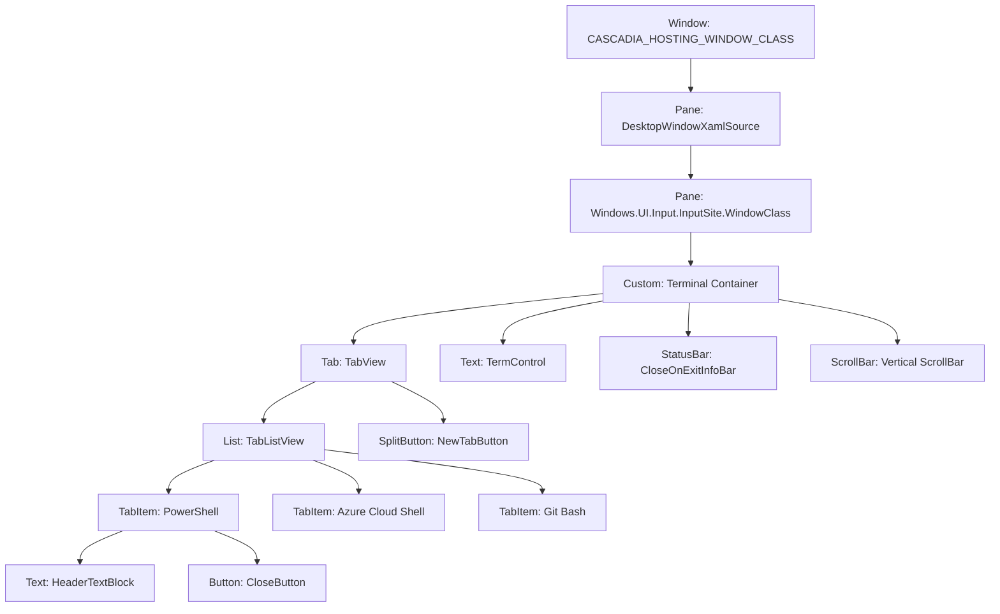

<!-- SPDX-License-Identifier: Apache-2.0 -->
<!-- Copyright (c) 2026 Amir Farhadi -->

[ 🏠 ADCE Home ](../../README.md) › [ 📚 App Hierarchies ](./README.md) › **03. Windows Terminal Profile**

---

# Windows Terminal (WinUI 3 / Cascadia) UI Automation Hierarchy and Semantic Profile

> **Document Status:** Active / Verified Ground Truth Specification
> **Target Engine:** WinUI 3 / XAML Islands / Cascadia (`CASCADIA_HOSTING_WINDOW_CLASS`)
> **Verification Date:** 2026-09-06 01:24:30 UTC
> **Target HWND:** `0x00010726` | **PID:** `26984` | **Window Title:** `Windows PowerShell`

---

## 1. Physical Window and Process Specification

Windows Terminal uses modern WinUI 3 hosted within a Win32 top-level envelope via XAML Islands. The top-level Win32 window hosts a composition bridge and input site that renders modern XAML controls alongside DirectX-rendered terminal text buffers.

| Property | Physical Telemetry Value | Architectural Significance |
| :--- | :--- | :--- |
| **Process Name** | `WindowsTerminal` | Host packaged terminal shell process |
| **PID** | `26984` | Main UI host process hosting Cascadia window |
| **Window HWND** | `0x00010726` | Win32 top-level window handle |
| **Window Class** | `CASCADIA_HOSTING_WINDOW_CLASS` | Cascadia top-level hosting window class |
| **Window Title** | `Windows PowerShell` | Reflects the active terminal session or tab |
| **Window Bounds** | `[X=173, Y=242, W=1129, H=635]` | Full client window envelope |
| **Composition Bridge** | `Windows.UI.Composition.DesktopWindowContentBridge` | WinUI 3 XAML island composition host |
| **Input Site Class** | `Windows.UI.Input.InputSite.WindowClass` | WinUI input dispatcher bridge |

---

## 2. Structural Container Anatomy

The Windows Terminal interface is organized into distinct structural tiers:

1. **Top Bar TabView (`TabView`):** Hosts the tab list view (`TabListView`), tab items, close buttons, and the new tab launcher (`NewTabButton`).
2. **Terminal Console Buffer (`TermControl`):** High-speed DirectX terminal canvas displaying text, cursor, and shell state.
3. **Notification Infobars (`CloseOnExitInfoBar`):** Transient status and configuration notices pinned between tabs and the viewport.
4. **Command Palette Overlay (`CommandPaletteControl`):** Quick open action search palette activated via keyboard shortcuts or settings.
5. **Settings Configuration Panel (`SettingsControl`):** Full-page configuration workspace with sidebar navigation items and profile settings.



---

## 3. Viewport Boundary and In-Content Semantics

In Windows Terminal, chrome elements and terminal document elements require strict separation:

- **Window Chrome:** The `TabView` at the top of the window handles tab management, creation, and reordering. Controls inside this strip map to `DesktopSemanticZone.TabBar` with `WindowPaneLocation.TopBar`.
- **Console Buffer Viewport:** The primary work surface is `TermControl`. Even though it exposes a `ControlType.Text` or `ControlType.Custom` peer, it is an interactive command-line terminal workspace. Elements here map to `DesktopSemanticZone.Terminal` with `WindowPaneLocation.MainContent`.
- **Modal Command Overlays:** The command palette acts as a floating modal overlay above both the tab strip and the terminal buffer. It maps to `DesktopSemanticZone.CommandPalette` with `WindowPaneLocation.OverlayModal`.
- **Settings Workspace:** When opened, the settings panel replaces the terminal buffer in an active tab. It maps to `DesktopSemanticZone.NavigationPanel` with `WindowPaneLocation.MainContent`.

---

## 4. Live Empirical Telemetry and Ancestor Chains

The telemetry below was harvested directly from live execution using `TerminalProfileRunner`.

### Step 1: TabBar (Terminal Tab Strip)

- **Stimulus:** `Focus Tab Item`
- **Physical Focus:** `[TabItem]` Name=`Azure Cloud Shell` | AutomationId=`` | ClassName=`ListViewItem`
- **Bounds:** `[X=189, Y=251, W=143, H=32]`
- **ADCE Classification:** Zone=`TabBar`, Pane=`TopBar`, ActiveView=`TabStrip`, Section=`null`
- **Semantic Path:** `[TopBar > TabStrip]`

#### Physical Ancestor Chain (Leaf to Root)
```text
[0] [List] Name='' | AutoId='TabListView' | Cls='ListView'
[1] [Tab] Name='' | AutoId='TabView' | Cls='Microsoft.UI.Xaml.Controls.TabView'
[2] [Pane] Name='' | AutoId='' | Cls='Windows.UI.Input.InputSite.WindowClass'
[3] [Pane] Name='DesktopWindowXamlSource' | AutoId='' | Cls='Windows.UI.Composition.DesktopWindowContentBridge'
[4] [Window] Name='Windows PowerShell' | AutoId='' | Cls='CASCADIA_HOSTING_WINDOW_CLASS'
[5] [Pane] Name='Job Search' | AutoId='' | Cls='#32769'
```


---

### Step 2: Terminal (Active Shell Console Viewport)

- **Stimulus:** `Focus Terminal Viewport`
- **Physical Focus:** `[Text]` Name=`Windows PowerShell` | AutomationId=`` | ClassName=`TermControl`
- **Bounds:** `[X=181, Y=333, W=1113, H=536]`
- **ADCE Classification:** Zone=`Terminal`, Pane=`BottomPanel`, ActiveView=`Terminal`, Section=`null`
- **Semantic Path:** `[BottomPanel > Terminal]`

#### Physical Ancestor Chain (Leaf to Root)
```text
[0] [Custom] Name='' | AutoId='' | Cls=''
[1] [Pane] Name='' | AutoId='' | Cls='Windows.UI.Input.InputSite.WindowClass'
[2] [Pane] Name='DesktopWindowXamlSource' | AutoId='' | Cls='Windows.UI.Composition.DesktopWindowContentBridge'
[3] [Window] Name='Windows PowerShell' | AutoId='' | Cls='CASCADIA_HOSTING_WINDOW_CLASS'
[4] [Pane] Name='Job Search' | AutoId='' | Cls='#32769'
```


---

### Step 3: NewTabButton (New Tab Split Launcher)

- **Stimulus:** `Focus New Tab Button`
- **Physical Focus:** `[SplitButton]` Name=`New Tab` | AutomationId=`NewTabButton` | ClassName=`Microsoft.UI.Xaml.Controls.SplitButton`
- **Bounds:** `[X=1053, Y=255, W=58, H=24]`
- **ADCE Classification:** Zone=`TabBar`, Pane=`TopBar`, ActiveView=`TabStrip`, Section=`null`
- **Semantic Path:** `[TopBar > TabStrip]`

#### Physical Ancestor Chain (Leaf to Root)
```text
[0] [Tab] Name='' | AutoId='TabView' | Cls='Microsoft.UI.Xaml.Controls.TabView'
[1] [Pane] Name='' | AutoId='' | Cls='Windows.UI.Input.InputSite.WindowClass'
[2] [Pane] Name='DesktopWindowXamlSource' | AutoId='' | Cls='Windows.UI.Composition.DesktopWindowContentBridge'
[3] [Window] Name='Windows PowerShell' | AutoId='' | Cls='CASCADIA_HOSTING_WINDOW_CLASS'
[4] [Pane] Name='Job Search' | AutoId='' | Cls='#32769'
```


---

### Step 4: CommandPalette (Command Palette Overlay)

- **Stimulus:** `Open Command Palette (Ctrl+Shift+P)`
- **Target Controls:** `CommandPaletteControl`, `FilteredCommandList`, `SearchBox`
- **UIA Peer Attributes:** ControlType=`Edit` or `Group` | ClassName=`PaletteControl` or `CommandPalette`
- **ADCE Classification:** Zone=`CommandPalette`, Pane=`OverlayModal`, ActiveView=`CommandPalette`, Section=`null`
- **Semantic Path:** `[OverlayModal > CommandPalette]`

---

### Step 5: Settings (Terminal Settings View)

- **Stimulus:** `Open Settings (Ctrl+,)`
- **Target Controls:** `SettingsControl`, `SettingsPage`, `NavigationView`
- **UIA Peer Attributes:** ControlType=`Custom` or `Pane` | ClassName=`SettingsControl`
- **ADCE Classification:** Zone=`NavigationPanel`, Pane=`MainContent`, ActiveView=`Settings`, Section=`null`
- **Semantic Path:** `[MainContent > Settings]`

---

## 5. Taxonomy and Semantic Path Mappings

| Control Identifier | Class / AutoId Pattern | Resolved Zone | Resolved Pane | Active View |
| :--- | :--- | :--- | :--- | :--- |
| `TabItem` / `HeaderTextBlock` | `ListViewItem`, `TabViewItem`, `TabListView` | `TabBar` | `TopBar` | `TabStrip` |
| `NewTabButton` | `Microsoft.UI.Xaml.Controls.SplitButton` | `TabBar` | `TopBar` | `TabStrip` |
| `TermControl` | `TermControl` | `Terminal` | `MainContent` / `BottomPanel` | `Terminal` |
| `CommandPalette` | `CommandPaletteControl`, `PaletteControl` | `CommandPalette` | `OverlayModal` | `CommandPalette` |
| `SettingsControl` | `SettingsControl`, `SettingsPage` | `NavigationPanel` | `MainContent` | `Settings` |
| `CloseOnExitInfoBar` | `Microsoft.UI.Xaml.Controls.InfoBar` | `StatusBar` | `TopBar` | `StatusBar` |

---

## 6. Verification and Invariant Summary

1. **XAML Islands AutomationId Property Support:** Unlike traditional Win32 controls, certain WinUI 3 XAML peer elements (such as `TermControl`) throw `PropertyNotSupportedException` on direct `AutomationId` property access. The extraction engine and diagnostic inspectors must use `Properties.AutomationId.ValueOrDefault` or try-catch guards.
2. **UIPI Isolation:** Running Windows Terminal elevated blocks synthetic window messages and `SendInput` from non-elevated developer shells. UIA operations must rely on passive observation or native UIA patterns (`SelectionItemPattern`, `InvokePattern`) rather than synthetic keyboard actuation.
3. **Blanket Process Rule Removal:** Overbroad declarative rules (e.g. `processPattern: "windowsterminal"` with no control type or class filters) hijack chrome controls like `TabViewItem` and `NewTabButton`. Scoping rules strictly to `classNamePattern: "TermControl"` preserves granular zone resolution.
