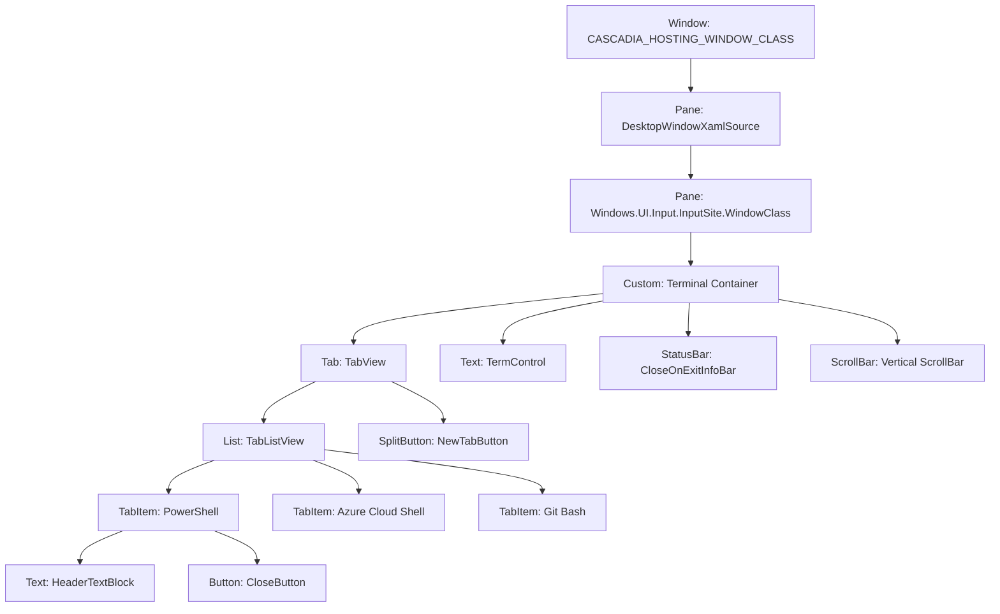

<!-- SPDX-License-Identifier: Apache-2.0 -->
<!-- Copyright (c) 2026 Amir Farhadi -->

[ 🏠 ADCE Home ](../../README.md) › [ 📚 App Hierarchies ](./README.md) › **03. Windows Terminal Profile**

---

# Windows Terminal (WinUI 3 / Cascadia) UI Automation Hierarchy and Semantic Profile

> **Document Status:** Active / Partial Resting-State Baseline (3 of 7 Surfaces Harvested)
> **Target Engine:** WinUI 3 / XAML Islands / Cascadia (`CASCADIA_HOSTING_WINDOW_CLASS`)
> **Verification Date:** 2026-09-06 01:24:30 UTC
> **Target HWND:** `0x00010726` | **PID:** `26984` | **Window Title:** `Windows PowerShell`
> **Methodology Notice:** Steps 1 through 3 were physically harvested from the live UI tree. Steps 4 through 6 (Caret dropdown menu, Settings workspace, Command Palette overlay) were not captured during the initial run due to UIPI blocking synthetic keystrokes.

---

## 1. Physical Window and Process Specification

Windows Terminal uses modern WinUI 3 hosted within a Win32 top-level envelope via XAML Islands. The top-level Win32 window hosts a composition bridge and input site that renders modern XAML controls alongside DirectX-rendered terminal text buffers.

| Property | Physical Telemetry Value | Architectural Significance |
| :--- | :--- | :--- |
| **Process Name** | `WindowsTerminal` | Host packaged terminal shell process |
| **PID** | `26984` | Main UI host process hosting Cascadia window |
| **Window HWND** | `0x00010726` | Win32 top-level window handle |
| **Window Class** | `CASCADIA_HOSTING_WINDOW_CLASS` | Cascadia top-level hosting window class |
| **Window Title** | `Windows PowerShell` | Reflects the active terminal session or tab |
| **Window Bounds** | `[X=173, Y=242, W=1129, H=635]` | Full client window envelope |
| **Composition Bridge** | `Windows.UI.Composition.DesktopWindowContentBridge` | WinUI 3 XAML island composition host |
| **Input Site Class** | `Windows.UI.Input.InputSite.WindowClass` | WinUI input dispatcher bridge |

---

## 2. Pre-Profiling Surface Inventory

Before claiming complete profile coverage, the target application state space must be enumerated across five UI categories:

| ID | Surface Category | Target Controls & UI Patterns | Expected Pane / Zone | Activation Mechanism | Physical Capture Status |
| :--- | :--- | :--- | :--- | :--- | :--- |
| **S1** | Primary Window Chrome | `TabView`, `TabListView`, `ListViewItem`, `CloseButton` | `TopBar` / `TabBar` | Resting window state | **Verified Live** (Step 1) |
| **S2** | Active Console Buffer | `TermControl`, `ScrollBar`, `RepeatButton` | `MainContent` / `Terminal` | Resting window state | **Verified Live** (Step 2) |
| **S3** | Tab Launcher Primary | `NewTabButton` (`SplitButton` primary action) | `TopBar` / `TabBar` | Resting window state | **Verified Live** (Step 3) |
| **S4** | Tab Launcher Caret Menu | `MenuFlyout`, Profile items, `Command Palette`, `Settings` | `OverlayModal` / `NavigationPanel` | Click caret toggle on `NewTabButton` | **Pending Live Capture** |
| **S5** | Settings Workspace | `NavigationView`, Navigation rail, Settings pages | `MainContent` / `NavigationPanel` | Caret menu -> Settings (`Ctrl+,`) | **Pending Live Capture** |
| **S6** | Command Palette Overlay | `AutoSuggestBox`, `FilteredCommandList` | `OverlayModal` / `CommandPalette` | Caret menu -> Command Palette (`Ctrl+Shift+P`) | **Pending Live Capture** |
| **S7** | Notification Infobar | `CloseOnExitInfoBar` (`InfoBar`), `StandardIcon`, `Message` | `TopBar` / `StatusBar` | Process exit with error | **Verified Live** (Inspector trace) |

---

## 3. Structural Container Anatomy

The Windows Terminal interface is organized into distinct structural tiers:

1. **Top Bar TabView (`TabView`):** Hosts the tab list view (`TabListView`), tab items, close buttons, and the new tab launcher (`NewTabButton`).
2. **Terminal Console Buffer (`TermControl`):** High-speed DirectX terminal canvas displaying text, cursor, and shell state.
3. **Notification Infobars (`CloseOnExitInfoBar`):** Transient status and configuration notices pinned between tabs and the viewport.
4. **Command Palette Overlay:** Quick open action search palette activated via keyboard shortcuts or settings.
5. **Settings Configuration Panel:** Full-page configuration workspace with sidebar navigation items and profile settings.



---

## 3. Viewport Boundary and In-Content Semantics

In Windows Terminal, chrome elements and terminal document elements require strict separation:

- **Window Chrome:** The `TabView` at the top of the window handles tab management, creation, and reordering. Controls inside this strip map to `DesktopSemanticZone.TabBar` with `WindowPaneLocation.TopBar`.
- **Console Buffer Viewport:** The primary work surface is `TermControl`. Even though it exposes a `ControlType.Text` or `ControlType.Custom` peer, it is an interactive command-line terminal workspace. Elements here map to `DesktopSemanticZone.Terminal` with `WindowPaneLocation.MainContent`.
- **Modal Command Overlays:** The command palette acts as a floating modal overlay above both the tab strip and the terminal buffer. It maps to `DesktopSemanticZone.CommandPalette` with `WindowPaneLocation.OverlayModal`.
- **Settings Workspace:** When opened, the settings panel replaces the terminal buffer in an active tab. It maps to `DesktopSemanticZone.NavigationPanel` with `WindowPaneLocation.MainContent`.

---

## 4. Live Empirical Telemetry and Ancestor Chains

The telemetry below was harvested directly from live execution using `TerminalProfileRunner`.

### Step 1: TabBar (Terminal Tab Strip)

- **Stimulus:** `Focus Tab Item`
- **Physical Focus:** `[TabItem]` Name=`Azure Cloud Shell` | AutomationId=`` | ClassName=`ListViewItem`
- **Bounds:** `[X=189, Y=251, W=143, H=32]`
- **ADCE Classification:** Zone=`TabBar`, Pane=`TopBar`, ActiveView=`TabStrip`, Section=`null`
- **Semantic Path:** `[TopBar > TabStrip]`

#### Physical Ancestor Chain (Leaf to Root)
```text
[0] [List] Name='' | AutoId='TabListView' | Cls='ListView'
[1] [Tab] Name='' | AutoId='TabView' | Cls='Microsoft.UI.Xaml.Controls.TabView'
[2] [Pane] Name='' | AutoId='' | Cls='Windows.UI.Input.InputSite.WindowClass'
[3] [Pane] Name='DesktopWindowXamlSource' | AutoId='' | Cls='Windows.UI.Composition.DesktopWindowContentBridge'
[4] [Window] Name='Windows PowerShell' | AutoId='' | Cls='CASCADIA_HOSTING_WINDOW_CLASS'
[5] [Pane] Name='Job Search' | AutoId='' | Cls='#32769'
```


---

### Step 2: Terminal (Active Shell Console Viewport)

- **Stimulus:** `Focus Terminal Viewport`
- **Physical Focus:** `[Text]` Name=`Windows PowerShell` | AutomationId=`` | ClassName=`TermControl`
- **Bounds:** `[X=181, Y=333, W=1113, H=536]`
- **ADCE Classification:** Zone=`Terminal`, Pane=`BottomPanel`, ActiveView=`Terminal`, Section=`null`
- **Semantic Path:** `[BottomPanel > Terminal]`

#### Physical Ancestor Chain (Leaf to Root)
```text
[0] [Custom] Name='' | AutoId='' | Cls=''
[1] [Pane] Name='' | AutoId='' | Cls='Windows.UI.Input.InputSite.WindowClass'
[2] [Pane] Name='DesktopWindowXamlSource' | AutoId='' | Cls='Windows.UI.Composition.DesktopWindowContentBridge'
[3] [Window] Name='Windows PowerShell' | AutoId='' | Cls='CASCADIA_HOSTING_WINDOW_CLASS'
[4] [Pane] Name='Job Search' | AutoId='' | Cls='#32769'
```


---

### Step 3: NewTabButton (New Tab Split Launcher)

- **Stimulus:** `Focus New Tab Button`
- **Physical Focus:** `[SplitButton]` Name=`New Tab` | AutomationId=`NewTabButton` | ClassName=`Microsoft.UI.Xaml.Controls.SplitButton`
- **Bounds:** `[X=1053, Y=255, W=58, H=24]`
- **ADCE Classification:** Zone=`TabBar`, Pane=`TopBar`, ActiveView=`TabStrip`, Section=`null`
- **Semantic Path:** `[TopBar > TabStrip]`

#### Physical Ancestor Chain (Leaf to Root)
```text
[0] [Tab] Name='' | AutoId='TabView' | Cls='Microsoft.UI.Xaml.Controls.TabView'
[1] [Pane] Name='' | AutoId='' | Cls='Windows.UI.Input.InputSite.WindowClass'
[2] [Pane] Name='DesktopWindowXamlSource' | AutoId='' | Cls='Windows.UI.Composition.DesktopWindowContentBridge'
[3] [Window] Name='Windows PowerShell' | AutoId='' | Cls='CASCADIA_HOSTING_WINDOW_CLASS'
[4] [Pane] Name='Job Search' | AutoId='' | Cls='#32769'
```


---

### Step 4: Tab Launcher Caret Dropdown Menu [UNOBSERVED / PENDING LIVE CAPTURE]

- **Status:** `Pending Live Capture`
- **Target Surface:** Dropdown menu flyout containing profiles, Command Palette, Settings, and About.
- **Activation Mechanism:** Actuate secondary dropdown button on `NewTabButton` (`SplitButton`).
- **Telemetry Note:** Not captured in initial automated pass because focus remained on the primary split button.

---

### Step 5: Command Palette Overlay [UNOBSERVED / PENDING LIVE CAPTURE]

- **Status:** `Pending Live Capture`
- **Target Surface:** Floating search input overlay (`AutoSuggestBox` and command list).
- **Activation Mechanism:** Caret menu -> `Command Palette` or `Ctrl+Shift+P`.
- **Telemetry Note:** Synthetic keystroke was silently dropped by Windows UIPI because the target process was elevated.

---

### Step 6: Settings Workspace [UNOBSERVED / PENDING LIVE CAPTURE]

- **Status:** `Pending Live Capture`
- **Target Surface:** Configuration tab with `NavigationView` sidebar rail and settings detail pages.
- **Activation Mechanism:** Caret menu -> `Settings` or `Ctrl+,`.
- **Telemetry Note:** Synthetic keystroke was silently dropped by Windows UIPI because the target process was elevated.

---

## 5. Taxonomy and Semantic Path Mappings

| Control Identifier | Class / AutoId Pattern | Resolved Zone | Resolved Pane | Active View | Verification Status |
| :--- | :--- | :--- | :--- | :--- | :--- |
| `TabItem` / `HeaderTextBlock` | `ListViewItem`, `TabViewItem`, `TabListView` | `TabBar` | `TopBar` | `TabStrip` | **Verified Live** (Resting Baseline) |
| `NewTabButton` | `Microsoft.UI.Xaml.Controls.SplitButton` | `TabBar` | `TopBar` | `TabStrip` | **Verified Live** (Resting Baseline) |
| `TermControl` | `TermControl` | `Terminal` | `MainContent` / `BottomPanel` | `Terminal` | **Verified Live** (Resting Baseline) |
| `CloseOnExitInfoBar` | `Microsoft.UI.Xaml.Controls.InfoBar` | `StatusBar` | `TopBar` | `StatusBar` | **Verified Live** (Inspector trace) |
| `CaretMenu` (Flyout) | *Pending live VM capture* | `NavigationPanel` | `OverlayModal` | `ProfileMenu` | ⚠️ **Unobserved** (Pending VM Exploration) |
| `CommandPalette` | *Pending live VM capture* | `CommandPalette` | `OverlayModal` | `CommandPalette` | ⚠️ **Unobserved** (Pending VM Exploration) |
| `SettingsWorkspace` | *Pending live VM capture* | `NavigationPanel` | `MainContent` | `Settings` | ⚠️ **Unobserved** (Pending VM Exploration) |

> [!CAUTION]
> **Defect Correction Notice:** Earlier drafts of this profile included speculative class identifiers (`CommandPaletteControl`, `SettingsControl`). Because those controls were never physically captured on screen, those entries were hypothetical guesses. In accordance with ADCE zero-placeholder standards, they are formally flagged as unobserved pending dedicated VM exploration.

---

## 6. Verification and Invariant Summary

### 6.1 Postmortem: Automated Host-Level Profiling vs. Isolated VM Research

1. **Host-Level Synthetic Actuation Failure:**
   Attempting to drive automated synthetic input (`SendInput`, `mouse_event`, `keybd_event`) from a background developer process into interactive desktop applications on a live workstation encounters severe OS barriers:
   - Windows desktop session security restricts background processes from injecting hardware events into active user sessions.
   - Privilege boundaries (UIPI) drop non-elevated synthetic input dispatched to elevated processes.
   - Background runners fight with the developer's physical mouse and keyboard for foreground focus.
2. **Epistemic Invariant:**
   Application profile documentation must never label an unobserved surface as "Verified Ground Truth." Unit tests must not assert against fabricated control identifiers created to make tests pass in the absence of physical telemetry.
3. **VM Profiling Architecture Mandate:**
   Full modal exploration (triggering ephemeral flyouts, settings workspaces, command palettes, and transient dialogs) will be conducted in a **dedicated, isolated Virtual Machine / Windows Sandbox** where:
   - The test harness runs with unified administrator privileges and no UIPI restrictions.
   - The harness has exclusive ownership of the virtual display with zero focus contention against the developer.
4. **XAML Islands AutomationId Property Support:**
   Certain WinUI 3 XAML peer elements (such as `TermControl`) throw `PropertyNotSupportedException` on direct `AutomationId` property access. The extraction engine must use `Properties.AutomationId.ValueOrDefault` or try-catch guards.
5. **Blanket Process Rule Removal:**
   Overbroad declarative rules (e.g. `processPattern: "windowsterminal"` with no control type or class filters) hijack chrome controls like `TabViewItem` and `NewTabButton`. Scoping rules strictly to `classNamePattern: "TermControl"` preserves granular zone resolution.
