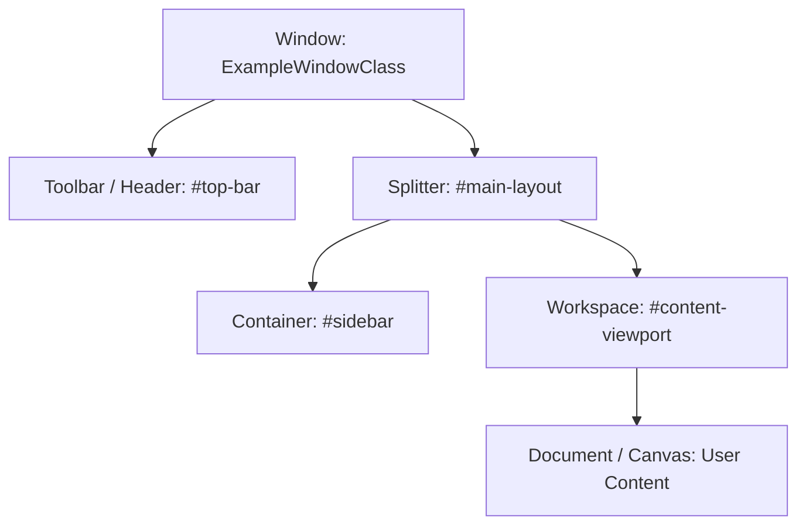

<!-- SPDX-License-Identifier: Apache-2.0 -->
<!-- Copyright (c) 2026 Amir Farhadi -->

[ 🏠 ADCE Home ](../../README.md) › [ 📚 App Hierarchies ](./README.md) › **Standard Profile Template**

---

# [Application Name] UI Automation Layout & Semantic Profile

> **Document Status:** [Draft / Active Ground Truth / Partial Resting-State Baseline]
> **Target Engine:** [e.g., Chromium / Electron | Mozilla Gecko | WinUI 3 / XAML | Classic Win32 | Custom Canvas]
> **Verification Date:** YYYY-MM-DD
> **Target Process:** `[process_name.exe]` | **Window Class:** `[WindowClass]`
> **Empirical Coverage:** [X of Y Surfaces Harvested]

---

## 1. Physical Window & Process Specification (Level 1 Invariants)

| Property | Physical Telemetry Value | Architectural Significance & Quirks |
| :--- | :--- | :--- |
| **Process Name** | `example.exe` | Multi-process vs. single-process architecture |
| **Window Class** | `ExampleWindowClass` | Top-level Win32 window registration class |
| **AppUserModelID** | `Publisher.App!App` | AUMID format; check for `~Wh~w<HEX_HWND>` secondary window tokens |
| **Multi-Process Model** | [Single / Dedicated Renderers / AppContainer] | Process isolation boundaries (PIDs) |
| **DWM Cloaking Behavior** | [Verified / Pending] | Response to `DWMWA_CLOAKED` during virtual desktop shifts |

---

## 2. Rendering Engine & Accessibility Adapter Quirks

* **Underlying Engine:** Describe how the application renders pixels (e.g. Blink via Skia, Gecko via WebRender, WinUI via DirectComposition, or custom DirectX/OpenGL).
* **Accessibility Adapter:** How does the app translate internal visual nodes to Windows UI Automation (`IRawElementProviderSimple` / `IUIAutomation`)?
* **Lazy Activation Behavior:** Does the application suppress accessibility events or text pattern population until a UIA client attaches?
* **DOM / Buffer Virtualization:** Does the app virtualize off-screen elements (e.g., Monaco only rendering visible editor lines, VirtualizingStackPanel)?

---

## 3. Structural Container Anatomy (Level 2 Invariants)

Document the major top-level containers that partition the application chrome from user content.

### Stable Container Registry
| Container Role | Level 2 Selector (AutomationId / Name / Class) | Semantic Zone Mapping |
| :--- | :--- | :--- |
| **Tab Strip** | e.g. `workbench.parts.titlebar` or `#tabbrowser-tabs` | `TabBar` |
| **Primary Sidebar** | e.g. `workbench.view.explorer` or `#sidebar-box` | `PrimarySidebar` / `SidebarExplorer` |
| **Bottom Panel** | e.g. `workbench.parts.panel` | `BottomPanel` / `Terminal` |
| **Editor / Document** | e.g. `workbench.parts.editor` or `#appcontent` | `EditorBuffer` / `WebDocument` |

---

## 4. Viewport Boundary Condition (Chrome vs. Document Isolation)

* **Boundary Definition:** Explicitly define where application window chrome stops and user-generated document content begins.
* **Invariant:** Once active keyboard focus enters the Document Viewport, window chrome rules (e.g. `PrimarySidebar`, `BottomPanel`) **cease to apply**. In-page DOM elements must not trigger window-level chrome classifications.

---

## 5. Resting-State Empirical Telemetry Matrix

| Step | Surface Name | Focus Stimulus | Leaf ControlType | Leaf AutomationId | Ancestor Chain (Leaf ➔ Root, Max Depth 5) | Verified Zone Tag | Screenshot |
| :---: | :--- | :--- | :--- | :--- | :--- | :--- | :---: |
| 1 | **Main Input / Buffer** | Click main text area | `Edit` | `active-input-id` | `[Input, Container, Viewport, Window]` | `EditorBuffer` | `step_01.png` |
| 2 | **Navigation Tab** | Focus active tab | `TabItem` | `tab-id` | `[TabItem, TabStrip, TopBar, Window]` | `TabBar` | `step_02.png` |

---

## 6. Update Volatility Matrix & Known Gotchas

* **Level 1/2 Stable Identifiers:** List the specific properties verified to survive application patches.
* **Rejected Fragile Selectors (Level 4 Anti-Patterns):** List any selectors that were tested and discarded due to fragility (e.g., dynamic CSS hashes, ordinal child indexing).
* **Observed Changes Across Versions:** Document any breaking shifts between major versions of the target application.

---

## 7. Epistemic Blind Spots & Unknown Unknowns

> [!IMPORTANT]
> This section enforces epistemic humility. It explicitly catalogs what has **not** been tested, potential failure modes, and areas where accessibility APIs may provide degraded information.

### 7.1 Unobserved Surfaces & States
- [ ] **Modal & Dialog Overlays:** Behavior during file pickers, alert dialogs, or settings modals has not been observed.
- [ ] **Multi-Window / Detached Panes:** Behavior when dragging a tab into an independent floating window (`~Wh~` token presence).
- [ ] **Auto-Complete / Context Popups:** Behavior of IntelliSense, dropdowns, or popup menus (whether they render in-tree or as top-level `WS_POPUP` HWNDs).
- [ ] **High-DPI / Multi-Monitor Scaling:** Behavior across mixed-DPI display boundaries.

### 7.2 Framework-Specific Failure Modes
- [ ] *Does the target application freeze or drop UIA events when executing heavy background tasks?*
- [ ] *Does the application require an external bridge or command-line flag (e.g. `--force-renderer-accessibility`) to expose full telemetry?*

### 7.3 Alternative Perception Paths
- If UIA fails or experiences RPC stalls on this application, what secondary source of truth exists?
  - Native socket / Extension bridge (e.g. CDP, VS Code extension pipe)?
  - Surface vision (DirectX capture + OCR)?
  - Win32 standard messages?
