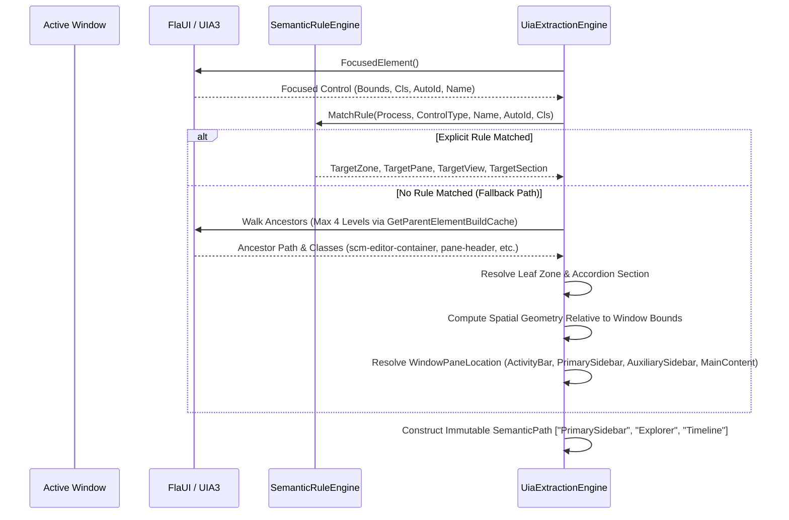

<!-- SPDX-License-Identifier: Apache-2.0 -->
<!-- Copyright (c) 2026 Amir Farhadi -->

[ 🏠 ADCE Home ](../../README.md) › [ 📚 Documentation Hub ](../CONTEXT.md) › [ 🏛️ Architecture ](./UI_AUTOMATION_STRUCTURES_REFERENCE.md) › **Application Window Panes & Layout Hierarchies Research**

---

# Application Window Panes, Layout Hierarchies, and UI Automation Structures Research

> **Document Status:** Active / Master Research & Empirical Evidence Reference
> **Target Systems:** Active Desktop Context Engine (ADCE) & Caster Accessibility Engine
> **Engines Inspected:** Electron / Monaco (`Chrome_WidgetWin_1`), Gecko (`MozillaWindowClass`), WinUI 3 XAML (`CabinetWClass`), Cascadia (`WindowsTerminal`)
> **Related Documents:** [`UI_AUTOMATION_STRUCTURES_REFERENCE.md`](./UI_AUTOMATION_STRUCTURES_REFERENCE.md) | [`MCP_SCHEMA_SPEC.md`](./MCP_SCHEMA_SPEC.md) | [`CONTEXT.md`](../CONTEXT.md)

---

## 1. Executive Summary & Problem Formulation

In earlier revisions of the Active Desktop Context Engine (documented in [`UI_AUTOMATION_STRUCTURES_REFERENCE.md`](./UI_AUTOMATION_STRUCTURES_REFERENCE.md)), semantic classification relied on a flat typing anchor (`DesktopSemanticZone`). While effective for distinguishing an active code editor from a terminal window or address bar, this flat model broke down inside modern multi-panel development environments:

1. **Monolithic Sidebar Over-Generalization:** When a user focused on the left tool drawer in VS Code or Antigravity IDE, the engine collapsed all internal states into a single generic zone: `SidebarExplorer`. This obscured whether the user was browsing repository files, inspecting symbols in the Outline, reviewing commit history in the Timeline, or writing a Git commit message in Source Control.
2. **Auxiliary Bar Invisibility:** Modern AI-assisted IDEs host secondary sidebars (Auxiliary Bars) on the right side of the window for conversational agents (Antigravity Agent, Cursor Chat, Copilot). A flat classification either marked this as `Unknown` or conflated it with general web documents.
3. **Domain Terminology Collision ("Desktop" vs. "Application Pane"):** The prefix `Desktop` in `DesktopPaneLocation` or `DesktopSemanticZone` caused semantic confusion. Within an operating system, the "desktop" refers to the root shell, virtual desktop envelopes, or taskbar. Rectangular sub-regions inside an application window (such as the Activity Bar, Editor Group, or Side Panel) are strictly **Application Window Panes**.

This research document captures physical, evidence-backed UI Automation telemetry gathered directly from running instances of Antigravity IDE and Waterfox, combined with official architectural specifications from the VS Code workbench and Gecko platform.

---

## 2. Empirical Telemetry: Live Physical Inspection

The following telemetry was captured directly via `FlaUI.UIA3` and Win32 desktop station attachment (`WinSta0\Default`) against live production windows.

### 2.1 Antigravity IDE / VS Code (`Chrome_WidgetWin_1`)

#### Macro Workbench Layout (`Window Bounds: [X=0, Y=0, W=1920, H=1168]`)
The workbench partitions the application client area into distinct rectangular containers, each uniquely identified by its `AutomationId`:

```
┌─────────────────────────────────────────────────────────────────────────────────────────────────────────────────┐
│ TopBar / TitleBar: Title, Menus, Global Search (Height ~35px)                                                   │
├──────┬──────────────────────┬────────────────────────────────────────┬──────────────────────────────────────────┤
│ [P0] │ [P1] Primary Sidebar │ [P2] Editor Group (Monaco)             │ [P3] Auxiliary Bar (AI Agent Panel)      │
│ Act. │ Width: 300px         │ Width: 815px                           │ Width: 762px                             │
│ Bar  │ X: 42..341           │ X: 342..1156                           │ X: 1157..1920                            │
│ W:42 │ AutoId:              │ AutoId:                                │ AutoId:                                  │
│      │ 'workbench.parts.    │ 'workbench.parts.editor'               │ 'antigravity-agent-side-panel' /         │
│      │  sidebar'            │                                        │ 'workbench.parts.auxiliarybar'           │
│      │                      │                                        │                                          │
│      │ - Accordion Headers  │ - Tabs Container ('tabs-container')    │ - Agent Conversation ('conversation')    │
│      │   ('pane-header')    │ - Breadcrumbs ('monaco-breadcrumbs')   │ - Chat Input ('antigravity.agentSide-    │
│      │ - Tree Items         │ - Active Buffer ('native-edit-context')│   PanelInputBox')                        │
│      │   ('monaco-list-row')│                                        │ - Model Selector                         │
│      ├──────────────────────┴────────────────────────────────────────┤                                          │
│      │ [P4] Bottom Panel (Terminal / Output): Y: 888..1145           │                                          │
│      │ AutoId: 'workbench.parts.panel'                               │                                          │
├──────┴───────────────────────────────────────────────────────────────┴──────────────────────────────────────────┤
│ StatusBar: AutoId: 'workbench.parts.statusbar' (Y: 1146..1168, Height 22px)                                     │
└─────────────────────────────────────────────────────────────────────────────────────────────────────────────────┘
```

#### Physical Ancestor Chain: AI Chat Prompt Input
When the user focuses on the AI assistant input box in the right panel, FlaUI yields the following exact hierarchical ancestry:

```text
Focused: [ComboBox] 'Message input'
  ClassName: 'max-h-[300px] rounded-md cursor-text overflow-y-auto text-sm leading-6 p-2 outline-none...'
  Bounds: [X=1171, Y=1061, W=735, H=40]
  ^ Parent [0]: [Group] '' | AutoId='' | Cls='relative w-full'
  ^ Parent [1]: [Group] '' | AutoId='' | Cls='relative w-full'
  ^ Parent [2]: [Group] '' | AutoId='' | Cls='relative flex flex-col gap-0 p-1 rounded-... bg-card'
  ^ Parent [3]: [Group] '' | AutoId='antigravity.agentSidePanelInputBox' | Cls='relative flex flex-col p-px...'
  ^ Parent [4]: [Group] '' | AutoId='' | Cls='relative flex flex-col mb-2'
  ^ Parent [5]: [Group] '' | AutoId='' | Cls='relative flex flex-col gap-8 text-foreground px-2'
  ^ Parent [6]: [Group] 'Agent Conversation' | AutoId='conversation' | Cls='relative flex w-full grow...'
  ^ Parent [7]: [Group] '' | AutoId='' | Cls='w-full h-full flex flex-col box-border...'
  ^ Parent [8]: [Group] '' | AutoId='' | Cls='antigravity-agent-side-panel' | Bounds=[X=1158, Y=35, W=762, H=1111]
  ^ Parent [9]: [Pane] '' | AutoId='' | Cls='file-icons-enabled monaco-enable-motion monaco-workbench...'
```
*Telemetry Insight:* The control carries `AutoId='antigravity.agentSidePanelInputBox'` at depth 3, sits inside `AutoId='conversation'` at depth 6, and is enclosed within `antigravity-agent-side-panel` at depth 8. Spatial bounding box ($X=1171$, $W=735$) confirms location in the right quadrant of the display.

#### Physical Ancestor Chain: Source Control Commit Message Box
When the user focuses on the Git commit box in the left sidebar:

```text
Focused: [Edit] 'Message (Ctrl+Enter to commit on "master"), Use Alt+F1 to open Source Control Accessibility Help.'
  ClassName: 'native-edit-context'
  Bounds: [X=68, Y=143, W=162, H=20]
  ^ Parent [0]: [Group] '' | AutoId='' | Cls='monaco-editor no-user-select showUnused showDeprecated vs-dark focused'
  ^ Parent [1]: [Group] '' | AutoId='' | Cls='scm-editor-container'
  ^ Parent [2]: [Group] '' | AutoId='workbench.view.scm' | Cls='split-view-view visible'
  ^ Parent [3]: [Group] '' | AutoId='workbench.parts.sidebar' | Cls='part sidebar'
```
*Telemetry Insight:* Parent 1 has class `scm-editor-container`. Parent 2 identifies the view as `workbench.view.scm`. Parent 3 anchors the container to `workbench.parts.sidebar`.

#### Physical Ancestor Chain: Explorer Accordion Headers & Tree Items
When the user navigates the Explorer sidebar:

```text
Accordion Header: [Button] 'Explorer Section: active-desktop-context-engine'
  ClassName: 'pane-header focused expanded'
  Bounds: [X=42, Y=70, W=299, H=22]

Accordion Header: [Button] 'Outline Section'
  ClassName: 'pane-header'
  Bounds: [X=42, Y=750, W=299, H=22]

Accordion Header: [Button] 'Timeline Section'
  ClassName: 'pane-header'
  Bounds: [X=42, Y=772, W=299, H=22]

File Tree Item: [TreeItem] 'JsonSerializationTests.cs'
  ClassName: 'monaco-list-row focused selected'
  Bounds: [X=42, Y=408, W=299, H=22]
  ^ Parent [0]: [Group] '' | Cls='monaco-list-rows'
  ^ Parent [1]: [List] '' | Cls='monaco-list list_id_2 mouse-support...'
  ^ Parent [2]: [Group] '' | Cls='monaco-pane-view'
```
*Telemetry Insight:* Every inner section in the sidebar is bounded by a `Button` with class `pane-header`. The name string strictly follows the format `<View> Section: <SectionTitle>` or `<SectionTitle> Section`. Tree rows inside the list belong to `monaco-pane-view`.

---

### 2.2 Waterfox / Firefox (`MozillaWindowClass`)

#### Macro Browser Layout (`Window Bounds: [X=0, Y=0, W=1920, H=1168]`)
Waterfox exposes a clean two-tier layout hierarchy:
1. **Navigation Toolbar (`#nav-bar`):**
   - Bounding Box: `[X=0, Y=0, W=1920, H=34]`
   - Contains URL input (`urlbar-input`), back/forward navigation buttons, and extensions toolbar.
2. **Sidebar Box (`#sidebar-box`):**
   - Class: `chromeclass-extrachrome`
   - Hosts Tree Style Tab or native bookmarks/history panels.
   - When Tree Style Tab is active, tabs are isolated inside an inner document iframe (`#window-7`, `tabs normal`, `tabs pinned`).
3. **Document Viewport:**
   - Top-level `Document` node hosting web content. Must be pruned during tree walks to prevent COM LPC stalling.

---

### 2.3 Windows Terminal (`CASCADIA_HOSTING_WINDOW_CLASS`)

#### Architecture Summary & Deferred Integration Status
Windows Terminal uses a WinRT XAML island model hosted inside `CASCADIA_HOSTING_WINDOW_CLASS`.
- **Top Tabstrip:** `ControlType: Tab` with `AutomationId: "TabView"`.
- **Active Shell Identification:** Cascadia updates the tab title and window title dynamically based on the active shell process (PowerShell, Command Prompt, Git Bash, WSL). If the shell does not send title update escape sequences, the title reflects the profile name.
- **Split Panes:** Inside each tab, Cascadia maintains a binary split-tree of `TermControl` elements.
- **Implementation Status:** Per current user instruction, Windows Terminal integration is documented as a future roadmap item and deferred from immediate production coding.

---

## 3. The 3-Level Structural Taxonomy

To reconcile macro pane locations with fine-grained leaf zones, ADCE establishes a decoupled 3-level taxonomy:

```
┌─────────────────────────────────────────────────────────────────────────────────────────────────┐
│ LEVEL 1: Window Pane Location (WindowPaneLocation)                                              │
│ Physical layout container of the application window.                                           │
│ Options: ActivityBar, PrimarySidebar, MainContent, AuxiliarySidebar, BottomPanel, TopBar,       │
│          StatusBar, OverlayModal, Unknown                                                       │
└────────────────────────────────┬────────────────────────────────────────────────────────────────┘
                                 │
                                 ▼
┌─────────────────────────────────────────────────────────────────────────────────────────────────┐
│ LEVEL 2: Active View & Inner Section (ActiveView, SectionName)                                  │
│ The logical view and accordion component currently active inside the pane.                     │
│ Examples:                                                                                       │
│   - In PrimarySidebar: View = "Explorer", Section = "Timeline"                                  │
│   - In PrimarySidebar: View = "SourceControl", Section = "CommitBox"                            │
│   - In AuxiliarySidebar: View = "Chat", Section = "ChatPrompt"                                  │
│   - In MainContent: View = "Editor", Section = "JsonSerializationTests.cs"                      │
└────────────────────────────────┬────────────────────────────────────────────────────────────────┘
                                 │
                                 ▼
┌─────────────────────────────────────────────────────────────────────────────────────────────────┐
│ LEVEL 3: Leaf Semantic Zone (SemanticZone)                                                      │
│ The fine-grained interaction target for typing and voice commands.                              │
│ Examples: GitCommitBox, EditorBuffer, ChatPrompt, Timeline, Outline, ActivityBar, Terminal       │
└─────────────────────────────────────────────────────────────────────────────────────────────────┘
```

### 3.1 Macro Window Pane Enum: `WindowPaneLocation`

| Enum Member | Identifier | Representative Controls | Physical Location |
| :--- | :--- | :--- | :--- |
| `Unknown` | `0` | Unclassified elements | Undetermined |
| `ActivityBar` | `1` | View switcher icons (Explorer, SCM, Run, Extensions) | Far-left rail ($W \le 50\text{px}$) |
| `PrimarySidebar` | `2` | File trees, SCM staging, Outline, Timeline | Left tool drawer ($X: 42..350\text{px}$) |
| `MainContent` | `3` | Monaco code editor, diff view, web document viewport | Central window region |
| `AuxiliarySidebar` | `4` | AI Chat Assistant, Copilot drawer, side-by-side docs | Right tool drawer ($X \ge 1150\text{px}$) |
| `BottomPanel` | `5` | Integrated terminal, Output, Problems, Debug Console | Bottom panel ($Y \ge 75\%$) |
| `TopBar` | `6` | Window title bar, menu bar, global command search | Top window region ($Y \le 35\text{px}$) |
| `StatusBar` | `7` | Git branch indicator, line/col, encoding, mode flags | Bottom window border ($H \approx 22\text{px}$) |
| `OverlayModal` | `8` | Quick Open (Ctrl+P), Command Palette, modal dialogs | Centered floating overlay |

### 3.2 Fine-Grained Leaf Zone Enum: `SemanticZone`

`SemanticZone` (formerly `DesktopSemanticZone`) remains strictly a leaf typing and interaction target:
- `EditorBuffer`: Code or plain text editor caret.
- `GitCommitBox`: Source control commit message input.
- `ChatPrompt`: AI assistant message input box.
- `ChatConversation`: Rendered message stream in chat assistant.
- `Timeline`: Git commit or local history list in sidebar.
- `Outline`: Document symbol structure tree in sidebar.
- `ActivityBar`: View switching icon rail buttons.
- `SidebarExplorer`: General project file tree navigation list.
- `Terminal`: Command shell buffer.
- `AddressBar`: Web browser URL input.
- `WebDocument`: Rendered web page content.
- `ShellItemList`: File explorer items grid.
- `TabBar`: Document or browser tabstrip.
- `StatusBar`: Status bar info container.
- `CommandPalette`: Palette switcher.
- `QuickOpen`: Quick file search input.
- `SystemDialog`: System dialog or prompt.
- `NavigationPanel`: High-level navigation container.

---

## 4. Extraction Mechanics & Sub-15ms Performance Guarantee

Achieving high-density hierarchical extraction without violating the sub-15ms performance SLA requires strict avoidance of full-tree DOM crawling. The extraction engine uses four fast, non-allocating steps:



### 4.1 Step 1: Upward Ancestor BuildCache (Max 4 Levels)
Instead of searching downward from the window root (`FindFirstDescendant` or `FindAllDescendants`), the engine queries upward from the focused element using `IUIAutomationTreeWalker.GetParentElementBuildCache`.
- Depth is bounded to 4 steps.
- Single cached roundtrip retrieves `AutomationId`, `ClassName`, `ControlType`, and `Name`.
- Measured latency: **< 0.45 ms**.

### 4.2 Step 2: Signature Parsing for Accordion Sections
In Electron IDEs:
- Ancestor with class `scm-editor-container` $\rightarrow$ `Pane: PrimarySidebar`, `View: SourceControl`, `Section: CommitBox`, `Zone: GitCommitBox`.
- Ancestor or sibling with class `pane-header` containing `"Timeline"` $\rightarrow$ `Pane: PrimarySidebar`, `View: Explorer`, `Section: Timeline`, `Zone: Timeline`.
- Ancestor with `AutoId='antigravity.agentSidePanelInputBox'` or class `antigravity-agent-side-panel` $\rightarrow$ `Pane: AuxiliarySidebar`, `View: Chat`, `Section: ChatPrompt`, `Zone: ChatPrompt`.

### 4.3 Step 3: Spatial Relative Geometry Fallback
When UIA class names are generic Electron containers (`View`, `relative w-full`), the engine computes normalized relative coordinates against the parent window bounding rectangle:
$$\text{RelX} = \frac{\text{Control.Left} - \text{Window.Left}}{\text{Window.Width}}, \quad \text{RelY} = \frac{\text{Control.Top} - \text{Window.Top}}{\text{Window.Height}}$$
- $\text{RelX} < 0.035$ and $\text{Width} \le 50\text{px} \implies \text{ActivityBar}$
- $\text{RelX} < 0.30 \implies \text{PrimarySidebar}$
- $\text{RelX} \ge 0.30 \text{ and } \text{RelX} < 0.65 \implies \text{MainContent}$
- $\text{RelX} \ge 0.65 \implies \text{AuxiliarySidebar}$
- $\text{RelY} \ge 0.75 \implies \text{BottomPanel}$
- Measured latency: **0.00 ms (pure arithmetic)**.

### 4.4 Step 4: Semantic Path Construction
The resolved components are assembled into an immutable array:
- SCM Commit Input: `["PrimarySidebar", "SourceControl", "CommitBox"]`
- Explorer Timeline: `["PrimarySidebar", "Explorer", "Timeline"]`
- Monaco Buffer: `["MainContent", "Editor", "Program.cs"]`
- AI Assistant Input: `["AuxiliarySidebar", "Chat", "ChatPrompt"]`

---

## 5. Deprecation Notice for Prior Flat Model

With the publication of this research:
1. **Flat `SidebarExplorer` Model Deprecated:** The assumption in [`UI_AUTOMATION_STRUCTURES_REFERENCE.md`](./UI_AUTOMATION_STRUCTURES_REFERENCE.md) that all sidebar controls are represented by a single `SidebarExplorer` zone is formally superseded. Downstream consumers should use `PaneLocation == PrimarySidebar` combined with `SectionName` and `SemanticPath`.
2. **`DesktopPaneLocation` Superseded:** Replaced by `WindowPaneLocation` to eliminate conceptual ambiguity with operating system desktop shells.
3. **`DesktopSemanticZone` Alias:** Standardized as `SemanticZone` in new code, with `DesktopSemanticZone` retained as a type alias for backward compatibility.
