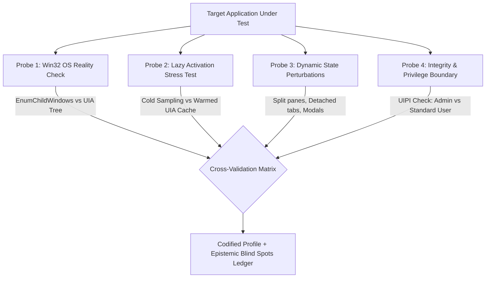

<!-- SPDX-License-Identifier: Apache-2.0 -->
<!-- Copyright (c) 2026 Amir Farhadi -->

[ 🏠 ADCE Home ](../../README.md) › [ 📚 Documentation Hub ](../CONTEXT.md) › **Desktop UI Perception & Volatility Taxonomy**

---

# Desktop UI Perception, Application Archetype Quirks, & Volatility Taxonomy

> **Document Status:** Active Canonical Epistemic Specification
> **Epistemic Authority:** Tier 2 (Normative Architectural Contract)
> **Target Audience:** ADCE Daemon Architects, Caster Voice Grammar Engineers, AI Perception Planners
> **Date:** September 2026

---

## 1. Executive Summary & Epistemic Thesis

Building an ultra-low latency (< 15 ms), zero-idle-CPU desktop perception engine on Windows requires navigating an operating system containing over 35 years of accumulated UI technologies.

There is no single "Windows UI." A modern desktop environment is a heterogeneous federation of rendering engines: classic Win32/GDI, Windows Presentation Foundation (WPF), WinUI 3 / XAML Islands, Chromium/Electron, Mozilla Gecko, and custom GPU canvas compositors (DirectX, Skia, Metal/Vulkan wrappers).

The core thesis of this taxonomy is fourfold:
1. **OS Ground Truth vs. Application Volatility:** Immutable OS primitives (Level 1: HWNDs, PIDs, DWM cloaking, and native window classes) provide decade-long stability. Application-specific container selectors (Level 2: `workbench.parts.*`, `#navigator-toolbox`) represent internal vendor conventions subject to layout churn across minor releases.
2. **Decoupled Architecture Invariant:** Core compiled extraction logic must anchor exclusively to Level 1 OS primitives and generic UIA structural patterns. Application-specific Level 2 container selectors must not be hardcoded into core binaries; they belong in external, hot-reloadable rule overlays (`semantic_rules.json`).
3. **Out-of-Band Viewport Handoff:** Desktop accessibility APIs cannot inspect in-viewport web documents or GPU canvases without triggering multi-second cross-process COM LPC stalls. Deep document comprehension must be delegated to specialized out-of-band protocols (Chrome DevTools Protocol for web viewports, Language Server Protocol for code editors), using ADCE's low-latency window telemetry (HWND, PID, sanitized URL, bounds) as the correlation handle.
4. **Surveillance of Unknown Unknowns (The Blind Spot Protocol):** Any accessibility API (`UIAutomationCore.dll`) can and will report incomplete, misleading, or lazy-degraded trees. Systems must actively triangulate across multiple OS signals (Win32 HWNDs, AUMIDs, DWM cloaking, dynamic perturbations) to expose architectural blind spots.

---

## 2. The Volatility Spectrum

To prevent brittle selectors that break across application patches or Windows cumulative updates, all desktop UI properties are classified into four volatility tiers:

```
STABILITY
   ▲
   │  LEVEL 1: IMMUTABLE OS GROUND TRUTH (Decade-Long Stability)
   │  • Win32 Window Handles (HWND), Process IDs (PID), Top-Level Window Class Names
   │  • Win32 AppUserModelID (PKEY_AppUserModel_ID), including sub-AUMIDs (~Wh~w<HEX_HWND>)
   │  • Standard UIA ControlType Enums (ControlType.Edit, ControlType.TabItem, ControlType.Document)
   │  • DWM Cloaking State (DWMWA_CLOAKED via dwmapi.dll)
   │
   │  LEVEL 2: APPLICATION CONTAINER CONVENTIONS (Semver Minor Stable, Heuristic Rule Overlays)
   │  • Semantic Container AutomationIds in well-architected applications:
   │    - VS Code / Electron: workbench.parts.panel, workbench.parts.sidebar, workbench.parts.editor
   │    - Gecko / Waterfox: #navigator-toolbox, #urlbar-input, #tabbrowser-tabs
   │    - Windows Terminal: TermControl, TabBar
   │  • Standard ARIA roles (role="tab", role="textbox") exposed through the browser accessibility bridge
   │  • Note: Maintained via dynamic rule overlays (semantic_rules.json) to prevent compiled code churn
   │
   │  LEVEL 3: MODERATE VOLATILITY (Alters on Major Feature Releases / UI Overhauls)
   │  • Exact child nesting depth (e.g. an element moving from 4 levels to 6 levels deep)
   │  • Responsive layout shifts (e.g. sidebars collapsing into hamburger panels at narrow bounds)
   │  • Flyout dialog container class names and docked tool windows
   │
   │  LEVEL 4: HYPER-VOLATILE / FRAGILE ANTI-PATTERNS (Breaks on Minor Updates / Patch Tuesday)
   │  • Minified dynamic CSS/Build hashes (e.g. .monaco-list-row-3a8f, styled-components hashes)
   │  • Child ordinal indexing (e.g. "take the 3rd child of the 2nd group")
   │  • Undocumented Private OS COM Vtable Offsets (e.g. twinui.pcshell.dll vtable slots 4, 8, 35)
   ▼
VOLATILITY
```

---

## 3. Windows Application Archetypes & Quirks Matrix

Different application rendering engines present radically different internal structures, threading behaviors, and accessibility quirks. ADCE categorizes targets into seven distinct framework archetypes:

| Archetype | Common Applications | Rendering Engine | Window Class / Signature | Architectural Quirks & Blind Spots | Recommended Perception Strategy |
| :--- | :--- | :--- | :--- | :--- | :--- |
| **Chromium / Electron** | VS Code, Antigravity IDE, Slack, Chrome, Edge, Teams | Blink / Skia (GPU SwapChain) | `Chrome_WidgetWin_1`<br>`Chrome_RenderWidgetHostHWND` | **1. Lazy Accessibility:** Disables rich AXTree until a UIA client requests it.<br>**2. Virtualized DOMs:** Monaco editor only renders visible buffer lines; off-screen text does not exist in DOM.<br>**3. Sandboxed Multi-Process:** Renderers run under separate PIDs. | Inverted ancestor climbing from `UiaGetFocusedElement()`. Read `workbench.parts.*` containers. Never crawl descendant trees. |
| **Gecko** | Waterfox, Firefox, LibreWolf | Gecko / WebRender | `MozillaWindowClass` | **1. Strict Isolation:** Desktop chrome (`#navigator-toolbox`) and web content (`#appcontent`) are isolated XUL/DOM spaces.<br>**2. Out-of-Process Tabs:** Content documents run in sandboxed child processes. | Check `#navigator-toolbox` for browser chrome. If focus is inside `Document`, immediately drop to `WebDocument` zone and halt container checks. |
| **WinUI 3 / XAML Islands** | Windows Terminal, Win 11 Settings, Calculator | XAML / DirectComposition | `CASCADIA_HOSTING_WINDOW_CLASS`<br>`ApplicationFrameWindow` | **1. Sub-AUMIDs (`~Wh~`):** Hosted detached panes append `~Wh~w<HEX_HWND>` to their AUMID.<br>**2. Host Wrapping:** Modern apps often wrap in `ApplicationFrameHost.exe`.<br>**3. Focus Routing:** XAML focus may report child pane while Win32 focus reports host frame. | Inspect `PKEY_AppUserModel_ID` to resolve parent HWND. Target `TermControl` / XAML controls using bounded parent traversal. |
| **Classic Win32 / GDI** | Notepad classic, File Explorer dialogs, Process Hacker | Win32 User32 / GDI | `CabinetWClass`<br>`#32770` (Dialog)<br>`Edit`, `Button` | **1. Every Control is an HWND:** Controls have dedicated Win32 handles.<br>**2. Synchronous Win32 Messages:** Inspectable via `WM_GETTEXT` without UIA overhead.<br>**3. UIPI Privilege Blocks:** High-integrity apps reject standard window messages. | Fast Win32 gating (< 0.5 ms). Direct HWND and class name inspection. |
| **WPF (XAML)** | Visual Studio (devenv.exe), enterprise tools | WPF / DirectX surface | `HwndWrapper[...]` | **1. Visual vs Logical Tree:** Containers exist in visual tree but may be omitted in logical tree.<br>**2. VirtualizingStackPanel:** List items outside viewport are virtualized away. | Use UIA RawView or ControlView with bounded ancestor climbing. |
| **Custom Canvas / Skia** | Blender, Figma, Ableton Live, JetBrains (IntelliJ) | Skia, OpenGL, Vulkan, Java Swing | `SunAwtFrame` (JetBrains)<br>`GHOST_WindowClass` (Blender) | **1. Near-Zero Native UIA:** Blender exposes zero accessibility nodes.<br>**2. Custom Accessible Bridges:** JetBrains requires Java Access Bridge or specific UIA plugin.<br>**3. Black-Box Canvases:** DOM inspection completely stalls or returns empty root. | Fallback to OS-level window topology, window titles, or surface vision (DirectX Capture + OCR). |
| **Console Subsystem** | conhost.exe, cmd.exe | GDI / Console Buffer | `ConsoleWindowClass` | **1. Character Grid Architecture:** No interactive buttons; raw text cell matrix.<br>**2. TextPattern Inefficiency:** Querying large console buffers via UIA TextPattern can stall console output. | Win32 console buffer APIs or top-level terminal container bindings. |

---

## 4. Shell Window Primitives vs. Intra-Window Leaf Primitives

A critical systems boundary must be drawn between **Windows Shell / Window Manager Primitives** and **Application Accessibility Primitives**:

```
┌────────────────────────────────────────────────────────────────────────────────────────┐
│                               OPERATING SYSTEM LAYERS                                  │
├────────────────────────────────────────────────────────────────────────────────────────┤
│                                                                                        │
│   [ LAYER A: WINDOWS SHELL & DWM (twinui.pcshell.dll / dwmapi.dll) ]                   │
│   • Operates strictly at the Window Envelope & Workspace Level                         │
│   • Primitives: Virtual Desktops, AppUserModelIDs, Window Z-Order, DWM Cloaking         │
│   • Blind Spot: Completely blind to what happens INSIDE an application's workspace.    │
│     Cannot see Monaco editor lines, URL input bars, or focused tab items.              │
│                                                                                        │
│                                           │                                            │
│                                           ▼                                            │
│                                                                                        │
│   [ LAYER B: ACCESSIBILITY SUB-SYSTEM (UIAutomationCore.dll / FlaUI.UIA3) ]            │
│   • Operates strictly INSIDE the application visual/DOM tree                           │
│   • Primitives: Focused Control, ControlType, AutomationId, Ancestor Hierarchy         │
│   • Invariant: Must use Inverted Ancestor Climbing (O(D)) to avoid DOM explosions.     │
│                                                                                        │
└────────────────────────────────────────────────────────────────────────────────────────┘
```

### The Takeaway for ADCE & Caster
- **Do not attempt to replace UIA with Shell COM:** Interfaces like `IApplicationView` or `IApplicationViewCollection` cannot tell you what button, tab, or editor line is focused.
- **Do use Shell & Win32 primitives to accelerate Layer 0:** Use Win32 `GetForegroundWindow()`, `SHGetPropertyStoreForWindow(PKEY_AppUserModel_ID)`, and `DwmGetWindowAttribute(DWMWA_CLOAKED)` to resolve window identity in `< 0.5 ms` before touching UIA.

---

## 5. The Role of Low-Level Debugging Tools (PDBs, DbgHelp, Detours)

Dynamic symbol auditing (`dbghelp.dll`, Microsoft public symbol servers, PDB disassembly) is a formidable engineering capability, but its architectural role must be strictly partitioned:

### 5.1 Permitted Role: Offline Reverse-Engineering Telescope
- **When to Use:** When a target application (e.g. a new Chromium build or `UIAutomationCore.dll` patch) exhibits unexpected RPC stalls or mysterious container structures.
- **How to Use:** Run in offline scratch scripts or isolated developer benchmarks to reconstruct vtables, inspect parameter types, and discover invariant structural patterns once.

### 5.2 Forbidden Role: Continuous 24/7 Runtime Perception Engine
- **Why it is Rejected for Production Daemons:**
  1. **Mutual Exclusion:** Attaching an active Windows debugger (`DebugActiveProcess`) prevents developer debuggers (Visual Studio, VS Code, WinDbg) from attaching to the process.
  2. **Security & EDR Triggers:** Continuous memory probing, DLL injection, and thread hijacking trigger endpoint protection (Windows Defender, CrowdStrike).
  3. **Process Stability:** An unhandled exception or struct mismatch inside an injected hook crashes the user's browser or IDE, corrupting open work.
  4. **Performance Overhead:** Parsing PDB debug streams requires hundreds of megabytes of RAM and takes seconds, directly violating the sub-15ms extraction SLA.

---

## 6. The Epistemic Blind Spot Protocol (Uncovering Unknown Unknowns)

To prevent developers and AI agents from suffering confirmation bias (assuming an application behaves cleanly just because a single UIA probe succeeded), every application profile must be vetted through the **Four Triangulation Probes**:



### Probe 1: Win32 OS Reality Check
- Enumerate native window handles using `EnumChildWindows(hwnd)`.
- *Cross-Check:* Does the application host hidden child HWNDs (e.g. `Chrome_RenderWidgetHostHWND`, XAML Island child windows) that the UIA tree collapsed or omitted?

### Probe 2: Lazy Activation Stress Test
- Sample the application in a completely cold resting state immediately after launch, with no other accessibility tools running.
- *Cross-Check:* Does the application return empty text patterns or missing children until a second UIA query warms the internal accessibility engine?

### Probe 3: Dynamic State Perturbation (Beyond Resting-State)
Test the application under four universal layout transitions:
1. **Multi-Pane Split:** Does splitting the editor or terminal create duplicate container IDs?
2. **Detached / Pop-out Windows:** Does dragging a tab into a new window spawn a `~Wh~w<HWND>` sub-AUMID or an independent process?
3. **Modal & Auto-Complete Overlays:** Do IntelliSense popups, context menus, and dropdowns live inside the main UIA tree or exist as detached top-level `WS_POPUP` windows?
4. **Virtual Desktop & Multi-Monitor Transitions:** Does the window report `DWMWA_CLOAKED` when moved to an inactive virtual desktop?

### Probe 4: Integrity & Privilege Boundary (UIPI)
- Verify behavior when the target application runs with elevated privileges (`Run as Administrator`) while the perception daemon runs as a standard user.
- *Cross-Check:* Does `SetWinEventHook` still receive events? (Yes, WinEvent hooks cross integrity boundaries, but direct `SendMessage` or UIA manipulation is blocked).

---

## 7. Implementation & Cross-Tool Grounding

This taxonomy provides the normative foundation for:
1. **Application Profiles ([`docs/app_hierarchies/`](../app_hierarchies/)):** Standardized structural maps of individual applications.
2. **Rule Classifiers (`ADCE.Extraction/Classifiers`):** Fast pattern matchers translating raw UIA chains into canonical `DesktopSemanticZone` tags.
3. **Caster Dynamic Voice Grammars:** Dragonfly voice navigation rules binding to Level 1 and Level 2 invariants.
