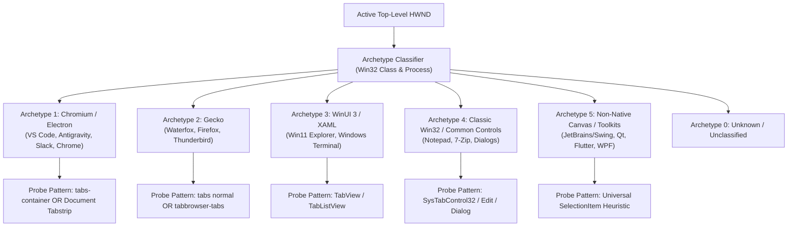

<!-- SPDX-License-Identifier: Apache-2.0 -->
<!-- Copyright (c) 2026 Amir Farhadi -->

[ 🏠 ADCE Home ](../../README.md) › [ 📚 Documentation Hub ](../CONTEXT.md) › **Epistemic Gaps, Dynamic App Discovery & Engine Requirements**

---

# Epistemic Gaps, Dynamic App Discovery & Engine Requirements Specification (018)

> **Document Status:** Active / Master Architecture Specification (Reconciled with Milestone 6 Production Baseline)
> **Epistemic Authority:** Tier 2 (Normative Architectural Blueprint — Subordinate to Tier 1 Code)
> **Target System:** Active Desktop Context Engine (ADCE)
> **Related Documents:** [Core Domain Model](CORE_DOMAIN_MODEL.md) | [Extraction Pipeline](EXTRACTION_PIPELINE.md) | [UI Automation SSOT](UI_AUTOMATION_STRUCTURES_REFERENCE.md)

---

## 1. Epistemic Pause: Interrogating Our Knowledge Gaps

In accordance with our **4-Gate Epistemic Protocol**, before scaling the C# `ADCE.Daemon`, we applied a rigorous epistemic brake:

> [!WARNING]
> **The Hardcoded Selector Trap (Mitigated in Milestone 4.5 & 5):**
> If `ADCE.Daemon` relies strictly on hardcoded class names and automation IDs, the engine is brittle. It breaks when applications update their UI frameworks, and it is blind to arbitrary third-party software.
> **Engineered Resolution:** ADCE implements a dual strategy: universal framework archetypes (`DesktopAppArchetype`) combined with dynamic declarative rule persistence (`ISemanticRuleEngine`).

### Core Knowledge Gaps & Production Resolutions:

```
┌────────────────────────────────────────────────────────────────────────────────────────┐
│                        KNOWLEDGE GAPS & PRODUCTION RESOLUTION MATRIX                   │
├────────────────────┬──────────────────────────────────┬─────────────┬──────────────────┤
│ Gap Category       │ Open Question / Uncertainty      │ Severity    │ Resolution Status│
├────────────────────┼──────────────────────────────────┼─────────────┼──────────────────┤
│ **1. Dynamic App** │ How does ADCE introspect and     │ **CRITICAL**│ **RESOLVED**     │
│ **Discovery**      │ adapt to unseen apps without     │             │ `SemanticRuleEng`│
│                    │ human configuration?             │             │ + ArchetypeClass │
├────────────────────┼──────────────────────────────────┼─────────────┼──────────────────┤
│ **2. Historical**  │ How to store millions of window  │ **HIGH**    │ **RESOLVED**     │
│ **Persistence**    │ & focus transitions without disk │             │ SQLite WAL +     │
│                    │ bloat or locking MCP queries?    │             │ L1 Memory Cache  │
├────────────────────┼──────────────────────────────────┼─────────────┼──────────────────┤
│ **3. Multi-Window**│ When an app has multiple windows │ **MEDIUM**  │ **RESOLVED**     │
│ **State Modeling** │ or tool palettes, how is active  │             │ `GA_ROOTOWNER` + │
│                    │ workspace state reconciled?      │             │ 3-Level Hierarchy│
├────────────────────┼──────────────────────────────────┼─────────────┼──────────────────┤
│ **4. 24/7 Daemon** │ How does memory footprint behave │ **MEDIUM**  │ **RESOLVED**     │
│ **Resiliency**     │ over days of continuous uptime   │             │ Named Mutex,     │
│                    │ with sleeping/resuming laptops?  │             │ 50ms COM Timeout │
└────────────────────┴──────────────────────────────────┴─────────────┴──────────────────┘
```

---

## 2. Desktop Framework Archetypes & Adaptive Discovery

Rather than hardcoding string selectors for every application in existence, ADCE classifies active windows into universal structural archetypes:



### The Canonical Archetype Enum (`ADCE.Core.Enums.DesktopAppArchetype`):
* `Unknown = 0`: Unclassified window.
* `ChromiumElectron = 1`: VS Code, Antigravity, Slack, Discord, Chrome, Edge.
* `Gecko = 2`: Waterfox, Firefox, Thunderbird.
* `WinUI3Xaml = 3`: Windows 11 Explorer (`CabinetWClass`), Windows Terminal (`CASCADIA_HOSTING_WINDOW_CLASS`).
* `ClassicWin32 = 4`: Notepad, 7-Zip, Dialog boxes (`#32770`), `ConsoleWindowClass`.
* `CanvasToolkit = 5`: JetBrains (`SunAwt`), Qt (`Qt5`/`Qt6`), Flutter, WPF (`HwndWrapper`).

### The 4-Tier Self-Healing Extraction Pipeline:

1. **Tier 1: Fast Win32 Envelope (< 0.5 ms — *`Win32Gating.cs`*):**
   * Instantly query HWND, Process Name, Window Title, and Window Rect via direct Win32 C-calls before entering the COM pipeline.
2. **Tier 2: Universal Pattern Probing (1–3 ms — *via MTA Worker Queue*):**
   * Query focused control. Probe for standard UIA patterns (`ValuePattern`, `TextPattern`, `SelectionItemPattern`) on a dedicated MTA thread.
3. **Tier 3: Archetype Container Discovery & Batch Caching (5–15 ms — *via `FlaUI.UIA3 CacheRequest`*):**
   * Scoped `CacheRequest.Activate()` (`AutomationElementMode.None`) fetches all child elements in 1 single cross-process round-trip.
4. **Tier 4: Dynamic Declarative Rule Engine (`ISemanticRuleEngine`):**
   * Thread-safe rule engine persisting dynamic user/agent overrides to `%LOCALAPPDATA%\ADCE\semantic_rules.json`, matching against Process, ControlType, ElementName, AutomationId, ClassName, and ContainerPath.

---

## 3. Historical Persistence: Storage Architecture Tradeoffs

To enable temporal context (*"What did I edit 20 minutes ago?"*), ADCE implements a high-throughput dual-tier storage engine in `ADCE.Storage`.

| Database Engine | Pros | Cons | Verdict |
| :--- | :--- | :--- | :--- |
| **SQLite (WAL mode)** | Ultra-lightweight, zero external dependencies, ubiquitous C# bindings (`Microsoft.Data.Sqlite`), instant indexed time-range queries. | Row-oriented; requires pruning policies. | **Adopted for Production Storage** |
| **DuckDB** | Columnar analytical queries over very large datasets. | ~30MB extra binary overhead. | Evaluated, deferred for future standalone analytics |
| **LiteDB** | Pure C# BSON document store. | Slower range scans under load. | Rejected |

### Production Database Schema (`desktop_snapshots`):
Rather than fragmenting high-frequency events across multiple normalized tables (which introduced transaction lock contention during rapid typing), production ADCE uses a single denormalized time-series WAL table:

```sql
CREATE TABLE IF NOT EXISTS desktop_snapshots (
    id INTEGER PRIMARY KEY AUTOINCREMENT,
    timestamp_utc TEXT NOT NULL,
    timestamp_unix_ms INTEGER NOT NULL,
    hwnd INTEGER NOT NULL,
    window_title TEXT NOT NULL,
    process_name TEXT NOT NULL,
    class_name TEXT NOT NULL,
    archetype INTEGER NOT NULL,
    focus_control_type TEXT NOT NULL,
    focus_element_name TEXT NOT NULL,
    focus_semantic_zone INTEGER NOT NULL,
    pane_location TEXT NOT NULL,
    active_view TEXT NOT NULL,
    section_name TEXT NOT NULL,
    semantic_path TEXT NOT NULL,
    active_file_or_tab TEXT NOT NULL,
    container_path TEXT NOT NULL,
    container_classes TEXT NOT NULL,
    snapshot_json TEXT NOT NULL
);

CREATE INDEX IF NOT EXISTS idx_snapshots_time ON desktop_snapshots(timestamp_unix_ms DESC);
CREATE INDEX IF NOT EXISTS idx_snapshots_hwnd ON desktop_snapshots(hwnd);
CREATE INDEX IF NOT EXISTS idx_snapshots_process ON desktop_snapshots(process_name);
CREATE INDEX IF NOT EXISTS idx_snapshots_zone ON desktop_snapshots(focus_semantic_zone);
CREATE INDEX IF NOT EXISTS idx_snapshots_pane ON desktop_snapshots(pane_location);
```

* **L1 In-Memory Atomic Cache:** Live queries bypass SQLite entirely and return in `< 0.001 ms`.
* **Channel-Decoupled Asynchronous Writer:** Snapshots enqueue into a `Channel<DesktopContextSnapshot>` with `DropOldest` full mode, shielding UI threads from disk I/O.
* **Automatic Maintenance:** Background vacuum/pruning executes periodically based on commit cadence.

---

## 4. ADCE Product Requirements Specification (PRS)

### A. Functional Requirements
* **FR-1 (Event-Driven Hooking):** Listen to `EVENT_SYSTEM_FOREGROUND` and `EVENT_OBJECT_FOCUS` via `SetWinEventHook` with zero CPU polling when idle.
* **FR-2 (Multi-Zone Hierarchical Extraction):** Extract top-level window metadata, 3-level focus hierarchy (`PaneLocation`, `ActiveView`, `SectionName`, `SemanticZone`), active editor/browser tabs, and breadcrumbs.
* **FR-3 (DOM Pruning):** Automatically isolate and prune browser content viewports (`ControlType.Document`) to guarantee zero IPC stalls.
* **FR-4 (MCP Server Interface):** Expose JSON context snapshots and historical queries over Model Context Protocol via SSE, HTTP, and Stdio transports.
* **FR-5 (System Tray Lifecycle):** Run silently in the Windows system tray with single-instance mutex, floating HUD overlay, and dynamic log streaming.

### B. Performance SLAs (Non-Functional Requirements)
* **SLA-1 (Idle CPU):** `0.0%` sustained CPU usage while user is idle.
* **SLA-2 (Focus Transition Latency):** Context state updated and cached in memory within **`< 25 ms`** of OS focus change.
* **SLA-3 (MCP Query Response):** Pre-cached context returned to AI agents or voice grammars in **`< 1.0 ms`**.
* **SLA-4 (Memory Footprint):** Working set `< 45 MB` during continuous 24/7 background execution.

---

## 5. Official Repository Boundary & Handover

With research phases (Docs `001`–`018`) and Gate 3 empirical micro-spikes completed in Caster, the active engineering focus officially transfers to the dedicated standalone repository:

* 🚀 **Active Engineering Repository:** [active-desktop-context-engine](../../README.md)
* **Caster Repository Role:** Serves as the upstream research archive and production consumer of the ADCE MCP server.
