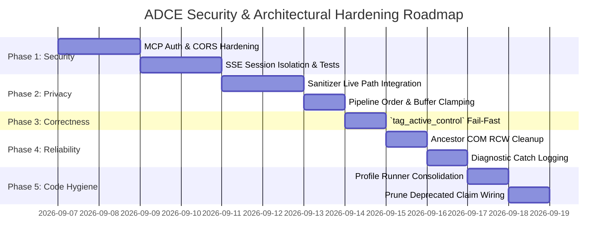

<!-- SPDX-License-Identifier: Apache-2.0 -->
<!-- Copyright (c) 2026 Amir Farhadi -->

[ 🏠 ADCE Home ](../../README.md) › [ 📚 Documentation Hub ](../CONTEXT.md) › **Security, Privacy & Architectural Hardening Audit**

---

# Security, Privacy & Architectural Hardening Audit (Post-Milestone Code Review)

> **Document Status:** Active Normative Audit & Hardening Roadmap
> **Epistemic Authority:** Tier 2 (Canonical Security & Hardening Specification)
> **Target Solution:** `ADCE.Core`, `ADCE.Extraction`, `ADCE.Storage`, `ADCE.Mcp`, `ADCE.Daemon`, `ADCE.Spikes`
> **Runtime:** .NET 10 (`net10.0-windows`) / C# 14 / `FlaUI.UIA3 5.0.0`
> **Date:** September 2026

---

## 1. Executive Summary & Threat Matrix

Following a comprehensive full-solution audit of the ADCE codebase, five primary vulnerability, privacy, correctness, and hygiene failure modes were identified. This document serves as the master record of findings, root-cause analyses, exploit/failure vectors, and explicit technical remediation blueprints.

```
┌───────────────────────────────────────────────────────────────────────────────────────────────────────┐
│                                ADCE SECURITY & HARDENING THREAT MATRIX                                │
├──────┬──────────────────────────────────────────┬──────────┬──────────────────────┬───────────────────┤
│ Ref  │ Finding / Subsystem                      │ Severity │ Failure Mechanism    │ Remediation State │
├──────┼──────────────────────────────────────────┼──────────┼──────────────────────┼───────────────────┤
│ SEC-1│ MCP HTTP/SSE Transport Vulnerabilities   │ Critical │ Wildcard CORS (*),   │ Planned (Phase 1) │
│      │ (`ADCE.Mcp.Transports.HttpSseMcpTransport`)│          │ No Auth Token, Shared│                   │
│      │                                          │          │ SSE Broadcast Leak   │                   │
├──────┼──────────────────────────────────────────┼──────────┼──────────────────────┼───────────────────┤
│ PRV-1│ Privacy Sanitizer Pipeline Disconnect   │ High     │ `SanitizeText` dead; │ Planned (Phase 2) │
│      │ (`ADCE.Extraction.Engine`, `Security`)   │          │ Control Name checked │                   │
│      │                                          │          │ instead of file path │                   │
├──────┼──────────────────────────────────────────┼──────────┼──────────────────────┼───────────────────┤
│ COR-1│ `tag_active_control` False Positives     │ Medium   │ Silent failure on    │ Planned (Phase 3) │
│      │ (`ADCE.Mcp.Server.DesktopContextMcpHandler`│        │ null `RuleEngine`    │                   │
├──────┼──────────────────────────────────────────┼──────────┼──────────────────────┼───────────────────┤
│ PRF-1│ COM RCW Churn & Unbounded Buffers       │ Medium   │ Unreleased COM ptrs; │ Planned (Phase 4) │
│      │ (`AncestorChainHarvester`, `ValueSnippet`)│         │ Uncapped edit snippet│                   │
├──────┼──────────────────────────────────────────┼──────────┼──────────────────────┼───────────────────┤
│ HYG-1│ Spikes Duplication & Deprecation Hygiene │ Low      │ Duplicate screenshot │ Planned (Phase 5) │
│      │ (`ProfileRunners`, `ClaimVerifier`, Logs)│          │ code; Bare catches   │                   │
└──────┴──────────────────────────────────────────┴──────────┴──────────────────────┴───────────────────┘
```

---

## 2. In-Depth Findings & Vulnerability Analysis

### 2.1 SEC-1: MCP HTTP/SSE Transport Security Surface
* **Component:** `src/ADCE.Mcp/Transports/HttpSseMcpTransport.cs`
* **Severity:** **Critical (P0)**

#### Root Cause & Flaw Breakdown
1. **Wildcard CORS (`Access-Control-Allow-Origin: *`):**
   Lines 136–140 in `HttpSseMcpTransport.cs` attach `Access-Control-Allow-Origin: *` to every response while binding to `http://127.0.0.1:<port>`. While localhost binding prevents remote network ingress, wildcard CORS completely defeats the browser's Same-Origin Policy (SOP). Any arbitrary webpage loaded in the user's web browser (e.g. Chrome, Edge, Waterfox) can execute client-side JavaScript that sends cross-origin HTTP requests to `http://127.0.0.1:<port>/messages` and reads live SSE streams.
2. **Absence of Authentication / Handshake Token:**
   There is no token, shared secret, or local process verification gating `/messages`, `/sse`, or `/tools/call`. Any untrusted local application or malicious browser script can exfiltrate real-time desktop telemetry (active IDE file paths, window titles, browser URLs, focused edit buffers) or invoke arbitrary tools.
3. **Broken SSE Session Model & Cross-Client Response Leak:**
   During the SSE handshake, the server sends:
   ```text
   event: endpoint
   data: /messages?session_id={clientId}
   ```
   However, the `POST /messages` handler never inspects `session_id`. All incoming messages are written to a single shared `Channel<string> _incomingChannel`. Furthermore, when emitting tool results, `SendMessageAsync` iterates through all connected clients:
   ```csharp
   foreach (var (clientId, writer) in _sseClients) { ... }
   ```
   This broadcasts every response to **every connected client**. If an IDE extension and a voice orchestrator (Caster) are connected simultaneously, each receives the other's private query responses.
4. **Zero Live Transport Test Coverage:**
   The automated test suite in `ADCE.Mcp.Tests` executes exclusively against `InMemoryMcpTransport` and `StdioMcpTransport`. `HttpSseMcpTransport` is never instantiated in automated test runs.

#### Remediation Specification
* **Strict Origin & Header Verification:** Remove wildcard CORS (`*`). For local HTTP transports, strictly disallow untrusted browser origins or restrict origin validation to configured developer origins. Reject requests with foreign `Origin` headers.
* **Local Loopback Bearer Authentication:** Generate a cryptographically secure ephemeral bearer token at daemon startup (`%LOCALAPPDATA%\ADCE\auth_token` or environment variable). Require all HTTP and SSE requests to supply `Authorization: Bearer <token>` or `?token=<token>`.
* **Session-Scoped Message Channels:** Map `session_id` to dedicated client ingress/egress channels so that JSON-RPC responses are dispatched exclusively to the client that originated the request.
* **Automated Integration Tests:** Add an `HttpSseMcpTransportTests` suite in `ADCE.Mcp.Tests` that spins up an ephemeral `HttpListener` on loopback, verifies token rejection (401 Unauthorized), origin rejection (403 Forbidden), session isolation, and clean client disconnect.

---

### 2.2 PRV-1: Privacy Sanitizer Pipeline Disconnect & Inversion
* **Component:** `src/ADCE.Extraction/Security/ContextPrivacySanitizer.cs`, `src/ADCE.Extraction/Engine/UiaExtractionEngine.cs`
* **Severity:** **High (P0)**

#### Root Cause & Flaw Breakdown
1. **Dead `SanitizeText` in Live Path:**
   `ContextPrivacySanitizer.SanitizeText()` strips local file schemes and transforms user profile paths (`UserProfileRoot/...`) to `~/...`. However, `SanitizeText` is only called inside the legacy/deprecated `EvidenceLedger.cs`. It is never invoked during live snapshot extraction or MCP serialization. As a result, `IdeContext.WorkspaceRoot`, `ActiveFilePath`, and `ExplorerContext.CurrentPath` leak raw Windows usernames into SQLite and MCP clients.
2. **Pipeline Ordering Inversion in Buffer Redaction:**
   In `UiaExtractionEngine.ExtractControlInfoCore`:
   ```csharp
   string name = focused.Properties.Name.ValueOrDefault ?? string.Empty;
   ...
   string? sanitizedValue = ContextPrivacySanitizer.SanitizeBuffer(value, name, isPassword);
   ```
   `IsSensitiveFile` evaluates `name` (the focused control's accessible name, such as `"Editor"`, `"RichEdit20W"`, or `""`), rather than the file path. The active file path is only computed later in Step 5 (`IdeContextExtractor.Extract`), after focus extraction in Step 4. Therefore, opening `.env`, `id_rsa`, or `credentials.json` fails to trigger secret buffer masking unless the accessibility name coincidentally equals the filename.

#### Remediation Specification
* **Live Path Path Scrubbing:** Enforce `ContextPrivacySanitizer.SanitizeText()` (or an opt-in/opt-out privacy policy) across all emitted path properties (`ActiveFilePath`, `WorkspaceRoot`, `CurrentPath`, `Window.Title`) prior to snapshot publication.
* **Pipeline Step Re-Ordering & File Path Coupling:** Ensure active file path identification occurs prior to focused control buffer extraction, or pass the resolved file name into `SanitizeBuffer` during context envelope assembly.

---

### 2.3 COR-1: `tag_active_control` Silent Failure Contract
* **Component:** `src/ADCE.Mcp/Server/DesktopContextMcpHandler.cs`
* **Severity:** **Medium (P1)**

#### Root Cause & Flaw Breakdown
In `ExecuteTagActiveControl`:
```csharp
_ruleEngine?.AddOrUpdateRule(rule);
...
var resultPayload = new { success = true, rule_id = rule.RuleId, ... };
```
When `DesktopContextMcpHandler` is instantiated with a null `ISemanticRuleEngine` (e.g. in headless mode or if rule engine loading failed), the rule is silently dropped. Despite not persisting to disk, the tool call returns `success: true` with a generated GUID. The consumer believes the rule was permanently saved when it only existed ephemerally in the in-memory snapshot.

#### Remediation Specification
* If `_ruleEngine == null`, `ExecuteTagActiveControl` must fail fast and return:
  ```csharp
  return CallToolResult.ErrorText("Semantic rule engine is not configured; unable to persist tag rule to disk.");
  ```

---

### 2.4 PRF-1: Unbounded `ValueSnippet` & COM RCW Lifecycle
* **Component:** `src/ADCE.Extraction/Engine/AncestorChainHarvester.cs`, `src/ADCE.Extraction/Engine/UiaExtractionEngine.cs`
* **Severity:** **Medium (P2)**

#### Root Cause & Flaw Breakdown
1. **Unbounded `ValueSnippet`:** `focused.Patterns.Value.PatternOrDefault?.Value.ValueOrDefault` is stored directly without length clamping. If a control exposes a multi-megabyte document buffer, the entire string is captured into memory and stored in SQLite.
2. **Unreleased COM Object Pointers:** In `AncestorChainHarvester.Harvest`, `RawViewWalker.GetParentElementBuildCache` returns raw COM `IUIAutomationElement` pointers. In continuous 24/7 background operation across rapid focus transitions, relying on GC finalizers causes handle accumulation and memory spikes between collection cycles.

#### Remediation Specification
* **Buffer Length Cap:** Clamp `ValueSnippet` to a maximum length (e.g. 2,048 characters with truncation marker `... [TRUNCATED]`).
* **Deterministic COM RCW Cleanup:** Implement explicit `Marshal.ReleaseComObject()` in ancestor climb loops to immediately release unmanaged COM interfaces.

---

### 2.5 HYG-1: Profiler Runner Duplication & Deprecation Hygiene
* **Component:** `src/ADCE.Spikes/Profiling/`, `src/ADCE.Spikes/Verification/`, `src/ADCE.Extraction/`
* **Severity:** **Low (P3)**

#### Root Cause & Flaw Breakdown
1. `WaterfoxProfileRunner.cs` and `AntigravityProfileRunner.cs` duplicate GDI screenshot logic instead of reusing `SurfaceVisualizer` / `SurfaceHarvester`.
2. `ClaimVerificationRunner` is marked `[Obsolete]` per postmortem, yet remains wired into CLI dispatch in `ADCE.Spikes/Program.cs`.
3. Bare `catch { }` blocks in `ADCE.Extraction` obscure unexpected runtime exceptions (`NullReferenceException`, `ArgumentException`) from expected COM disconnections.

#### Remediation Specification
* Refactor profile runners to delegate screenshot capturing to `SurfaceVisualizer`.
* Remove legacy claim verification CLI entrypoints.
* Introduce structured diagnostic logging (differentiating COM exceptions from programmatic failures).

---

## 3. Phased Implementation Roadmap



### Phase 1: MCP Transport Hardening & Security (P0)
1. **Remove Wildcard CORS:** Restrict CORS headers in `HttpSseMcpTransport.cs` to explicit origins or remove them for non-browser desktop clients.
2. **Implement Loopback Bearer Authentication:** Add token verification middleware to `HttpSseMcpTransport.cs`.
3. **Isolate SSE Sessions:** Map `session_id` to per-client channels in `HttpSseMcpTransport.cs`.
4. **Integration Test Suite:** Create `tests/ADCE.Mcp.Tests/HttpSseMcpTransportTests.cs` validating 401 Unauthorized, session segregation, and lifecycle.

### Phase 2: Privacy Sanitizer & Pipeline Alignment (P0)
1. **Live User Path Scrubbing:** Connect `ContextPrivacySanitizer.SanitizeText()` to `IdeContext`, `ExplorerContext`, and snapshot serialization.
2. **Pipeline Ordering Fix:** Reorganize `UiaExtractionEngine` so `ActiveFilePath` is resolved before or during buffer redaction.
3. **Snippet Clamping:** Enforce a 2,048-character limit on `ValueSnippet`.
4. **Unit Tests:** Add unit tests validating path masking and secret file buffer redaction in end-to-end snapshots.

### Phase 3: MCP Tool Correctness (P1)
1. **`tag_active_control` RuleEngine Validation:** Return `CallToolResult.ErrorText` when `_ruleEngine` is null or fails to persist rules.
2. **Unit Tests:** Add unit tests asserting error response when `_ruleEngine` is absent.

### Phase 4: COM Cleanup & Resilient Logging (P2)
1. **Deterministic RCW Release:** Add `Marshal.ReleaseComObject` in `AncestorChainHarvester.cs`.
2. **Structured Catch Blocks:** Distinguish `COMException` and `ElementNotAvailableException` from general exceptions and log diagnostics to standard error or trace listeners.

### Phase 5: Spikes & Codebase Hygiene (P3)
1. **Consolidate GDI Rendering:** Refactor `WaterfoxProfileRunner.cs` and `AntigravityProfileRunner.cs` to invoke `SurfaceVisualizer`.
2. **Prune Deprecated Harnesses:** Clean up dead CLI commands referencing `ClaimVerificationRunner`.
