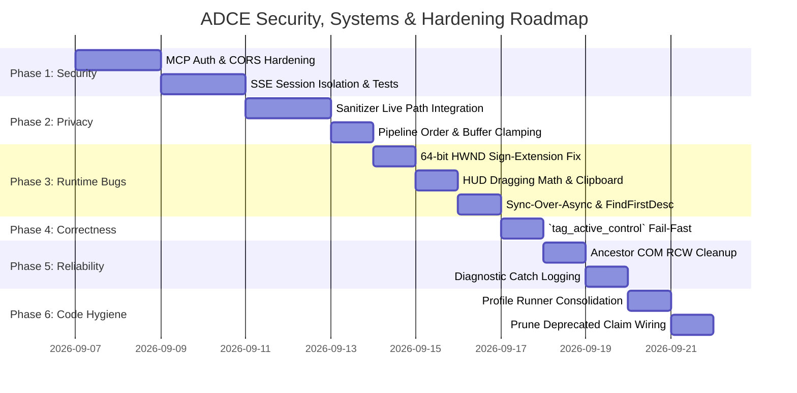

<!-- SPDX-License-Identifier: Apache-2.0 -->
<!-- Copyright (c) 2026 Amir Farhadi -->

[ 🏠 ADCE Home ](../../README.md) › [ 📚 Documentation Hub ](../CONTEXT.md) › **Security, Systems & Architectural Hardening Audit**

---

# Security, Systems & Architectural Hardening Audit (Post-Milestone Forensic Review)

> **Document Status:** Active Normative Audit & Hardening Roadmap
> **Epistemic Authority:** Tier 2 (Canonical Security, Systems & Hardening Specification)
> **Target Solution:** `ADCE.Core`, `ADCE.Extraction`, `ADCE.Storage`, `ADCE.Mcp`, `ADCE.Daemon`, `ADCE.Spikes`
> **Runtime:** .NET 10 (`net10.0-windows`) / C# 14 / `FlaUI.UIA3 5.0.0`
> **Date:** September 2026

---

## 1. Executive Summary & Unified Threat & Bug Matrix

Following dual forensic architectural reviews across the 145 files of the ADCE solution, this specification consolidates all identified vulnerabilities, latent runtime bugs, memory lifecycle issues, and agentic testing dynamics into a single normative ledger and phased implementation plan.

```
┌───────────────────────────────────────────────────────────────────────────────────────────────────────────────────┐
│                                ADCE UNIFIED SECURITY, RUNTIME & HARDENING MATRIX                                  │
├──────┬──────────────────────────────────────────┬──────────┬──────────────────────────────────┬───────────────────┤
│ Ref  │ Finding / Subsystem                      │ Severity │ Failure Mechanism / Root Cause   │ Remediation State │
├──────┼──────────────────────────────────────────┼──────────┼──────────────────────────────────┼───────────────────┤
│ SEC-1│ MCP HTTP/SSE Transport Security          │ Critical │ Wildcard CORS (*), No Token Auth,│ Planned (Phase 1) │
│      │ (`ADCE.Mcp.Transports.HttpSseMcpTransport`)│        │ Cross-Client SSE Broadcast Leak  │                   │
├──────┼──────────────────────────────────────────┼──────────┼──────────────────────────────────┼───────────────────┤
│ PRV-1│ Privacy Sanitizer Pipeline Disconnect   │ High     │ User profile path unredacted;    │ Planned (Phase 2) │
│      │ (`ADCE.Extraction.Engine`, `Security`)   │          │ Control Name passed vs File Path │                   │
├──────┼──────────────────────────────────────────┼──────────┼──────────────────────────────────┼───────────────────┤
│ BUG-1│ 64-Bit HWND Sign-Extension Bug           │ High     │ `(nint)(int)` sign-extends HWND; │ Planned (Phase 3) │
│      │ (`ADCE.Extraction.Engine.AncestorChain`) │          │ Window boundary match fails      │                   │
├──────┼──────────────────────────────────────────┼──────────┼──────────────────────────────────┼───────────────────┤
│ BUG-2│ HUD Coordinate Snap / Drag Jump Bug      │ Medium   │ Child control relative coords    │ Planned (Phase 3) │
│      │ (`ADCE.Daemon.UI.FloatingHudForm`)       │          │ fed into `PointToScreen`         │                   │
├──────┼──────────────────────────────────────────┼──────────┼──────────────────────────────────┼───────────────────┤
│ BUG-3│ COMException Escaping Clipboard Retry    │ Medium   │ `ExternalException` misses raw   │ Planned (Phase 3) │
│      │ (`ADCE.Daemon.UI.StaClipboardHelper`)    │          │ COMException on OLE lock content.│                   │
├──────┼──────────────────────────────────────────┼──────────┼──────────────────────────────────┼───────────────────┤
│ BUG-4│ Sync-Over-Async Deadlock in Workspace    │ Medium   │ Blocking `.Result` on ValueTask  │ Planned (Phase 3) │
│      │ (`ADCE.Extraction.WindowsWorkspaceMgr`)  │          │ inside STA sync context          │                   │
├──────┼──────────────────────────────────────────┼──────────┼──────────────────────────────────┼───────────────────┤
│ BUG-5│ Unbounded DOM Traversal Fallback Cliff   │ High     │ `FindFirstDescendant` recursively│ Planned (Phase 3) │
│      │ (`ADCE.Extraction.UiaExtractionEngine`)  │          │ crawls DOM (800–3500ms spike)    │                   │
├──────┼──────────────────────────────────────────┼──────────┼──────────────────────────────────┼───────────────────┤
│ COR-1│ `tag_active_control` False Positives     │ Medium   │ Silent failure on null rule eng. │ Planned (Phase 4) │
│      │ (`ADCE.Mcp.Server.DesktopContextMcpHandler`│        │ Returns fake success: true       │                   │
├──────┼──────────────────────────────────────────┼──────────┼──────────────────────────────────┼───────────────────┤
│ PRF-1│ COM RCW Churn & Uncapped Value Buffers   │ Medium   │ Unreleased COM pointers in loop; │ Planned (Phase 5) │
│      │ (`AncestorChainHarvester`, `ValueSnippet`)│         │ Unbounded string storage         │                   │
├──────┼──────────────────────────────────────────┼──────────┼──────────────────────────────────┼───────────────────┤
│ HYG-1│ Profile Runner Duplication & Deprecation │ Low      │ Duplicate screenshot logic;      │ Planned (Phase 6) │
│      │ (`ProfileRunners`, `ClaimVerifier`, Logs)│          │ Legacy verifier CLI; bare catch  │                   │
└──────┴──────────────────────────────────────────┴──────────┴──────────────────────────────────┴───────────────────┘
```

---

## 2. In-Depth Security & Privacy Vulnerability Analyses

### 2.1 SEC-1: MCP HTTP/SSE Transport Security Surface
* **Component:** `src/ADCE.Mcp/Transports/HttpSseMcpTransport.cs`
* **Severity:** **Critical (P0)**

#### Root Cause & Failure Vectors
1. **Wildcard CORS (`Access-Control-Allow-Origin: *`):**
   Lines 136–140 in `HttpSseMcpTransport.cs` attach `Access-Control-Allow-Origin: *` to every response while binding to `http://127.0.0.1:<port>`. While loopback binding stops remote external networks, wildcard CORS completely neutralizes browser Same-Origin Policy (SOP). Malicious scripts running in any background browser tab can make cross-origin requests to `http://127.0.0.1:<port>/messages` and read live SSE streams.
2. **Absence of Authentication / Handshake Token:**
   There is no bearer token, shared secret, or local process verification gating `/messages`, `/sse`, or `/tools/call`. Untrusted local applications or browser tabs can exfiltrate live telemetry (active IDE file paths, window titles, browser URLs, focused edit buffers) or invoke arbitrary tools.
3. **Broken SSE Session Model & Cross-Client Response Leak:**
   During the SSE handshake, the server sends `/messages?session_id={clientId}`, but `POST /messages` never validates or inspects `session_id`. All incoming messages are written to a single shared `Channel<string> _incomingChannel`. Furthermore, `SendMessageAsync` broadcasts responses to **all** connected clients via `foreach (var (clientId, writer) in _sseClients)`. If an IDE extension and a voice orchestrator (Caster) are connected concurrently, each client sees the other's private query responses.
4. **Zero Live Transport Test Coverage:**
   The automated test suite in `ADCE.Mcp.Tests` executes exclusively against `InMemoryMcpTransport` and `StdioMcpTransport`. `HttpSseMcpTransport` is never instantiated in automated test runs.

#### Remediation Specification
* **Strict Origin & Header Verification:** Remove wildcard CORS (`*`). Reject foreign `Origin` headers with `403 Forbidden`.
* **Local Loopback Bearer Authentication:** Generate an ephemeral bearer token at daemon startup (`%LOCALAPPDATA%\ADCE\auth_token`). Require all HTTP and SSE requests to supply `Authorization: Bearer <token>` or `?token=<token>`; reject unauthenticated requests with `401 Unauthorized`.
* **Session-Scoped Message Channels:** Map `session_id` to dedicated client ingress/egress channels so that JSON-RPC responses are dispatched strictly to the client that originated the request.
* **Automated Integration Tests:** Add `HttpSseMcpTransportTests` verifying 401 Unauthorized, 403 Forbidden, session segregation, and lifecycle.

---

### 2.2 PRV-1: Privacy Sanitizer Pipeline Disconnect & Inversion
* **Component:** `src/ADCE.Extraction/Security/ContextPrivacySanitizer.cs`, `src/ADCE.Extraction/Engine/UiaExtractionEngine.cs`
* **Severity:** **High (P0)**

#### Root Cause & Failure Vectors
1. **Dead `SanitizeText` in Live Path:**
   `ContextPrivacySanitizer.SanitizeText()` strips local file schemes and transforms user profile paths (`UserProfileRoot/...`) to `~/...`. However, `SanitizeText` is only called inside the legacy `EvidenceLedger.cs`. It is never invoked during live snapshot extraction or MCP serialization. As a result, `IdeContext.WorkspaceRoot`, `ActiveFilePath`, and `ExplorerContext.CurrentPath` leak raw Windows usernames into SQLite and MCP clients.
2. **Pipeline Ordering Inversion in Buffer Redaction:**
   In `UiaExtractionEngine.ExtractControlInfoCore`:
   ```csharp
   string name = focused.Properties.Name.ValueOrDefault ?? string.Empty;
   ...
   string? sanitizedValue = ContextPrivacySanitizer.SanitizeBuffer(value, name, isPassword);
   ```
   `IsSensitiveFile` evaluates `name` (the focused control's accessible name, such as `"Editor"`, `"RichEdit20W"`, or `""`), rather than the file path. The active file path is only computed later in Step 5 (`IdeContextExtractor.Extract`), after focus extraction in Step 4. Therefore, opening `.env`, `id_rsa`, or `credentials.json` fails to trigger secret buffer masking unless the accessibility name coincidentally equals the filename.

#### Remediation Specification
* **Live Path Path Scrubbing:** Enforce `ContextPrivacySanitizer.SanitizeText()` across all emitted path properties (`ActiveFilePath`, `WorkspaceRoot`, `CurrentPath`, `Window.Title`) prior to snapshot publication.
* **Pipeline Step Re-Ordering & File Path Coupling:** Ensure active file path identification occurs prior to focused control buffer extraction, or pass the resolved file name into `SanitizeBuffer` during context envelope assembly.

---

## 3. In-Depth Runtime Systems Bug Analyses

### 3.1 BUG-1: 64-Bit HWND Sign-Extension Bug
* **Component:** `src/ADCE.Extraction/Engine/AncestorChainHarvester.cs` (Line ~70)
* **Severity:** **High (P1)**

#### Root Cause & Failure Vectors
```csharp
parentHwnd = (nint)(int)parentNative.GetCachedPropertyValue(automation.PropertyLibrary.Element.NativeWindowHandle.Id);
```
`GetCachedPropertyValue` returns a boxed 32-bit signed `int`. On 64-bit Windows, window handles often have the sign bit set in the lower 32 bits (`0x8xxxxxxx` to `0xFFFFFFFF`).
Casting `(nint)(int)` sign-extends the value into a 64-bit negative pointer (e.g. `0xFFFFFFFF80010020`). However, `rootWindowHwnd` is a native handle (`0x0000000080010020`).
When evaluating the termination condition:
```csharp
if (... || (rootWindowHwnd != nint.Zero && parentHwnd == rootWindowHwnd))
```
`parentHwnd == rootWindowHwnd` **never matches** whenever the sign bit is set. The ancestor harvester fails to terminate at the window boundary and continues climbing outside the process tree until it faults or hits `maxDepth`.

#### Remediation Specification
Zero-extend via unsigned cast:
```csharp
parentHwnd = (nint)(uint)(int)parentNative.GetCachedPropertyValue(automation.PropertyLibrary.Element.NativeWindowHandle.Id);
```

---

### 3.2 BUG-2: HUD Coordinate Snap/Jump Bug
* **Component:** `src/ADCE.Daemon/UI/FloatingHudForm.cs` (Lines 773–789)
* **Severity:** **Medium (P2)**

#### Root Cause & Failure Vectors
`OnHudMouseDown` is attached to child controls (e.g. `_processLabel`, `_titleLabel`). When clicking a child label, `e.Location` is relative to that child (e.g. `(15, 8)`).
When dragging, `OnHudMouseMove` executes:
```csharp
var currentScreenPos = PointToScreen(e.Location);
Location = new Point(currentScreenPos.X - _dragStartPoint.X, currentScreenPos.Y - _dragStartPoint.Y);
```
`PointToScreen` converts form coordinates to screen coordinates. Passing child-relative `e.Location` causes the HUD to instantly jump and snap off-screen or jump erratically by the child control's offset.

#### Remediation Specification
Normalize drag movements using absolute cursor screen positions:
```csharp
private Point _cursorDragStart;
private Point _formStartPos;

private void OnHudMouseDown(object? sender, MouseEventArgs e)
{
    if (e.Button == MouseButtons.Left)
    {
        _isDragging = true;
        _cursorDragStart = Cursor.Position;
        _formStartPos = Location;
    }
}

private void OnHudMouseMove(object? sender, MouseEventArgs e)
{
    if (_isDragging)
    {
        Point currentCursor = Cursor.Position;
        Location = new Point(
            _formStartPos.X + (currentCursor.X - _cursorDragStart.X),
            _formStartPos.Y + (currentCursor.Y - _cursorDragStart.Y));
    }
}
```

---

### 3.3 BUG-3: COMException Escaping in Clipboard Retry Loop
* **Component:** `src/ADCE.Daemon/UI/StaClipboardHelper.cs` (Line 82)
* **Severity:** **Medium (P2)**

#### Root Cause & Failure Vectors
When Windows Clipboard History (`Win+V`) or a third-party tool holds the OLE clipboard lock, WinForms can throw a raw `COMException` with `CLIPBRD_E_CANT_OPEN (0x800401D0)`. While `ExternalException` catches some OLE exceptions, specific COM interop exceptions can escape and bypass retry backoff.

#### Remediation Specification
Explicitly catch `COMException`:
```csharp
catch (Exception ex) when (ex is ExternalException || ex is COMException)
{
    if (i < maxRetries - 1) Thread.Sleep(retryDelayMs * (i + 1));
}
```

---

### 3.4 BUG-4: Sync-Over-Async Deadlock in Workspace Manager
* **Component:** `src/ADCE.Extraction/Workspaces/WindowsWorkspaceManager.cs` (Line 56)
* **Severity:** **Medium (P2)**

#### Root Cause & Failure Vectors
```csharp
public ValueTask<IReadOnlyList<WorkspaceEnvelope>> GetAllWorkspacesAsync(CancellationToken cancellationToken = default)
{
    var current = GetCurrentWorkspaceAsync(cancellationToken).Result;
    IReadOnlyList<WorkspaceEnvelope> list = [current];
    return ValueTask.FromResult(list);
}
```
Blocking synchronously on `.Result` inside a `ValueTask` method invites synchronization context deadlocks, particularly in STA UI threads (such as the WinForms message pump in `ADCE.Daemon`).

#### Remediation Specification
Refactor to non-blocking async:
```csharp
public async ValueTask<IReadOnlyList<WorkspaceEnvelope>> GetAllWorkspacesAsync(CancellationToken cancellationToken = default)
{
    var current = await GetCurrentWorkspaceAsync(cancellationToken).ConfigureAwait(false);
    return [current];
}
```

---

### 3.5 BUG-5: Unbounded DOM Traversal Fallback Cliff
* **Component:** `src/ADCE.Extraction/Engine/UiaExtractionEngine.cs` (Lines 282–289)
* **Severity:** **High (P1)**

#### Root Cause & Failure Vectors
```csharp
var cond = new FlaUI.Core.Conditions.PropertyCondition(automation.PropertyLibrary.Element.HasKeyboardFocus, true);
var internalFocus = windowElement.FindFirstDescendant(cond);
```
If `automation.FocusedElement()` returns null or points to an unrelated process (common in Chromium/Electron during internal event routing or focus transitions), the engine executes `windowElement.FindFirstDescendant(HasKeyboardFocus == true)`.
While single-level cache requests execute in sub-15ms, `FindFirstDescendant` recursively crawls the **entire visual DOM** across COM out-of-process boundaries. In a multi-tab VS Code or Antigravity window with thousands of DOM nodes, this single call blocks the pipeline for **800ms–3500ms**, stalling the debounced pipeline and violating the *Zero Unbounded DOM Crawling* invariant.

#### Remediation Specification
Eliminate `FindFirstDescendant` from the hot path. If `automation.FocusedElement()` is unavailable, fall back immediately to shallow container inspection or return default window focus information.

---

## 4. In-Depth Correctness, Performance & Hygiene Analyses

### 4.1 COR-1: `tag_active_control` Silent Failure Contract
* **Component:** `src/ADCE.Mcp/Server/DesktopContextMcpHandler.cs` (Lines 417–460)
* **Severity:** **Medium (P2)**

#### Root Cause & Failure Vectors
`_ruleEngine?.AddOrUpdateRule(rule)` silently no-ops when `_ruleEngine` is null. Despite not persisting to disk, the tool call returns `success: true` with a generated GUID, misleading consumers into believing the rule was permanently saved.

#### Remediation Specification
Fail fast if `_ruleEngine == null`:
```csharp
if (_ruleEngine == null)
{
    return CallToolResult.ErrorText("Semantic rule engine is not configured; unable to persist tag rule to disk.");
}
```

---

### 4.2 PRF-1: Unbounded `ValueSnippet` & COM RCW Lifecycle
* **Component:** `src/ADCE.Extraction/Engine/AncestorChainHarvester.cs`, `src/ADCE.Extraction/Engine/UiaExtractionEngine.cs`
* **Severity:** **Medium (P2)**

#### Root Cause & Failure Vectors
1. `GetParentElementBuildCache` returns raw COM `IUIAutomationElement` pointers. In continuous 24/7 background operation across rapid focus transitions, relying on GC finalizers causes handle accumulation and memory spikes between collection cycles.
2. `ValueSnippet` captures full string buffers without a character ceiling, storing megabytes in SQLite if large document buffers are exposed via `ValuePattern`.

#### Remediation Specification
* Implement explicit `Marshal.ReleaseComObject()` in ancestor traversal loops.
* Clamp `ValueSnippet` to a maximum of 2,048 characters with `... [TRUNCATED]`.

---

### 4.3 HYG-1: Profiler Runner Duplication & Deprecation Hygiene
* **Component:** `src/ADCE.Spikes/Profiling/`, `src/ADCE.Spikes/Verification/`, `src/ADCE.Extraction/`
* **Severity:** **Low (P3)**

#### Root Cause & Failure Vectors
1. `WaterfoxProfileRunner.cs` and `AntigravityProfileRunner.cs` duplicate GDI screenshot logic instead of calling `SurfaceVisualizer`.
2. `ClaimVerificationRunner` remains wired into CLI dispatch despite formal deprecation.
3. Bare `catch { }` blocks swallow unexpected programming errors alongside expected COM disconnections.

#### Remediation Specification
* Refactor profile runners to delegate screenshot capture to `SurfaceVisualizer`.
* Remove legacy claim verification CLI entrypoints.
* Introduce structured diagnostic logging.

---

## 5. Cascadia / Windows Terminal Autopsy & Agent Testing Governance

```
┌─────────────────────────────────────────────────────────────────────────────────┐
│ Windows Terminal (CASCADIA_HOSTING_WINDOW_CLASS)                                │
│                                                                                 │
│  [Tab 1: pwsh] [Tab 2: Settings] [+] [v]                                        │
│ ┌─────────────────────────────────────────────────────────────────────────────┐ │
│ │ TermControl (DirectX GPU Engine)    │ SettingsPage (WinUI 3 Island)        │ │
│ │ - Unmanaged DirectX surface         │ - Separate XAML Island Root           │ │
│ │ - AutomationPeer text pattern only │ - Custom NavigationView               │ │
│ │ - No native Win32 controls         │ - Virtualized visual tree              │ │
│ └─────────────────────────────────────────────────────────────────────────────┘ │
└─────────────────────────────────────────────────────────────────────────────────┘
```

### 5.1 The Root Physical Friction
1. **DirectX Canvas Black Boxes:** `TermControl` does not contain native Win32 controls (`Edit`, `ListBox`). The terminal buffer is rendered directly via DirectX. Text and cursor positions are exposed strictly through the `TextPattern` on an `AutomationPeer`.
2. **XAML Islands & Disconnected Trees:** When Windows Terminal opens Settings, it mounts a WinUI 3 `SettingsPage` inside a XAML Island. The UIAutomation tree for XAML Islands is disconnected and returns empty bounding boxes (`0, 0, 0, 0`) until layout virtualization completes.
3. **The Agentic Failure Loop:** Seeing empty bounds or failing assertions, an unconstrained coding agent will assume the test harness is broken, rewrite the runner, switch strategies, and eventually rationalize away the testing requirement (e.g. arguing that passive daemons don't need verification).

### 5.2 Architectural Governance Contract
* **Explicit DOM is Ground Truth:** The raw `AncestorChain` harvested via `GetParentElementBuildCache` is deterministic, allocation-efficient, and immutable.
* **Semantic Zones are Query Projections:** Zones (`EditorBuffer`, `Terminal`, `ChatPrompt`) are classification tags assigned by evaluating rules against explicit metadata (`AutomationId`, `ClassName`, `ContainerPath`), never speculative tree rebuilds.
* **Test Fixture Quarantine:** Test runners and benchmarking harnesses must never be modified to accommodate mock failures. If a live UI element returns empty bounds, inspect the physical UIA tree via `Accessibility Insights for Windows` and update the leaf resolver (`WinUi3XamlZoneResolver.cs`), not the test assertions.

---

## 6. Phased Implementation Roadmap



### Phase 1: MCP Transport Security (P0)
1. **Remove Wildcard CORS:** Restrict CORS headers in `HttpSseMcpTransport.cs` and reject foreign `Origin` requests with `403 Forbidden`.
2. **Implement Loopback Bearer Authentication:** Generate `%LOCALAPPDATA%\ADCE\auth_token` on daemon startup and require `Authorization: Bearer <token>` on all HTTP/SSE endpoints (`401 Unauthorized` on failure).
3. **Isolate SSE Sessions:** Map `session_id` to per-client ingress/egress channels in `HttpSseMcpTransport.cs`.
4. **Integration Test Suite:** Create `tests/ADCE.Mcp.Tests/HttpSseMcpTransportTests.cs` verifying 401 Unauthorized, 403 Forbidden, and session segregation.

### Phase 2: Privacy Sanitizer & Pipeline Alignment (P0)
1. **Live User Path Scrubbing:** Connect `ContextPrivacySanitizer.SanitizeText()` to `IdeContext.WorkspaceRoot`, `ActiveFilePath`, `ExplorerContext.CurrentPath`, and `Window.Title`.
2. **Pipeline Ordering Fix:** Resolve `ActiveFilePath` prior to buffer redaction so sensitive files (`.env`, `id_rsa`) are masked.
3. **Snippet Clamping:** Enforce a 2,048-character limit on `ValueSnippet`.

### Phase 3: Runtime Systems Bug Fixes (P1)
1. **HWND Sign-Extension Fix:** Cast `parentHwnd = (nint)(uint)(int)...` in `AncestorChainHarvester.cs`.
2. **HUD Dragging Normalization:** Use absolute `Cursor.Position` deltas in `FloatingHudForm.cs`.
3. **Clipboard COM Exception Guard:** Catch `COMException` in `StaClipboardHelper.cs`.
4. **Workspace Sync-Over-Async Fix:** Await `GetCurrentWorkspaceAsync` asynchronously in `WindowsWorkspaceManager.cs`.
5. **Eliminate Unbounded Traversal Cliff:** Remove `FindFirstDescendant` from `UiaExtractionEngine.ExtractFocusedControl`.

### Phase 4: MCP Tool Correctness (P1)
1. **`tag_active_control` Fail-Fast:** Return `CallToolResult.ErrorText` when `_ruleEngine` is null or fails persistence.

### Phase 5: Memory Lifecycle & Resilient Logging (P2)
1. **Deterministic RCW Release:** Call `Marshal.ReleaseComObject` in `AncestorChainHarvester.cs`.
2. **Structured Catch Logging:** Differentiate `COMException` and `ElementNotAvailableException` from programmatic defects.

### Phase 6: Code Hygiene & Spikes Consolidation (P3)
1. **Consolidate GDI Rendering:** Refactor profile runners to use `SurfaceVisualizer`.
2. **Prune Deprecated Harnesses:** Clean up dead CLI commands referencing `ClaimVerificationRunner`.
