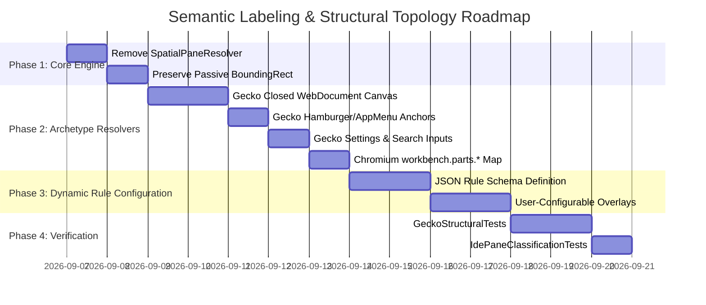

<!-- SPDX-License-Identifier: Apache-2.0 -->
<!-- Copyright (c) 2026 Amir Farhadi -->

[ 🏠 ADCE Home ](../../README.md) › [ 📚 Documentation Hub ](../CONTEXT.md) › **Semantic Classification & Interaction Graph Specification**

---

# Semantic Classification & Structural Archetype Taxonomy Specification

> **Document Status:** Active Canonical Architecture Specification
> **Epistemic Authority:** Tier 2 (Canonical Domain & Semantic Taxonomy Model)
> **Target Solution:** `ADCE.Core`, `ADCE.Extraction`, `ADCE.Mcp`, `ADCE.Daemon`
> **Target Consumers:** AI Coding Assistants (Antigravity IDE, Claude, Cline), Voice Frameworks (Caster)
> **Runtime:** .NET 10 (`net10.0-windows`) / C# 14 / `FlaUI.UIA3 5.0.0`
> **Date:** September 2026

---

## 1. Executive Overview & Problem Statement

ADCE operates strictly as a **Passive Observation Sensor** for downstream AI and automation consumers:
1. **Passive Telemetry Extraction:** Deterministically classifying the user's active focus, macro window pane, semantic zone, and interactive control role with sub-millisecond overhead and zero spatial coordinate guessing.
2. **Strict Scope Separation:** ADCE does not maintain multi-step click recipes, UI path trajectories, or state transition graphs. Action execution, keystroke synthesis, and UI automation planning belong exclusively to external agent frameworks or automation drivers, as codified in [ADCE_PHILOSOPHY_AND_SCOPE_BOUNDARIES.md](ADCE_PHILOSOPHY_AND_SCOPE_BOUNDARIES.md).

```
┌──────────────────────────────────────────────────────────────────────────────────────────────────┐
│                                ADCE PASSIVE OBSERVATION ARCHITECTURE                             │
├─────────────────────────────────────────────────────────────────┬────────────────────────────────┤
│ PASSIVE OBSERVATION PLANE (ADCE Core Engine)                    │ DOWNSTREAM CONSUMERS & ACTORS  │
├─────────────────────────────────────────────────────────────────┼────────────────────────────────┤
│ • Focus Element & AncestorChain Harvesting                      │ • Action Planning & Execution  │
│ • Closed Structural Archetype Topologies (Zero Spatial Math)    │ • Keyboard Shortcuts & Drivers │
│ • Fine-Grained Sub-Zones & Control Roles                        │ • Agent Navigation Reasoning   │
│ • Emits: DesktopContextSnapshot over MCP & Caster IPC           │ • Sensory Verification Loops   │
└─────────────────────────────────────────────────────────────────┴────────────────────────────────┘
```

---

## 2. Closed Structural Archetype Taxonomy (Zero Spatial Guessing)

### 2.1 The Fallacy of Spatial Coordinate Classification
Previous iterations utilized relative window geometry ($\text{RelY} \ge 0.75 \implies \text{BottomPanel}$, $\text{RelX} \ge 0.65 \implies \text{AuxiliarySidebar}$).
This created severe semantic bugs:
* **Web Page Footers Misclassified as `BottomPanel`:** Interactive buttons near the bottom of a web article were labeled as IDE terminal drawers.
* **Hamburger Menus Misclassified as `AuxiliarySidebar`:** The application menu on the top-right of a browser was labeled as a persistent auxiliary sidebar.
* **Window Snapping & Multi-Column Instability:** Snapping an IDE or browser to half-screen invalidated all global pixel percentage assumptions.

### 2.2 The Closed Macro Topologies
Every desktop application window is a finite, closed partition of structural layout compartments. Each `IArchetypeZoneResolver` provides an **exhaustive, closed topology**:

```
┌────────────────────────────────────────────────────────────────────────────────────────┐
│                        CLOSED STRUCTURAL ARCHETYPE RESOLUTION                          │
├────────────────────────┬───────────────────────────────────────┬───────────────────────┤
│ Archetype              │ Explicit Structural Containers        │ Closed Default Canvas │
├────────────────────────┼───────────────────────────────────────┼───────────────────────┤
│ Gecko / Browsers       │ TopBar: #navigator-toolbox            │ MainContent /         │
│ (Waterfox, Chrome)     │ Sidebar: #sidebar-box                 │ WebDocument           │
│                        │ Popups/AppMenu: #appMenu-popup,       │ (Never BottomPanel    │
│                        │                 #PanelUI-popup        │  or PrimarySidebar!)  │
│                        │ BottomPanel: #devtools-toolbox,       │                       │
│                        │             #findbar                  │                       │
├────────────────────────┼───────────────────────────────────────┼───────────────────────┤
│ ChromiumElectron       │ ActivityBar: workbench.parts.act..    │ MainContent /         │
│ (VS Code, Antigravity) │ PrimarySidebar: workbench.parts.side..│ EditorBuffer          │
│                        │ AuxSidebar: workbench.parts.aux..     │ (Monaco workspace)    │
│                        │ BottomPanel: workbench.parts.panel    │                       │
│                        │ StatusBar: workbench.parts.statusbar  │                       │
│                        │ TopBar: workbench.parts.titlebar      │                       │
│                        │ Menus: monaco-menu, context-view      │                       │
├────────────────────────┼───────────────────────────────────────┼───────────────────────┤
│ WinUi3Xaml             │ TopBar: TabRow / TabBarStrip          │ MainContent /         │
│ (Windows Terminal)     │ Settings: SettingsPage (XAML Island)  │ Terminal              │
│                        │ (No sidebars or bottom drawers!)      │ (TermControl buffer)  │
├────────────────────────┼───────────────────────────────────────┼───────────────────────┤
│ ClassicWin32           │ TopBar: ShellTabWindowClass           │ MainContent /         │
│ (Explorer, Notepad)    │ Sidebar: DirectUIHWND TreeControl     │ DocumentContent       │
│                        │ StatusBar: msctls_statusbar32         │                       │
└────────────────────────┴───────────────────────────────────────┴───────────────────────┘
```

### 2.3 Passive Telemetry Invariant
`BoundingRectangle` is preserved on `FocusedControlInfo` and `WindowEnvelope` strictly for visual HUD overlay rendering, click coordinates, and accessibility inspection. **Bounding boxes never drive semantic zone or pane naming.**

---

## 3. Fine-Grained Sub-Zones & Interactive Control Roles

To enable precise AI context comprehension, semantic paths decompose into five hierarchical segments:
$$\text{Semantic Path} = [\text{Macro Pane} > \text{Active View} > \text{Section Name} > \text{Control Role} > \text{Target Name}]$$

```
┌──────────────────────────────────────────────────────────────────────────────────────────────────┐
│                             HIERARCHICAL CONTEXT DECOMPOSITION                                   │
├───────────────────┬───────────────────┬───────────────────┬───────────────────┬──────────────────┤
│ 1. Macro Pane     │ 2. Active View    │ 3. Section Name   │ 4. Control Role   │ 5. Target Name   │
├───────────────────┼───────────────────┼───────────────────┼───────────────────┼──────────────────┤
│ MainContent       │ Settings          │ Search            │ Edit              │ Find in Settings │
│ MainContent       │ Settings          │ Privacy           │ CheckBox          │ Remember History │
│ MainContent       │ WebDocument       │ Article           │ Hyperlink         │ Documentation    │
│ TopBar            │ AppMenu           │ Menu              │ MenuItem          │ New Private Tab  │
│ TopBar            │ NavigationBar     │ AddressBar        │ Edit              │ Search or URL    │
│ PrimarySidebar    │ Explorer          │ OpenEditors       │ TreeItem          │ Program.cs       │
│ AuxiliarySidebar  │ Chat              │ ChatPrompt        │ Edit              │ Message input    │
│ BottomPanel       │ Terminal          │ Console           │ Document / Edit   │ pwsh (Terminal 1)│
└───────────────────┴───────────────────┴───────────────────┴───────────────────┴──────────────────┘
```

### 3.1 Browser Settings & Preferences Views
* **Detection:** Document URL contains `about:preferences`, `about:config`, `about:addons`, or `chrome://settings` $\implies \text{ActiveView} = \text{"Settings"}$.
* **In-Page Search Inputs:** Elements with `ControlType == "Edit"` or `AutomationId` containing `search-input` / `searchInput` $\implies \text{SectionName} = \text{"Search"}$, $\text{Zone} = \text{EditorBuffer}$.
* **Setting Sections:** Category navigation items map to `SectionName` (e.g. `"General"`, `"Home"`, `"Search"`, `"Privacy"`).

### 3.2 Interactive Control Roles
`FocusedControlInfo` directly surfaces native accessibility roles:
* `Edit`: Text entry inputs, code buffers, URL bars, search boxes.
* `Button`: Action triggers, submit buttons, toolbar toggles.
* `Hyperlink`: In-page web links, documentation anchors.
* `CheckBox` / `RadioButton`: Boolean configuration options.
* `ComboBox` / `DropDown`: Dropdown option selectors.
* `MenuItem`: Application and context menu commands.
* `TreeItem` / `ListItem`: File trees, search results, history lists.

---

## 4. The Ephemeral UI Tree & Sensory Verification Boundaries

### 4.1 The Physical Problem: The "Dark / Virtualized Tree"
In modern UI frameworks (Chromium/Electron, Gecko, WinUI 3 XAML Islands):
1. **Dynamic Mounting:** Menus (`#appMenu-popup`, `monaco-menu`), Command Palettes, In-Page Find Bars (`#findbar`), and Settings pages do NOT exist in the accessibility tree when closed. They are dynamically mounted and rendered only upon specific user interaction.
2. **Deferred Layout Virtualization:** WinUI 3 XAML Islands (e.g. Windows Terminal Settings) defer layout virtualization until the tab is actively focused and rendered, returning empty bounding boxes (`0, 0, 0, 0`) prior to layout completion.
3. **The Agentic Brute-Force Trap:** An AI agent attempting to inspect an unmounted surface cannot find the target control through passive querying. If the agent attempts recursive full-tree scanning (`FindFirstDescendant`), it triggers 800 ms to 3500 ms CPU stalls and still finds zero elements because the controls are unmounted.

### 4.2 The Solution: External Orchestration with Passive Sensory Feedback
ADCE does not embed automation recipes or navigation click scripts into the telemetry engine. Storing multi-step click recipes inside ADCE violates the core invariant of being a passive, zero-allocation sensor. External agents execute actions using their own planners and use ADCE's real-time sensory feedback to verify whether the target surface mounted successfully:

```
┌────────────────────────────────────────────────────────────────────────────────────────┐
│                       THE PERCEPTION-ACTION AGENTIC LOOP                               │
├────────────────────────────────────────────────────────────────────────────────────────┤
│                                                                                        │
│  1. Agent Receives Goal: "Search for proxy settings in Waterfox"                       │
│                                                                                        │
│  2. Agent Queries Sensor (ADCE):                                                       │
│     MCP: `get_current_snapshot` ──▶ State: [Waterfox | MainContent > WebDocument]     │
│                                                                                        │
│  3. Agent Plans Action (External Planner):                                             │
│     Agent knows shortcut is Ctrl+, or direct navigation to about:preferences           │
│                                                                                        │
│  4. Agent Executes Action (External Automation Driver):                                │
│     Agent triggers shortcut or navigates to about:preferences                         │
│                                                                                        │
│  5. ADCE Passively Detects Transition:                                                 │
│     Focus shifts ──▶ WinEvent hook fires ──▶ ADCE extracts state (< 10 ms)             │
│                                                                                        │
│  6. Agent Queries Sensor to Verify:                                                    │
│     MCP: `get_current_snapshot` ──▶ State: [Waterfox | MainContent > Settings > Search]│
│                                            Control: Edit ("Find in Settings")          │
│                                                                                        │
│  7. Agent Confirms Success & Proceeds to Next Step.                                    │
│                                                                                        │
└────────────────────────────────────────────────────────────────────────────────────────┘
```

---

## 5. Consumer Integration: How Agents Use This Model

### 5.1 Passive Observation Flow (Live Telemetry)
1. User clicks or tabs to an element.
2. `AncestorChainHarvester` captures parent container IDs within a single COM roundtrip.
3. The closed `IArchetypeZoneResolver` maps the control to `[MacroPane > ActiveView > SectionName > Role]`.
4. MCP tool `get_current_snapshot` returns the enriched envelope in `< 1.0 ms` from the L1 cache.

### 5.2 Verification Verification Flow
When an agent or voice grammar issues an action, it queries ADCE post-action to confirm that the focused control, macro pane, or semantic zone transitioned to the expected state before proceeding to subsequent keystrokes.

---

## 6. Implementation Roadmap


