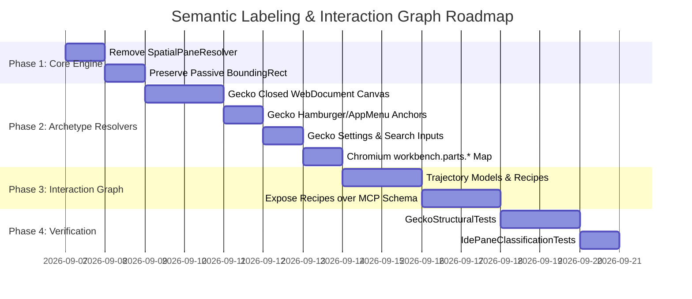

<!-- SPDX-License-Identifier: Apache-2.0 -->
<!-- Copyright (c) 2026 Amir Farhadi -->

[ 🏠 ADCE Home ](../../README.md) › [ 📚 Documentation Hub ](../CONTEXT.md) › **Semantic Classification & Interaction Graph Specification**

---

# Semantic Classification & Interaction State Graph Specification

> **Document Status:** Active Canonical Architecture Specification
> **Epistemic Authority:** Tier 2 (Canonical Domain & Semantic Taxonomy Model)
> **Target Solution:** `ADCE.Core`, `ADCE.Extraction`, `ADCE.Mcp`, `ADCE.Daemon`
> **Target Consumers:** AI Coding Assistants (Antigravity IDE, Claude, Cline), Voice Frameworks (Caster), Automation Engines
> **Runtime:** .NET 10 (`net10.0-windows`) / C# 14 / `FlaUI.UIA3 5.0.0`
> **Date:** September 2026

---

## 1. Executive Overview & Problem Statement

ADCE serves two interconnected operational roles for downstream AI and automation consumers:
1. **Passive Observation Plane:** Deterministically classifying the user's active focus, macro window pane, semantic zone, and interactive control role with sub-millisecond overhead and zero spatial coordinate guessing.
2. **Actionable Interaction Plane (State Transition Graph):** Providing AI agents and voice grammars with deterministic **Interaction Trajectories (UI Paths)** to reach, reveal, and automate ephemeral or unmounted UI surfaces (such as Settings, Hamburger Menus, Command Palettes, and XAML Island tabs) without requiring blind full-tree DOM crawling.

```
┌──────────────────────────────────────────────────────────────────────────────────────────────────┐
│                                ADCE DUAL-PLANE ARCHITECTURE                                      │
├─────────────────────────────────────────────────────────────────┬────────────────────────────────┤
│ PASSIVE OBSERVATION PLANE (Live State)                          │ ACTIONABLE INTERACTION PLANE   │
├─────────────────────────────────────────────────────────────────┼────────────────────────────────┤
│ • Focus Element & AncestorChain Harvesting                      │ • Semantic State Graph         │
│ • Closed Structural Archetype Topologies (Zero Spatial Math)    │ • Ephemeral UI Reveal Recipes  │
│ • Fine-Grained Sub-Zones & Control Roles                        │ • Deterministic Key / UI Paths │
│ • Emits: DesktopContextSnapshot over MCP & Caster IPC           │ • Exposes: Interaction Traject.│
└─────────────────────────────────────────────────────────────────┴────────────────────────────────┘
```

---

## 2. Closed Structural Archetype Taxonomy (Zero Spatial Guessing)

### 2.1 The Fallacy of Spatial Coordinate Classification
Previous iterations utilized relative window geometry ($\text{RelY} \ge 0.75 \implies \text{BottomPanel}$, $\text{RelX} \ge 0.65 \implies \text{AuxiliarySidebar}$).
This created severe semantic bugs:
* **Web Page Footers Misclassified as `BottomPanel`:** Interactive buttons near the bottom of a web article were labeled as IDE terminal drawers.
* **Hamburger Menus Misclassified as `AuxiliarySidebar`:** The application menu on the top-right of a browser was labeled as a persistent auxiliary sidebar.
* **Window Snapping & Multi-Column Instability:** Snapping an IDE or browser to half-screen invalidated all global pixel percentage assumptions.

### 2.2 The Closed Macro Topologies
Every desktop application window is a finite, closed partition of structural layout compartments. Each `IArchetypeZoneResolver` provides an **exhaustive, closed topology**:

```
┌────────────────────────────────────────────────────────────────────────────────────────┐
│                        CLOSED STRUCTURAL ARCHETYPE RESOLUTION                          │
├────────────────────────┬───────────────────────────────────────┬───────────────────────┤
│ Archetype              │ Explicit Structural Containers        │ Closed Default Canvas │
├────────────────────────┼───────────────────────────────────────┼───────────────────────┤
│ Gecko / Browsers       │ TopBar: #navigator-toolbox            │ MainContent /         │
│ (Waterfox, Chrome)     │ Sidebar: #sidebar-box                 │ WebDocument           │
│                        │ Popups/AppMenu: #appMenu-popup,       │ (Never BottomPanel    │
│                        │                 #PanelUI-popup        │  or PrimarySidebar!)  │
│                        │ BottomPanel: #devtools-toolbox,       │                       │
│                        │             #findbar                  │                       │
├────────────────────────┼───────────────────────────────────────┼───────────────────────┤
│ ChromiumElectron       │ ActivityBar: workbench.parts.act..    │ MainContent /         │
│ (VS Code, Antigravity) │ PrimarySidebar: workbench.parts.side..│ EditorBuffer          │
│                        │ AuxSidebar: workbench.parts.aux..     │ (Monaco workspace)    │
│                        │ BottomPanel: workbench.parts.panel    │                       │
│                        │ StatusBar: workbench.parts.statusbar  │                       │
│                        │ TopBar: workbench.parts.titlebar      │                       │
│                        │ Menus: monaco-menu, context-view      │                       │
├────────────────────────┼───────────────────────────────────────┼───────────────────────┤
│ WinUi3Xaml             │ TopBar: TabRow / TabBarStrip          │ MainContent /         │
│ (Windows Terminal)     │ Settings: SettingsPage (XAML Island)  │ Terminal              │
│                        │ (No sidebars or bottom drawers!)      │ (TermControl buffer)  │
├────────────────────────┼───────────────────────────────────────┼───────────────────────┤
│ ClassicWin32           │ TopBar: ShellTabWindowClass           │ MainContent /         │
│ (Explorer, Notepad)    │ Sidebar: DirectUIHWND TreeControl     │ DocumentContent       │
│                        │ StatusBar: msctls_statusbar32         │                       │
└────────────────────────┴───────────────────────────────────────┴───────────────────────┘
```

### 2.3 Passive Telemetry Invariant
`BoundingRectangle` is preserved on `FocusedControlInfo` and `WindowEnvelope` strictly for visual HUD overlay rendering, click coordinates, and accessibility inspection. **Bounding boxes never drive semantic zone or pane naming.**

---

## 3. Fine-Grained Sub-Zones & Interactive Control Roles

To enable precise AI context comprehension, semantic paths decompose into five hierarchical segments:
$$\text{Semantic Path} = [\text{Macro Pane} > \text{Active View} > \text{Section Name} > \text{Control Role} > \text{Target Name}]$$

```
┌──────────────────────────────────────────────────────────────────────────────────────────────────┐
│                             HIERARCHICAL CONTEXT DECOMPOSITION                                   │
├───────────────────┬───────────────────┬───────────────────┬───────────────────┬──────────────────┤
│ 1. Macro Pane     │ 2. Active View    │ 3. Section Name   │ 4. Control Role   │ 5. Target Name   │
├───────────────────┼───────────────────┼───────────────────┼───────────────────┼──────────────────┤
│ MainContent       │ Settings          │ Search            │ Edit              │ Find in Settings │
│ MainContent       │ Settings          │ Privacy           │ CheckBox          │ Remember History │
│ MainContent       │ WebDocument       │ Article           │ Hyperlink         │ Documentation    │
│ TopBar            │ AppMenu           │ Menu              │ MenuItem          │ New Private Tab  │
│ TopBar            │ NavigationBar     │ AddressBar        │ Edit              │ Search or URL    │
│ PrimarySidebar    │ Explorer          │ OpenEditors       │ TreeItem          │ Program.cs       │
│ AuxiliarySidebar  │ Chat              │ ChatPrompt        │ Edit              │ Message input    │
│ BottomPanel       │ Terminal          │ Console           │ Document / Edit   │ pwsh (Terminal 1)│
└───────────────────┴───────────────────┴───────────────────┴───────────────────┴──────────────────┘
```

### 3.1 Browser Settings & Preferences Views
* **Detection:** Document URL contains `about:preferences`, `about:config`, `about:addons`, or `chrome://settings` $\implies \text{ActiveView} = \text{"Settings"}$.
* **In-Page Search Inputs:** Elements with `ControlType == "Edit"` or `AutomationId` containing `search-input` / `searchInput` $\implies \text{SectionName} = \text{"Search"}$, $\text{Zone} = \text{EditorBuffer}$.
* **Setting Sections:** Category navigation items map to `SectionName` (e.g. `"General"`, `"Home"`, `"Search"`, `"Privacy"`).

### 3.2 Interactive Control Roles
`FocusedControlInfo` directly surfaces native accessibility roles:
* `Edit`: Text entry inputs, code buffers, URL bars, search boxes.
* `Button`: Action triggers, submit buttons, toolbar toggles.
* `Hyperlink`: In-page web links, documentation anchors.
* `CheckBox` / `RadioButton`: Boolean configuration options.
* `ComboBox` / `DropDown`: Dropdown option selectors.
* `MenuItem`: Application and context menu commands.
* `TreeItem` / `ListItem`: File trees, search results, history lists.

---

## 4. The Ephemeral UI Tree & The Interaction State Graph

### 4.1 The Physical Problem: The "Dark / Virtualized Tree"
In modern UI frameworks (Chromium/Electron, Gecko, WinUI 3 XAML Islands):
1. **Dynamic Mounting:** Menus (`#appMenu-popup`, `monaco-menu`), Command Palettes, In-Page Find Bars (`#findbar`), and Settings pages **do NOT exist in the UIA accessibility tree when closed**. They are dynamically mounted and rendered only upon specific user interaction.
2. **Deferred Layout Virtualization:** WinUI 3 XAML Islands (e.g. Windows Terminal Settings) defer layout virtualization until the tab is actively focused and rendered, returning empty bounding boxes (`0, 0, 0, 0`) prior to layout completion.
3. **The Agentic Brute-Force Trap:** An AI agent attempting to automate or inspect an unmounted surface cannot find the target control through passive querying. If the agent attempts recursive full-tree scanning (`FindFirstDescendant`), it triggers 800ms–3500ms CPU stalls and still finds zero elements because the controls are unmounted.

### 4.2 The Solution: Interaction Trajectories & Transition Recipes
Rather than guessing or blind-crawling, ADCE formalizes an **Interaction State Graph** defining the deterministic recipes to reveal, focus, and navigate to any target state.

```
┌────────────────────────────────────────────────────────────────────────────────────────┐
│                              INTERACTION STATE TRANSITION GRAPH                        │
├──────────────────────┬─────────────────────────┬───────────────────────────────────────┤
│ Target UI State      │ Primary Shortcut Path   │ Deterministic UI Click Trajectory     │
├──────────────────────┼─────────────────────────┼───────────────────────────────────────┤
│ Settings (Browser)   │ about:preferences       │ TopBar > #PanelUI-menu-button (Click) │
│                      │                         │ └─ OverlayModal > #appMenu-settings   │
├──────────────────────┼─────────────────────────┼───────────────────────────────────────┤
│ Settings (IDE)       │ Ctrl+,                  │ TopBar > MenuBar > "File" (Click)     │
│                      │                         │ └─ "Preferences" > "Settings"         │
├──────────────────────┼─────────────────────────┼───────────────────────────────────────┤
│ Command Palette (IDE)│ Ctrl+Shift+P            │ TopBar > MenuBar > "View" (Click)     │
│                      │                         │ └─ "Command Palette..."               │
├──────────────────────┼─────────────────────────┼───────────────────────────────────────┤
│ In-Page Find (Browser│ Ctrl+F                  │ TopBar > #PanelUI-menu-button (Click) │
│                      │                         │ └─ "Find in This Page..."             │
├──────────────────────┼─────────────────────────┼───────────────────────────────────────┤
│ Integrated Terminal  │ Ctrl+` (or Ctrl+J)      │ TopBar > MenuBar > "Terminal" (Click) │
│                      │                         │ └─ "New Terminal"                     │
├──────────────────────┼─────────────────────────┼───────────────────────────────────────┤
│ AI Assistant Drawer  │ Ctrl+L (or Ctrl+Alt+B)  │ ActivityBar > "Chat" Icon (Click)     │
└──────────────────────┴─────────────────────────┴───────────────────────────────────────┘
```

### 4.3 Structure of an Interaction Recipe (Schema)

```csharp
public record InteractionTrajectory(
    string TargetView,
    string? TargetSection,
    string? PrimaryShortcut,
    IReadOnlyList<UiInteractionStep> UiSteps);

public record UiInteractionStep(
    int StepOrder,
    string ContainerAnchor,
    string TargetControlId,
    string ActionType, // "Click", "Expand", "Focus", "SetText"
    string ExpectedResultZone);
```

#### Example: Revealing Waterfox Application Settings via UI Path:
```json
{
  "target_view": "Settings",
  "primary_shortcut": "Ctrl+,",
  "direct_url": "about:preferences",
  "ui_steps": [
    {
      "step": 1,
      "container": "TopBar > NavigationBar",
      "target_id": "PanelUI-menu-button",
      "action": "Click",
      "expected_zone": "NavigationPanel (AppMenu)"
    },
    {
      "step": 2,
      "container": "OverlayModal > AppMenu",
      "target_id": "appMenu-settings-button",
      "action": "Click",
      "expected_zone": "WebDocument (Settings)"
    }
  ]
}
```

---

## 5. Consumer Integration: How Agents Use This Model

### 5.1 Passive Observation Flow (Live Telemetry)
1. User clicks or tabs to an element.
2. `AncestorChainHarvester` captures parent container IDs.
3. The closed `IArchetypeZoneResolver` maps the control to `[MacroPane > ActiveView > SectionName > Role]`.
4. MCP tool `get_current_snapshot` returns the enriched envelope in `< 1.0 ms`.

### 5.2 Actionable Intent Flow (Agentic Navigation)
1. Agent receives user goal: *"Search for cookie settings in Waterfox"*.
2. Agent queries ADCE: Current state is `[MainContent > WebDocument > Article]`.
3. Agent inspects interaction recipe for `TargetView: "Settings"`:
   * Option A (Direct): Invoke `Ctrl+,` or navigate to `about:preferences`.
   * Option B (UI Trajectory): Click `#PanelUI-menu-button` $\implies$ Click `#appMenu-settings-button`.
4. Agent executes recipe.
5. ADCE detects focus transition and immediately confirms: `[MainContent > Settings > Search]`, Control: `Edit ("Find in Settings")`.
6. Agent writes `"cookie"` into the search box via UIA `ValuePattern.SetValue()`.

---

## 6. Implementation Roadmap


