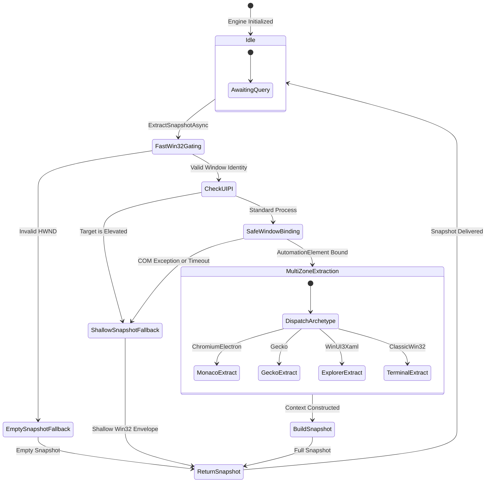
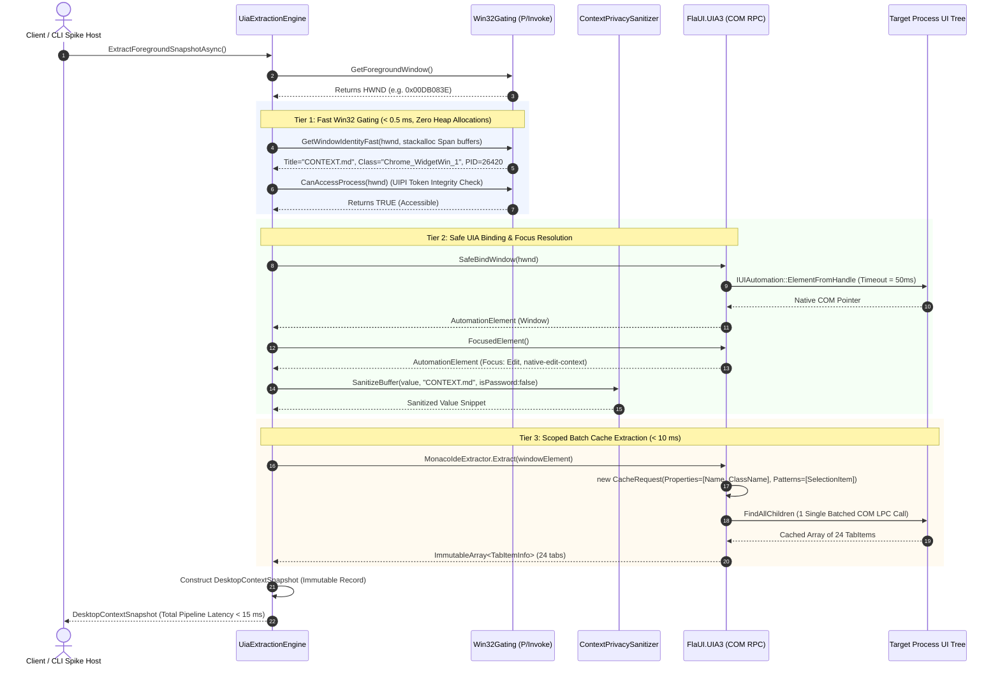

<!-- SPDX-License-Identifier: Apache-2.0 -->
<!-- Copyright (c) 2026 Amir Farhadi -->

[ 🏠 ADCE Home ](../../README.md) › [ 📚 Documentation Hub ](../CONTEXT.md) › **ADCE.Extraction Deep-Dive & Architecture Reference**

---

# ADCE.Extraction Deep-Dive & Architectural Reference

> **Target Library:** `ADCE.Extraction` (.NET 10 / C# 14 / `FlaUI.UIA3 5.0.0`)
> **Purpose:** Plain-English architectural breakdown, modular UML diagrams, state lifecycle machines, sequence dataflows, and file-by-file failure mode analysis for the context extraction engine.
> **Parent Context:** [`docs/CONTEXT.md`](../CONTEXT.md) | [`docs/ADCE_CORE_DEEP_DIVE.md`](ADCE_CORE_DEEP_DIVE.md) | [`docs/HOSTILE_ARCHITECTURE_REVIEW.md`](../architecture/HOSTILE_ARCHITECTURE_REVIEW.md)

---

## 1. Architectural View 1: Structural & Dependency Model

The extraction plane is structured into decoupled components separating fast Win32 P/Invoke gating, privacy sanitization, framework archetype classification, and specialized multi-zone UIA extractors:

```mermaid
graph TD
    subgraph HostPlane["Host & Diagnostics Layer"]
        Spikes["ADCE.Spikes (CLI Spike Host)"]
    end

    subgraph ExtractionPlane["ADCE.Extraction (Extraction Engine)"]
        Engine["UiaExtractionEngine"]
        Win32Gate["Win32Gating (P/Invoke Fast Gating)"]
        Privacy["ContextPrivacySanitizer (Redaction Firewall)"]
        Classifier["ArchetypeClassifier"]

        subgraph ZoneExtractors["Specialized Multi-Zone Extractors"]
            Monaco["MonacoIdeExtractor (VS Code / Antigravity)"]
            Gecko["GeckoBrowserExtractor (Waterfox / Firefox)"]
            Explorer["WinUIExplorerExtractor (Win11 File Explorer)"]
            Terminal["TerminalExtractor (Cascadia / Console)"]
        end
    end

    subgraph CorePlane["ADCE.Core (Domain Models & Interfaces)"]
        IEngine["IExtractionEngine"]
        IClassifier["IArchetypeClassifier"]
        Snapshot["DesktopContextSnapshot (Root Immutable Record)"]
        EventToken["DesktopEventToken (16-byte Unmanaged Struct)"]

        subgraph Models["Domain Context Envelopes"]
            WindowEnv["WindowEnvelope"]
            WorkspaceEnv["WorkspaceEnvelope"]
            FocusEnv["FocusedControlInfo"]
            IdeCtx["IdeContext (ImmutableArray)"]
            BrowserCtx["BrowserContext (ImmutableArray)"]
            ExplorerCtx["ExplorerContext (ImmutableArray)"]
            TerminalCtx["TerminalContext (ImmutableArray)"]
        end
    end

    subgraph TestsPlane["Automated Verification Suites"]
        CoreTests["ADCE.Core.Tests (20 Tests)"]
        ExtTests["ADCE.Extraction.Tests (39 Tests)"]
    end

    Spikes --> Engine
    Spikes --> Snapshot
    Engine -.-> IEngine
    Classifier -.-> IClassifier

    Engine --> Win32Gate
    Engine --> Privacy
    Engine --> Classifier
    Engine --> Monaco
    Engine --> Gecko
    Engine --> Explorer
    Engine --> Terminal

    Monaco --> Privacy
    Gecko --> Privacy

    Engine --> Snapshot
    Snapshot --> WindowEnv
    Snapshot --> WorkspaceEnv
    Snapshot --> FocusEnv
    Snapshot --> IdeCtx
    Snapshot --> BrowserCtx
    Snapshot --> ExplorerCtx
    Snapshot --> TerminalCtx

    CoreTests --> CorePlane
    ExtTests --> ExtractionPlane
    ExtTests --> CorePlane
```



---

## 2. Architectural View 2: State & Lifecycle Machine

This state machine tracks window discovery through sub-millisecond Win32 shallow gating, UIPI privilege filtering, safe UIA binding with 50ms transaction timeouts, and graceful fallbacks:



---

## 3. Architectural View 3: Execution & Sequence Dataflow

This sequence diagram details the synchronous vs. asynchronous boundaries across Win32 C-calls, FlaUI COM RPC, privacy redaction, and snapshot generation:



---

## 4. Educational Breakdown: Systems Patterns Explained

### 4.1 Zero-Allocation Memory Optimization (`ImmutableArray<T>`)
* **The Problem:** In high-frequency UI tracking, the daemon processes 20–50 focus/window events per second. When comparing state snapshots (`contextA == contextB`), standard C# `IReadOnlyList<T>` properties invoke LINQ's `Enumerable.SequenceEqual`. This creates **2 heap allocations for `IEnumerator<T>` on every comparison**, rapidly filling Gen 0 memory and causing cyclic GC pauses.
* **The Solution:** All collection properties in `IdeContext`, `BrowserContext`, `ExplorerContext`, and `TerminalContext` are typed as `ImmutableArray<T>`. `ImmutableArray<T>` is a value-type `struct` wrapping a raw array pointer (`T[]`).
* **The `.IsDefaultOrEmpty` Safety Guard:** If an `ImmutableArray` is created via default struct instantiation or empty JSON deserialization, its internal pointer is `null`. Calling `.Length` or `[i]` would throw an `InvalidOperationException`. Our custom `Equals()` guards against this with `IsDefault` checks before iterating with direct register-indexed loops—achieving **0 bytes of heap allocation** during sequence equality checks.

### 4.2 Fast Win32 Shallow Gating (`Span<char>` & Stackalloc)
* **The Problem:** UI Automation (UIA) is a heavy cross-process RPC engine. Querying an invalid or closed window via UIA costs 10–50 ms.
* **The Solution:** [`Win32Gating.cs`](../../src/ADCE.Extraction/Win32/Win32Gating.cs) screens candidate windows in $< 0.5\text{ ms}$ using raw C-style Win32 calls (`GetWindowTextW`, `GetClassNameW`, `GetWindowThreadProcessId`).
* **Zero-Allocation String Extraction:** Instead of allocating managed `StringBuilder(512)` instances, we allocate raw buffers on the CPU thread stack using `Span<char> titleBuffer = stackalloc char[512]`. We only instantiate a single managed string once the final length is returned by the kernel.

### 4.3 UIPI Privilege Gating (Preventing COM RPC Deadlocks)
* **The Problem:** Windows User Interface Privilege Isolation (UIPI) prevents lower-integrity processes from accessing higher-integrity (Elevated/Admin) windows. If ADCE runs as a standard user and attempts a UIA query on Task Manager or an Admin IDE, Windows returns `E_ACCESSDENIED` (`0x80070005`) or hangs the RPC worker thread.
* **The Solution:** Before invoking FlaUI, `Win32Gating.CanAccessProcess(hwnd)` inspects the target process token integrity level (`TOKEN_MANDATORY_LABEL`). If the target is elevated, ADCE immediately downgrades to a Win32 shallow snapshot (`WindowEnvelope`), capturing the title and PID without stalling in COM.

### 4.4 Single-Roundtrip Batch Caching (`CacheRequest.Activate()`)
* **The Problem:** In naive UI Automation, reading 30 tabs requires 30 separate cross-process COM calls (querying Name, SelectionItem, ClassName for each tab), totaling $\sim 150\text{ ms}$.
* **The Solution:** [`MonacoIdeExtractor.cs`](../../src/ADCE.Extraction/Extractors/MonacoIdeExtractor.cs) and [`GeckoBrowserExtractor.cs`](../../src/ADCE.Extraction/Extractors/GeckoBrowserExtractor.cs) activate a scoped FlaUI `CacheRequest`:
  ```csharp
  var cacheRequest = new CacheRequest();
  cacheRequest.AutomationElementMode = AutomationElementMode.None; // Zero active COM proxies created
  cacheRequest.TreeScope = TreeScope.Children;
  cacheRequest.Properties.Add(automation.PropertyLibrary.Element.Name);
  cacheRequest.Patterns.Add(automation.PatternLibrary.SelectionItemPattern);

  using (cacheRequest.Activate())
  {
      var tabElements = tabContainer.FindAllChildren(); // 1 single OS kernel roundtrip (< 10 ms)
  }
  ```

### 4.5 The Privacy Firewall (`ContextPrivacySanitizer`)
* **The Problem:** Scraping the browser address bar or terminal buffer can capture OAuth authorization codes (`?code=eyJ...`), session tokens, and passwords typed into `.env` files or password prompts.
* **The Solution:** [`ContextPrivacySanitizer.cs`](../../src/ADCE.Extraction/Security/ContextPrivacySanitizer.cs) intercepts data before it enters the snapshot:
  1. **URL Sanitizer:** Strips all query parameters (`?param=val`) and hash fragments (`#hash`) from HTTP/HTTPS URLs.
  2. **Buffer Redactor:** Detects `IsPassword` UIA properties and sensitive file patterns (`.env`, `.pem`, `.key`, `id_rsa`, `secrets.yaml`), replacing the text with `[REDACTED_PASSWORD]` or `[REDACTED_SENSITIVE_FILE_BUFFER]`.

---

## 5. File-by-File Responsibility & Failure Mode Matrix

| Directory | File | Core Responsibility | Failure Mode Prevented |
| :--- | :--- | :--- | :--- |
| **`Win32/`** | [`NativeMethods.cs`](../../src/ADCE.Extraction/Win32/NativeMethods.cs) | P/Invoke signatures for User32, Kernel32, and Advapi32 APIs. | **Type Safety & Missing Symbols:** Provides strongly-typed interop without heavy external dependencies. |
| | [`Win32Gating.cs`](../../src/ADCE.Extraction/Win32/Win32Gating.cs) | Stack-allocated window identity queries, visibility checking, and UIPI process token integrity validation. | **COM RPC Deadlocks & UIPI Blocks:** Screens invalid/elevated windows in $< 0.5\text{ ms}$ before entering heavy UIA layer. |
| **`Security/`** | [`ContextPrivacySanitizer.cs`](../../src/ADCE.Extraction/Security/ContextPrivacySanitizer.cs) | URL query string parameter stripping and password/secret file buffer redaction. | **Plaintext Credential Leaks:** Prevents OAuth tokens, reset links, and `.env` secrets from leaking to MCP listeners. |
| **`Classifiers/`** | [`ArchetypeClassifier.cs`](../../src/ADCE.Extraction/Classifiers/ArchetypeClassifier.cs) | Maps HWNDs into 5 universal desktop framework archetypes based on Win32 class and process names. | **Brittle Hardcoding:** Enables recipe-based dynamic discovery without hardcoding per-application rules. |
| **`Extractors/`** | [`MonacoIdeExtractor.cs`](../../src/ADCE.Extraction/Extractors/MonacoIdeExtractor.cs) | Batched extraction of open editor tabs, Monaco breadcrumbs, and sidebar views. | **DOM Crawling Traps:** Replaces full DOM tree scans with scoped `tabs-container` batch cache requests ($< 15\text{ ms}$). |
| | [`GeckoBrowserExtractor.cs`](../../src/ADCE.Extraction/Extractors/GeckoBrowserExtractor.cs) | Batched extraction of Tree Style Tab and native Firefox tabstrips with sanitized URL input. | **Browser Content Viewport Freezes:** Prunes 6,800+ node web page DOM viewports to eliminate 5,800 ms thread stalls. |
| | [`WinUIExplorerExtractor.cs`](../../src/ADCE.Extraction/Extractors/WinUIExplorerExtractor.cs) | Batched extraction of Win11 Explorer TabView tabs, address breadcrumbs, and selected Items View files. | **Shell Navigation Blindness:** Provides voice engines and AI assistants with instant active folder/file awareness. |
| | [`TerminalExtractor.cs`](../../src/ADCE.Extraction/Extractors/TerminalExtractor.cs) | Extraction of Windows Terminal (Cascadia) tabs and active shell title. | **Console Isolation:** Bridges command-line terminal state into the unified desktop semantic graph. |
| **`Engine/`** | [`UiaExtractionEngine.cs`](../../src/ADCE.Extraction/Engine/UiaExtractionEngine.cs) | Orchestrates Win32 gating, UIPI checks, SafeBindWindow, and multi-zone archetype routing with 50ms transaction timeouts. | **Process Hangs & Invalid HWNDs:** Catches `UIA_E_ELEMENTNOTAVAILABLE` and aborts slow COM queries after 50ms. |

---

## 6. Verification Harness

To verify extraction performance and execute live tests:

```powershell
# Run the automated unit test suite (59 tests across solution)
dotnet test

# Run the repository safety, path hygiene, and secret check
python scripts/check_repo_safety.py

# Run the live standalone context grabber against the active foreground window
dotnet run --project src/ADCE.Spikes -- --grab
```
