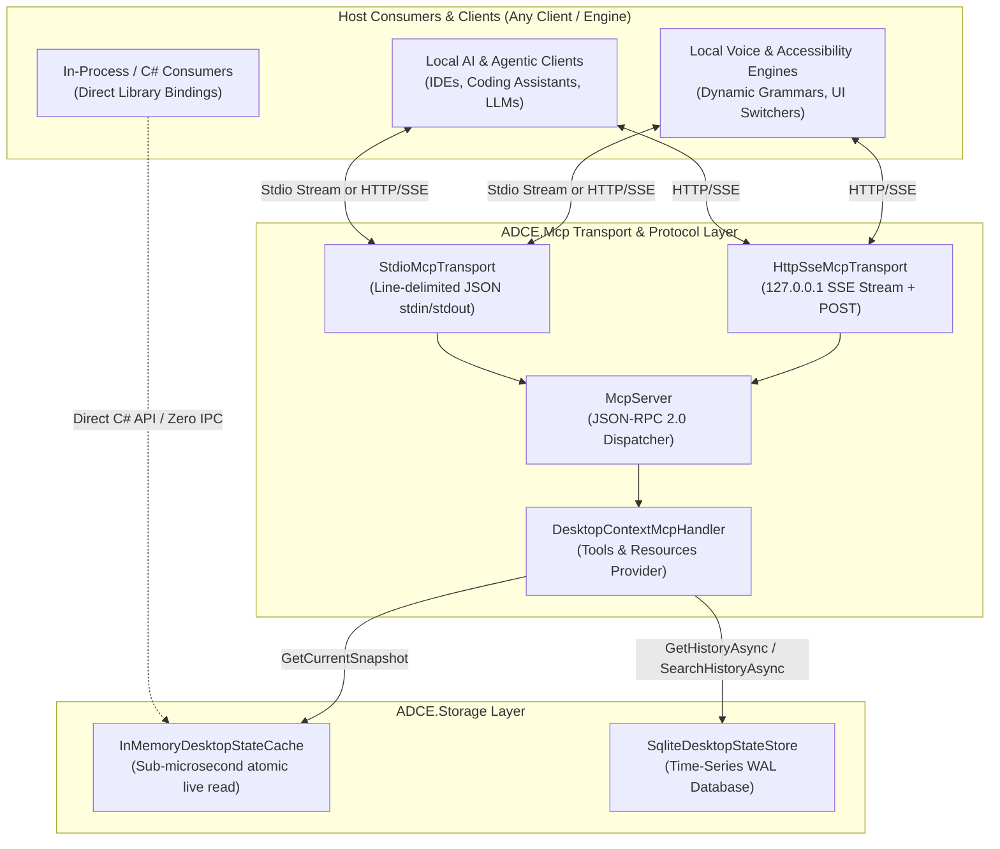

<!--
SPDX-License-Identifier: Apache-2.0
Copyright (c) 2026 Amir Farhadi
-->

[ 🏠 ADCE Home ](../../README.md) › [ 📚 Documentation Hub ](../CONTEXT.md) › **ADCE.Mcp Deep-Dive & Systems Reference**

---

# ADCE.Mcp Deep-Dive & Systems Reference Specification

> **Subsystem:** Model Context Protocol Server (`ADCE.Mcp`)
> **Protocol Standard:** Model Context Protocol (MCP) JSON-RPC 2.0 (`2024-11-05` / `1.0.0`)
> **Runtime:** .NET 10 (`net10.0-windows`) / C# 14
> **Parent Context:** [`docs/CONTEXT.md`](../CONTEXT.md)
> **Schema Spec:** [`docs/MCP_SCHEMA_SPEC.md`](../architecture/MCP_SCHEMA_SPEC.md)

---

## 1. System Vision & Architecture

The **ADCE.Mcp** library provides the universal Model Context Protocol JSON-RPC 2.0 server for the Active Desktop Context Engine. It bridges **Local AI & Agentic Clients** (e.g. IDE assistants, local LLM orchestrators) and **Local Voice & Accessibility Engines** directly to the live in-memory context cache and historical time-series repository.

> [!NOTE]
> **Transport Agnosticism & Client Decoupling:**
> ADCE does not couple specific client categories to specific transports. Any consumer (whether an AI agent, voice recognition grammar, or custom automation script) can connect via **Stdio** (ideal for child-process lifecycle management) or **HTTP/SSE** (ideal for connecting to a shared background daemon). Additionally, in-process C#/.NET tools can query `IDesktopStateStore` directly with zero serialization overhead.



---

## 2. Protocol Framing & Critical Systems Traps Guarded

ADCE.Mcp explicitly guards against 4 major Windows stream and MCP specification failure modes:

### Trap 1: The `content` vs. `contents` Schema Discrepancy
* **Tool Call Execution (`tools/call`):** The MCP specification dictates a singular property named `content` containing an array of text/image blocks and `isError`:
  ```json
  {
    "content": [
      { "type": "text", "text": "{...}" }
    ],
    "isError": false
  }
  ```
* **Resource Reads (`resources/read`):** The MCP specification dictates a plural property named `contents` containing resource blocks with `uri`, `mimeType`, and `text`/`blob`:
  ```json
  {
    "contents": [
      {
        "uri": "desktop://current",
        "mimeType": "application/json",
        "text": "{...}"
      }
    ]
  }
  ```
* **ADCE Defense:** Explicitly modeled distinct DTO records (`CallToolResult` with `Content` vs. `ReadResourceResult` with `Contents`) ensuring 100% strict conformance to MCP specification.

### Trap 2: Windows Console UTF-8 BOM Prevention
* **The Problem:** Windows console streams default to OEM code pages and often prepend a 3-byte Byte Order Mark (`0xEF, 0xBB, 0xBF`), causing host MCP parsers to fail on initialization.
* **ADCE Defense:** `StdioMcpTransport` explicitly sets `Console.OutputEncoding` and `Console.InputEncoding` using `new UTF8Encoding(encoderShouldEmitUTF8Identifier: false)` on both the stream writer and reader.

### Trap 3: Polymorphic JSON-RPC 2.0 Request ID Handling
* **The Problem:** In JSON-RPC 2.0, `id` may validly be a numeric integer (`42`), a string (`"req-101"`), or omitted/null for notifications.
* **ADCE Defense:** `JsonRpcRequest` models `Id` as `JsonElement?`, allowing lossless round-tripping of any valid JSON primitive without deserialization failure.

### Trap 4: Windows Stream EOF Teardown
* **The Problem:** Unmanaged console handles wrapped by `Console.ReadLineAsync()` can hang or ignore broken pipes when host processes exit.
* **ADCE Defense:** `StdioMcpTransport` reads directly from `Console.OpenStandardInput()`. When `ReadLineAsync()` returns `null`, the transport signals immediate clean EOF and initiates server teardown.

---

## 3. Endpoints & Tool Capabilities

### Exposed Tools (`tools/list` & `tools/call`)

| Tool Name | Parameters | Description | Response SLA |
| :--- | :--- | :--- | :--- |
| `get_desktop_context` | `process_filter` (optional string) | Returns live active desktop context snapshot, optionally filtering by process name. | `< 0.05 ms` |
| `search_desktop_history` | `query` (required string), `limit` (int) | Full-text search across past window titles, tabs, and file paths. | `< 5.0 ms` |

### Exposed Resources (`resources/list` & `resources/read`)

| Resource URI | MIME Type | Description | Response SLA |
| :--- | :--- | :--- | :--- |
| `desktop://current` | `application/json` | Live snapshot of current foreground window, workspace, and focus. | `< 0.001 ms` |
| `desktop://history` | `application/json` | Time-series focus transitions (supports `?minutes=15&limit=50`). | `< 3.0 ms` |

---

## 4. Verification Evidence & Benchmarks

The subsystem is validated via **16 dedicated unit tests** in `ADCE.Mcp.Tests` and the live console micro-spike (`--mcp-test`):

```
==========================================================================
    ADCE Milestone 5: Model Context Protocol (MCP) Verification Spike
==========================================================================
Runtime   : .NET 10.0.8 (x64)
Timestamp : 2026-08-25T04:27:04.710Z

[STEP 1/5] Testing MCP Handshake ('initialize')...
  -> Negotiated Protocol: 2024-11-05
  -> Server Name: ADCE.Mcp

[STEP 2/5] Testing Tools Discovery ('tools/list')...
  -> Registered Tools Count: 2
     * get_desktop_context - Returns the current live active desktop context snapshot...
     * search_desktop_history - Searches past desktop history for matching keywords...

[STEP 3/5] Testing Tool Execution ('tools/call' -> 'get_desktop_context')...
  -> Spec Check (Singular 'content' array): PASS (Conforms)
  -> Content Type: text
  -> Text Length: 1170 chars

[STEP 4/5] Testing Resource Read ('resources/read' -> 'desktop://current')...
  -> Spec Check (Plural 'contents' array): PASS (Conforms)
  -> URI: desktop://current
  -> MimeType: application/json

[STEP 5/5] Testing History Search ('tools/call' -> 'search_desktop_history')...
  -> Search Results payload: [{"timestamp":"2026-08-25T04:27:04...

==========================================================================
  [VERDICT: PASS] All 5 MCP Protocol Operations Verified (89.38 ms)
==========================================================================
```
