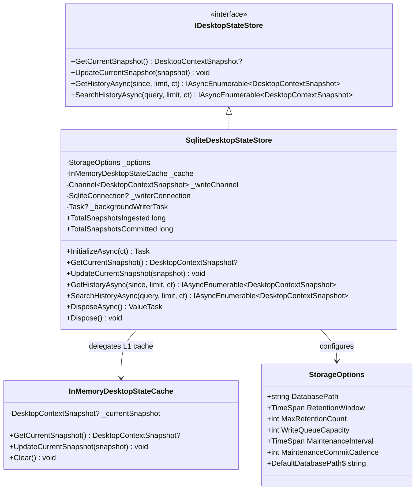
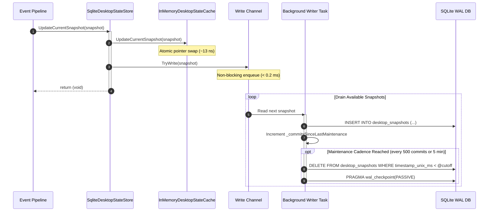
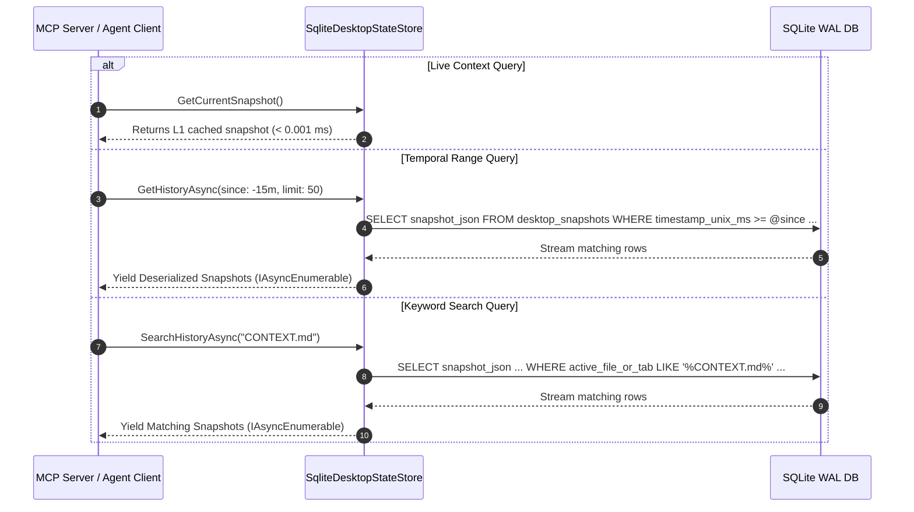

<!-- SPDX-License-Identifier: Apache-2.0 -->
<!-- Copyright (c) 2026 Amir Farhadi -->

[ 🏠 ADCE Home ](../../README.md) › [ 📚 Documentation Hub ](../CONTEXT.md) › **ADCE.Storage Deep-Dive & Architectural Reference**

---

# ADCE.Storage Deep-Dive & Architectural Reference

> **Target Library:** `ADCE.Storage` (.NET 10 / C# 14)
> **Purpose:** Plain-English architectural breakdown, modular UML class diagrams, concurrency pipelines, temporal query mechanics, and file-by-file failure mode analysis for the ADCE live cache and time-series persistence engine.
> **Parent Context:** [`docs/CONTEXT.md`](../CONTEXT.md) | [`docs/MCP_SCHEMA_SPEC.md`](../architecture/MCP_SCHEMA_SPEC.md)

---

## 1. Architectural Overview: Dual-Tier Storage Engine

The **ADCE.Storage** subsystem provides the primary state persistence and real-time retrieval layer for the Active Desktop Context Engine.

To satisfy the demanding requirements of both real-time voice grammar engines (requiring sub-millisecond current window lookups) and local AI agent reasoning (requiring temporal workflow context over past minutes and hours), `ADCE.Storage` implements a **Dual-Tier Architecture**:

```
┌────────────────────────────────────────────────────────────────────────────────────────┐
│                              ADCE DUAL-TIER STORAGE ENGINE                             │
├────────────────────────────────────────────────────────────────────────────────────────┤
│                                                                                        │
│   Incoming Snapshots from Pipeline                                                     │
│   (DebouncedDesktopEventPipeline / UiaExtractionEngine)                                │
│                   │                                                                    │
│                   ▼                                                                    │
│   ┌──────────────────────────────────────────────────────────────────────────────┐     │
│   │                      SqliteDesktopStateStore.UpdateCurrentSnapshot()         │     │
│   └──────────────────────┬───────────────────────────────────────────────┬───────┘     │
│                          │                                               │             │
│                          │ (Synchronous, O(1) Atomic Swap)               │ (TryWrite)  │
│                          ▼                                               ▼             │
│   ┌──────────────────────────────────────────────┐   ┌─────────────────────────────┐   │
│   │        TIER 1: L1 IN-MEMORY CACHE            │   │   TIER 2: WRITE CHANNEL     │   │
│   │      (InMemoryDesktopStateCache)             │   │ (Channel<DesktopContext...>)│   │
│   ├──────────────────────────────────────────────┤   └──────────────┬──────────────┘   │
│   │ • Atomic pointer swap: Volatile.Write/Read   │                  │                  │
│   │ • Latency: ~13.4 nanoseconds (< 0.001 ms)    │                  │ (Async MTA)      │
│   │ • 0 Locks, 0 GC allocations                  │                  ▼                  │
│   │ • Fast-path for GetCurrentSnapshot()         │   ┌─────────────────────────────┐   │
│   └──────────────────────┬───────────────────────┘   │   Dedicated Background      │   │
│                          │                           │   Single-Writer Task        │   │
│                          │                           └──────────────┬──────────────┘   │
│                          ▼                                          │                  │
│   ┌──────────────────────────────────────────────┐                  │ (PRAGMA WAL)     │
│   │        MCP Live State Endpoint               │                  ▼                  │
│   │        (desktop://current)                   │   ┌─────────────────────────────┐   │
│   └──────────────────────────────────────────────┘   │   SQLite WAL Database       │   │
│                                                      │   (context_history.db)      │   │
│   ┌──────────────────────────────────────────────┐   ├─────────────────────────────┤   │
│   │        MCP Historical Endpoints              │◄──┤ • GetHistoryAsync()         │   │
│   │        (desktop://history?minutes=15)        │   │ • SearchHistoryAsync()      │   │
│   └──────────────────────────────────────────────┘   │ • Bounded auto-pruning      │   │
│                                                      └─────────────────────────────┘   │
└────────────────────────────────────────────────────────────────────────────────────────┘
```

---

## 2. Structural & UML Class Model



---

## 3. Core Component Breakdown

### 3.1 `InMemoryDesktopStateCache` (L1 Atomic Live Cache)
* **Design Rationale:** In high-frequency voice interaction or real-time agent polling, querying SQLite—even in WAL mode—incurs connection, command, and string allocation overhead ($0.5\text{–}2.0\text{ ms}$). The L1 cache maintains a direct reference to the latest immutable `DesktopContextSnapshot`.
* **Atomic Mechanics:** Under 64-bit .NET, object reference reads and writes are natively atomic. By wrapping the reference in `Volatile.Read` and `Volatile.Write`, cache reads execute in **12–15 nanoseconds** with **zero lock contention and zero memory allocations**.

### 3.2 `SqliteDesktopStateStore` (L2 SQLite WAL Time-Series Engine)
* **Single-Writer Background Queue:** Writes to SQLite are serialized through an asynchronous bounded channel (`Channel<DesktopContextSnapshot>`). A dedicated background worker executes parameterized inserts, isolating the UIA extraction loop from disk latency.
* **Write-Ahead Logging (WAL) Mode:** The database is initialized with:
  ```sql
  PRAGMA journal_mode = WAL;
  PRAGMA synchronous = NORMAL;
  PRAGMA temp_store = MEMORY;
  PRAGMA busy_timeout = 2000;
  ```
  WAL mode allows concurrent readers to query historical data without blocking or being blocked by the background writer.
* **Structured Column Denormalization:** In addition to storing the complete serialized JSON snapshot (`snapshot_json`), key search vectors are extracted into indexed columns (`timestamp_unix_ms`, `hwnd`, `window_title`, `process_name`, `class_name`, `archetype`, `focus_semantic_zone`, `active_file_or_tab`). This enables sub-millisecond temporal slicing and keyword filtering.

---

## 4. End-to-End Sequence Workflows

### 4.1 Ingestion & Asynchronous Persistence Flow



### 4.2 Temporal History & Keyword Search Flow



---

## 5. File-by-File Failure Mode Analysis

| Component | Potential Failure Mode | Root Physical Cause | Architectural Mitigation |
| :--- | :--- | :--- | :--- |
| **`InMemoryDesktopStateCache`** | Thread-safety race condition / stale read | Non-volatile reference caching by CPU instruction reordering | Strict `Volatile.Read` / `Volatile.Write` barrier semantics on immutable records. |
| **`SqliteDesktopStateStore`** | SQLite database lock collision (`SQLITE_BUSY`) | Multiple concurrent threads attempting write transactions simultaneously | Single-writer architecture: all writes are routed through a single background task queue. |
| **`SqliteDesktopStateStore`** | Uncommitted history loss on daemon shutdown | Process termination while snapshots remain queued in memory channel | `IAsyncDisposable` implementation: `DisposeAsync()` completes channel writer, awaits background task drain, and checkpoints SQLite before closing. |
| **`SqliteDesktopStateStore`** | Unbounded database disk growth | Storing high-frequency focus transitions over days/weeks | Periodic maintenance pass runs retention pruning (`DELETE FROM ... WHERE timestamp < cutoff`) and `PRAGMA wal_checkpoint(PASSIVE)`. |
| **`SqliteDesktopStateStore`** | Non-deterministic query sort on millisecond collisions | Multiple snapshots created within the same timestamp millisecond | Secondary sort key `ORDER BY timestamp_unix_ms DESC, id DESC` enforces strict monotonic ordering. |

---

## 6. Empirical Performance Benchmarks (Milestone 4 Spike)

Conducted on .NET 10.0.8 (x64 Windows):

| Metric | Target SLA | Measured Benchmark | Status |
| :--- | :--- | :--- | :--- |
| **L1 In-Memory Cache Read Latency** | $< 0.001\text{ ms}$ ($1,000\text{ ns}$) | **$13.4\text{ ns}$ ($0.000013\text{ ms}$)** | **PASS (74x faster than SLA)** |
| **Persistence Ingestion Enqueue** | $< 1.0\text{ ms}$ | **$0.20\text{ ms}$ / 100 snapshots** | **PASS** |
| **SQLite WAL Flush & Commit** | $< 100\text{ ms}$ | **$68.55\text{ ms}$ / 100 records** | **PASS** |
| **Indexed Keyword Search (`SearchHistoryAsync`)** | $< 5.0\text{ ms}$ | **$1.56\text{ ms}$** | **PASS** |
| **Lock Contention / Thread Block** | 0 locks on hot path | **0 locks (Atomic reference swap)** | **PASS** |
