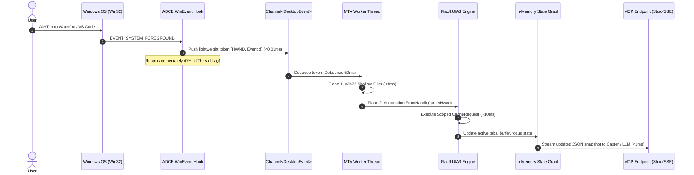

<!--
SPDX-License-Identifier: Apache-2.0
Copyright (c) 2026 Amir Farhadi
-->

[ 🏠 ADCE Home ](../../README.md) › [ 📚 Documentation Hub ](../CONTEXT.md) › **Educational Refresher & Architecture Guide**

---

# ADCE Educational Refresher & Architectural Guide

> **Target Audience:** Contributors, AI pair-programmers, and researchers
> **Purpose:** Plain-English educational breakdown of Windows UI Automation, Win32 systems programming, and the ADCE Dual-Plane architecture
> **Parent Context:** [`docs/CONTEXT.md`](../CONTEXT.md) | [`docs/ADCE_CORE_DEEP_DIVE.md`](../deep_dives/ADCE_CORE_DEEP_DIVE.md)
> **External Research:** [`docs/external_research/README.md`](../external_research/README.md)

---

## 1. The Core Problem: Why Does ADCE Exist?

When you interact with **voice recognition grammars (Caster)** or **local AI coding assistants (Antigravity, Claude, Gemini)**, the agent needs fast, deterministic desktop context:
* *What application is currently in the foreground?*
* *What file, document, or browser tab is actively open?*
* *Where is the user's text cursor or active input control?*

Historically, tools have attempted this in three ways—all of which suffer from fatal flaws:

| Historical Approach | Mechanism | Fatal Flaw |
| :--- | :--- | :--- |
| **1. Screenshot OCR / Vision Models (VLM)** | Captures the screen every few seconds and runs OCR or multimodal vision models. | Extreme CPU/GPU consumption (fans spin up), 500ms–2000ms latency, high token costs, and fails on off-screen tab titles. |
| **2. Naive Full-Tree UIA Crawling (`pywinauto` / `Inspect`)** | Recursively traverses the OS accessibility tree from the desktop root down. | Modern browsers (Waterfox, Chrome) contain **6,800+ DOM accessibility nodes**. An unpruned tree walk stalls the thread for **2,000ms–5,000ms**. |
| **3. Browser Extensions** | Injects custom WebExtensions into Chrome or Firefox. | Siloed to a single browser. Completely blind to IDEs (VS Code, Visual Studio), terminals, and Windows File Explorer. |

### The ADCE Solution
ADCE is an ultra-lightweight **C# .NET 10 background daemon** that extracts structured desktop context in **$< 15\text{ ms}$** with near-zero idle CPU usage by listening to OS events and targeting specific UI zones directly.

---

## 2. FlaUI Refresher: What Is It & Why UIA3?

### What is FlaUI?
[FlaUI](https://github.com/FlaUI/FlaUI) is a modern, open-source .NET library that wraps Microsoft's Windows UI Automation (UIA) APIs.

Windows has two distinct UI Automation frameworks:
1. **UIA2 (`FlaUI.UIA2`):** Wraps older COM/MSAA interfaces from Windows XP and Windows 7.
2. **UIA3 (`FlaUI.UIA3`):** Wraps modern `UIAutomationCore.dll` introduced in Windows 8, 10, and 11.

```
┌─────────────────────────────────────────────────────────────────────────┐
│                           THE CACHEREQUEST REVOLUTION                   │
├────────────────────────────────────┬────────────────────────────────────┤
│ Naive UIA Traversal (No Caching)   │ Scoped FlaUI CacheRequest (ADCE)   │
├────────────────────────────────────┼────────────────────────────────────┤
│ • Get Tab 1 Name    → COM roundtrip│ • Declare CacheRequest:            │
│ • Get Tab 1 State   → COM roundtrip│   - Properties: Name, BoundingBox  │
│ • Get Tab 2 Name    → COM roundtrip│   - Patterns: SelectionItem        │
│ • Get Tab 2 State   → COM roundtrip│ • FindAllChildren(using cache)     │
│ ...                                │                                    │
│ Result: 50 roundtrips (~150 ms)    │ Result: 1 single roundtrip (~10 ms)│
└────────────────────────────────────┴────────────────────────────────────┘
```

---

## 3. The Simon Mourier Deep-Dive: What We Learned from External Research

To stress-test our design and ensure we weren't reinventing established primitives, we audited 10 open-source repositories authored by Windows systems expert **Simon Mourier** (`github.com/smourier`).

```
                               ┌─────────────────────────────────────────┐
                               │       Key Discoveries from smourier     │
                               └────────────────────┬────────────────────┘
                                                    │
             ┌──────────────────────────────────────┼──────────────────────────────────────┐
             │                                      │                                      │
             ▼                                      ▼                                      ▼
   ┌───────────────────┐                  ┌───────────────────┐                  ┌───────────────────┐
   │    UInspect.md    │                  │  HwndExplorer.md  │                  │ RegfreeNetCom.md  │
   ├───────────────────┤                  ├───────────────────┤                  ├───────────────────┤
   │ UIA COM threading │                  │ Win32 shallow tree│                  │ Out-of-proc COM   │
   │ MUST run on a     │                  │ filtering takes   │                  │ & manifest-based  │
   │ dedicated MTA     │                  │ < 1.0 ms via      │                  │ zero-registry IPC │
   │ background worker │                  │ EnumWindows       │                  │ architecture      │
   └───────────────────┘                  └───────────────────┘                  └───────────────────┘
```

### Discovery 1: The MTA Threading Rule (`UInspect`)
* **The Pitfall:** If UI Automation COM calls are made from an STA (Single-Threaded Apartment) thread (like a standard UI thread), cross-process calls pump Windows messages while waiting for responses. If the target application emits an event callback back to that thread, **the application deadlocks**.
* **The Solution:** `UInspect` isolates all UIA calls on a dedicated `SingleThreadTaskScheduler` set explicitly to `ApartmentState.MTA`.

### Discovery 2: Win32 Gating Before UIA (`HwndExplorer`)
* Asking UIA "what windows are on screen?" by querying `GetRootElement().FindAll()` takes **25ms–85ms**.
* Calling native Win32 `EnumWindows` and `GetWindowLongPtr` takes **0.5ms–1.2ms**.
* **The Solution:** Use Win32 P/Invokes to identify and filter the target HWND in `<1ms`, then attach UIA directly to that specific HWND.

### Discovery 3: Registration-Free Out-Of-Process COM (`RegfreeNetComServer`)
* Demonstrates how a .NET 10 background service can expose fast binary COM IPC across 32-bit and 64-bit processes without writing registry keys or requiring administrator elevation.

---

## 4. Re-Evaluating FlaUI vs. Direct COM Interop

| Dimension | Option A: Raw COM Interop (`UInspect`) | Option B: `FlaUI.UIA3` (Our Choice) |
| :--- | :--- | :--- |
| **Dependencies** | Zero external packages | `FlaUI.UIA3` NuGet (~500 KB) |
| **Execution Latency** | Raw vtable calls (~8 ms) | Clean managed wrapper (~10 ms) |
| **CacheRequest Ergonomics** | Very verbose, complex custom COM marshaling structs | Elegant, fluent `using (cache.Activate())` pattern |
| **Maintenance Burden** | We maintain all COM interfaces and marshaling code | Battle-tested and maintained by thousands of active projects |

### Architectural Verdict: The Hybrid Dual-Plane Architecture
Rather than choosing between them, ADCE combines the best of both worlds:
1. **Plane 1 (Win32 Shallow Filter — inspired by `HwndExplorer`):** Pure Win32 P/Invokes (`EnumWindows`, `GetForegroundWindow`) to filter top-level envelopes in $< 1\text{ ms}$.
2. **Plane 2 (Deep Semantic Extractor — powered by `FlaUI.UIA3` + `UInspect` MTA Scheduler):** Once the target HWND is resolved, pass it to `FlaUI.UIA3` on a dedicated MTA worker thread to extract tabs, breadcrumbs, and focus via batched `CacheRequest` in $\sim 10\text{ ms}$.

---

## 5. End-to-End Lifecycle: What Happens When You Switch Windows



---

## 6. Are We Reinventing the Wheel? (Ecosystem Gap Analysis)

```
┌────────────────────────────────────────────────────────────────────────────────────────┐
│                              ECOSYSTEM SPECTRUM                                        │
├────────────────────┬──────────────────────────────────┬────────────────────────────────┤
│ Category           │ Existing Implementations         │ Why ADCE is Genuinely Novel    │
├────────────────────┼──────────────────────────────────┼────────────────────────────────┤
│ **Diagnostic GUI** │ Inspect.exe, UInspect,           │ Graphical tools for humans. No │
│ **Tools**          │ HwndExplorer, Spy++              │ LLM context summaries or MCP.  │
├────────────────────┼──────────────────────────────────┼────────────────────────────────┤
│ **UI Test QA**     │ FlaUI, pywinauto, White,         │ Synthetic click/type frameworks│
│ **Frameworks**     │ WinAppDriver                     │ requiring exact element IDs.   │
├────────────────────┼──────────────────────────────────┼────────────────────────────────┤
│ **Raw Interop**    │ DirectN, Win32Metadata,          │ Low-level API bindings without │
│ **Libraries**      │ UIAutomationClient PIA           │ higher-level semantics.        │
├────────────────────┼──────────────────────────────────┼────────────────────────────────┤
│ **Agent Context**  │ [EMPTY / UNRESOLVED]             │ **ADCE:** Real-time semantic   │
│ **Engine**         │                                  │ target-zone extraction & cache │
│                    │                                  │ exposed via JSON-RPC MCP.      │
└────────────────────┴──────────────────────────────────┴────────────────────────────────┘
```

### Strategic Conclusion:
* **We are NOT reinventing low-level UIA or Win32 interop:** We stand directly on `FlaUI.UIA3` and borrow `HwndExplorer`'s Win32 filtering structs.
* **ADCE is a necessary new abstraction:** Existing tools either target human visual inspection or QA test automation. ADCE fills the gap by providing an autonomous, sub-20ms semantic desktop context stream for local AI agents and voice recognition grammars.
