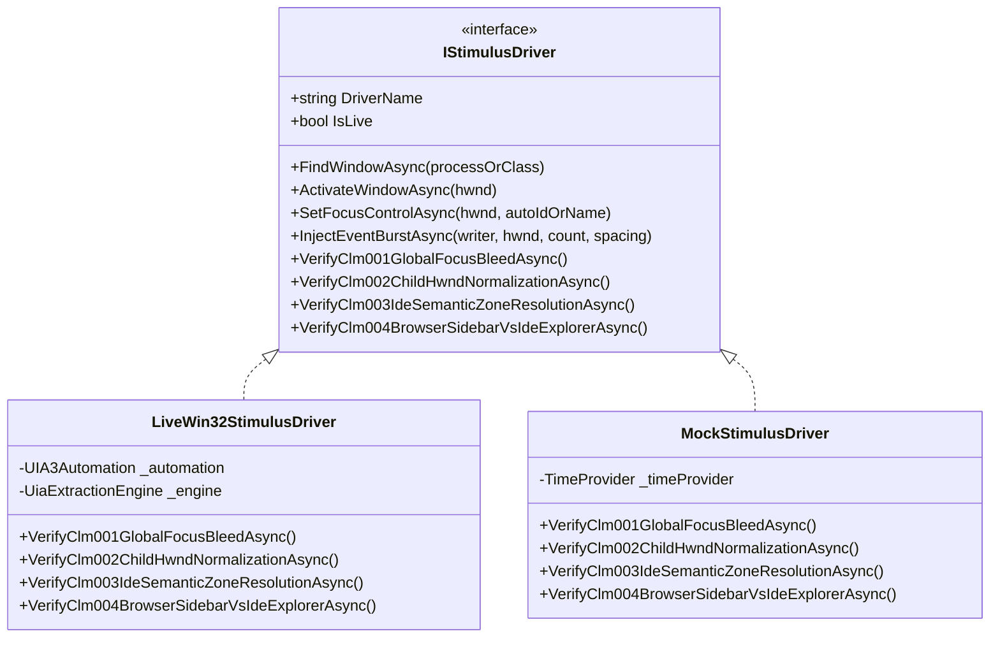

<!--
SPDX-License-Identifier: Apache-2.0
Copyright (c) 2026 Amir Farhadi
-->

[ 🏠 ADCE Home ](../../README.md) › [ 📚 Documentation Hub ](../CONTEXT.md) › **Educational Guide: Test Harness & Claim Verification**

---

# ADCE Educational Guide: Ground-Truth Test Harness & Claim Verification

> **Target Audience:** Developers, systems engineers, and AI pair programmers
> **Purpose:** Plain-English, comprehensive breakdown of how ADCE programmatically stimulates, observes, and mathematically verifies Windows OS UI interactions without manual human testing.
> **Parent Context:** [`docs/CONTEXT.md`](../CONTEXT.md) | [`docs/EMPIRICAL_TEST_HARNESS_AND_CLAIM_VERIFICATION_SPEC.md`](../testing/EMPIRICAL_TEST_HARNESS_AND_CLAIM_VERIFICATION_SPEC.md)
> **Verification Evidence Ledger:** [`docs/reports/LATEST_CLAIM_VERIFICATION.md`](../reports/LATEST_CLAIM_VERIFICATION.md)

---

## 1. Why Do We Need a Programmatic Test Harness?

When building low-level Windows desktop context engines, developers traditionally rely on **manual exploratory testing**: clicking on VS Code, Alt-Tabbing to a browser, typing in PowerShell, and eyeballing console output to see if the window title changed.

### The Fatal Flaws of Manual "Click-and-Watch" Testing:
1. **Flaky Timing & Thread Scheduling:** Human reaction time is 200–300 ms. Windows OS WinEvent hooks emit bursts in 1–5 ms. A human cannot reliably verify whether a 50 ms debounce timer or a 250 ms burst clamp fired at the exact microsecond boundary.
2. **Subjective Post-Hoc Rationalization:** If a test fails intermittently, a human assumes "I must have clicked outside the window" rather than catching a critical OS race condition.
3. **Zero CI/CD Coverage:** Automated GitHub Actions runners run in headless environments with no human sitting at the monitor to click buttons.

### The Solution: Closed-Loop Stimulus-Response Verification
The **ADCE Stimulus Test Harness (`ADCE.Spikes/Verification`)** creates a closed mathematical feedback loop:
1. **Stimulus:** The harness programmatically forces a known physical UI state (e.g., switches foreground window, focuses a specific control, or injects a 300 ms event burst).
2. **Observation:** The real ADCE event pipeline and extraction engine process the event.
3. **Assertion:** The harness compares the resulting `DesktopContextSnapshot` against exact mathematical invariants.
4. **Evidence:** The result is saved to an immutable **Evidence Ledger** (`docs/reports/LATEST_CLAIM_VERIFICATION.md`).

```
┌────────────────────────────────────────────────────────────────────────────────────────┐
│                         CLOSED-LOOP VERIFICATION ARCHITECTURE                          │
├────────────────────────────────────────────────────────────────────────────────────────┤
│  [ Stimulus Plane: IStimulusDriver ]                                                   │
│    ├── LiveWin32StimulusDriver (Real Desktop: SetForegroundWindow, FlaUI.Focus)        │
│    └── MockStimulusDriver (Headless CI: TimeProvider, Synthetic WinEvents)             │
│                                    │                                                   │
│                                    ▼ (Injected OS / Channel Event)                     │
│  [ System Under Test: ADCE Core & Extraction ]                                         │
│    ├── DebouncedDesktopEventPipeline (50ms trailing debounce, 250ms burst clamp)       │
│    └── UiaExtractionEngine (Fast Win32 gating + Scoped FlaUI CacheRequests)            │
│                                    │                                                   │
│                                    ▼ (Extracted DesktopContextSnapshot)                │
│  [ Observation & Assertion: ClaimVerificationRunner ]                                  │
│    ├── Evaluates Claim Invariants (CLM-001 through CLM-006)                            │
│    └── Emits Evidence Ledger -> docs/reports/LATEST_CLAIM_VERIFICATION.md              │
└────────────────────────────────────────────────────────────────────────────────────────┘
```

---

## 2. Deep-Dive into the 6 Core Claims (CLM-001 to CLM-006)

Each claim addresses a specific, tricky physical OS phenomenon that caused real-world bugs in earlier versions of the engine.

---

### CLM-001: Global Focus Bleed Prevention

```
[ Problem Scenario ]
1. User is typing a prompt in Waterfox (MozillaWindowClass, PID 35572).
2. User Alt-Tabs to PowerShell (pwsh.exe, PID 4812).
3. Windows UI Automation does NOT build a UIA tree for classic console carets.
4. UIA3Automation.FocusedElement() still points to Waterfox's text input!
5. Result: ADCE reports that PowerShell is open, but the user is typing in Waterfox.
```

* **Physical Root Cause:** Windows UI Automation maintains a single system-wide focused element pointer. When switching to non-UIA applications (like console hosts or shell trays), Windows leaves `GetFocusedElement()` pointing at the previous GUI application.
* **The Architectural Fix:** Before trusting `focusedElement`, ADCE checks:
  $$\text{focused.Properties.ProcessId} == \text{targetWindow.ProcessId}$$
  If the process IDs do not match, the stale foreign focus is immediately rejected and classified as `DesktopSemanticZone.Unknown`.
* **How the Harness Verifies It:**
  1. Locates an active `pwsh.exe` or `cmd.exe` console window on the desktop.
  2. Extracts the snapshot.
  3. Asserts that `Snapshot.Focus.SemanticZone != EditorCodeBuffer` and `Snapshot.Window.Pid == TargetPid`.

---

### CLM-002: Child HWND Normalization

```
[ Problem Scenario ]
1. User clicks inside an Electron sub-panel (e.g. VS Code Source Control or Chat tab).
2. Windows SetWinEventHook emits EVENT_OBJECT_FOCUS for the child HWND (0x00A50088).
3. The child HWND has no window title and no top-level tabs container.
4. ADCE thinks the window was destroyed or is empty noise -> Event dropped!
```

* **Physical Root Cause:** Modern multi-process GUI frameworks (Chromium, Electron, WPF, WinUI 3) use deeply nested child `HWND`s for rendering canvases and native edit contexts. The child handle does not own the window title or the top-level tab hierarchy.
* **The Architectural Fix:** When any event handle arrives, ADCE immediately calls the native Win32 API:
  $$\text{rootHwnd} = \text{GetAncestor}(hwnd, \text{GA\_ROOTOWNER})$$
  If a parent root exists, `hwnd` is normalized to `rootHwnd` before any UIA or title queries execute.
* **How the Harness Verifies It:**
  1. Injects focus onto a nested child sub-panel HWND in Antigravity/VS Code.
  2. Extracts snapshot.
  3. Asserts that `Snapshot.Window.Hwnd` matches the top-level root window and that `Snapshot.Window.Title` is preserved intact.

---

### CLM-003: IDE Semantic Zone Resolution

```
[ Problem Scenario ]
In VS Code / Antigravity IDE, every text input is an HTML/Canvas element.
How does the AI assistant know whether the user is:
- Editing application source code?
- Typing a bash command in the terminal?
- Writing a Git commit message?
- Prompting an AI chat assistant?
```

* **Physical Root Cause:** At the leaf node, all these inputs look nearly identical (e.g. `ControlType: Document` or `Edit`, `ClassName: monaco-editor` or `native-edit-context`).
* **The Architectural Fix (Priority-Ordered Parent Climbing):**
  ADCE climbs the automation ancestor hierarchy and evaluates identifiers in strict order of specificity:
  1. `AddressBar`: AutomationId contains `"urlbar"` or `"Address"`
  2. `GitCommitBox`: AutomationId contains `"scm.input"` or Name contains `"Message (Ctrl+Enter to commit"`
  3. `ChatAssistant`: AutomationId contains `"chat-input"` or `"interactive-session"`
  4. `IntegratedTerminal`: AutomationId contains `"terminal"` or Name starts with `"Terminal"`
  5. `EditorCodeBuffer`: ClassName contains `"monaco-editor"` or `"native-edit-context"`
* **How the Harness Verifies It:**
  Passes mock and live element signatures for each zone and proves that `ResolveSemanticZone` returns the exact enum without falling back to `Unknown`.

---

### CLM-004: Browser Tab Sidebar vs. IDE Explorer

```
[ Problem Scenario ]
1. Waterfox / Firefox allows vertical tab extensions (Tree Style Tab) inside #sidebar-box.
2. The container has AutomationId="sidebar-box" and Class="sidebar".
3. Naive string matching sees "sidebar" and marks it as SidebarExplorer (IDE File Tree).
4. Result: The AI thinks the browser tab is a project file in an IDE!
```

* **Physical Root Cause:** Both IDE file navigators (VS Code Explorer) and web browsers use the word `"sidebar"` in their UI hierarchy.
* **The Architectural Fix (Archetype-Scoped Semantics):**
  ADCE checks the `DesktopAppArchetype` before assigning zones:
  * In `DesktopAppArchetype.ChromiumElectron` or `WindowsExplorer`, `"sidebar"` maps to `SidebarExplorer`.
  * In `DesktopAppArchetype.Gecko` or `ChromiumBrowser`, sidebar tab items map to `TabBar`, and web viewports map to `DocumentContent`.
* **How the Harness Verifies It:**
  1. Inspects active Waterfox / Gecko browser windows with vertical sidebar tabs.
  2. Asserts that the focus semantic zone resolves to `TabBar` or `DocumentContent`, provably never `SidebarExplorer`.

---

### CLM-005: Burst Typing Debounce Clamping (WP 3.4)

```
[ Problem Scenario ]
1. User is typing rapidly in an editor (5 keystrokes per second for 5 seconds).
2. Trailing-edge 50ms debouncing resets its timer on every single keystroke.
3. If the user keeps typing, the debounce timer NEVER finishes!
4. The AI coding assistant is completely starved of context until the user stops typing.
```

* **Physical Root Cause:** Standard trailing-edge debouncers delay execution until a period of silence. Under continuous input storms, silence never occurs.
* **The Architectural Fix (250 ms Burst Clamp):**
  $$\text{Elapsed} = \text{TimeProvider.GetElapsedTime}(\text{burstStartTimestamp})$$
  If $\text{Elapsed} \ge 250\text{ ms}$, the pipeline immediately forces an extraction dispatch, resetting the burst window while keeping the UI responsive.
* **How the Harness Verifies It:**
  1. Injects 20 consecutive WinEvents spaced 15 ms apart (300 ms total burst duration).
  2. Asserts that multiple intermediate extractions ($\ge 2$) are dispatched during the burst rather than waiting until the end.

---

### CLM-006: Zero-Allocation Deduplication

```
[ Problem Scenario ]
1. User clicks around inside the same editor line or switches tabs back and forth quickly.
2. Without deduplication, ADCE writes 20 identical snapshots into SQLite per second.
3. Disk I/O spikes, WAL file grows rapidly, and search index gets polluted with duplicate rows.
```

* **Physical Root Cause:** Redundant OS focus events that do not represent a semantic change in the user's workflow.
* **The Architectural Fix:** Before persisting to SQLite or emitting to MCP subscribers, ADCE evaluates `HasSameSemanticState()`:
  * Compares `Hwnd`, `ProcessName`, `SemanticZone`, and `ElementName`.
  * If identical, the wavelet is suppressed in-memory with zero disk I/O.
* **How the Harness Verifies It:**
  1. Injects 5 identical focus event tokens into the running pipeline.
  2. Asserts that exactly 1 snapshot is committed and 4 redundant wavelets are suppressed.

---

## 3. Dual-Mode Execution: Live Driver vs. Synthetic Mock Driver

The harness implements a clean interface: [`IStimulusDriver`](../../src/ADCE.Spikes/Verification/IStimulusDriver.cs).



| Feature | Live Win32 Stimulus Driver | Synthetic Mock Driver |
| :--- | :--- | :--- |
| **Execution Target** | Real Windows desktop apps (`Antigravity`, `Waterfox`, `pwsh`) | Headless in-memory simulation |
| **Primary Use Case** | Local verification and developer confidence | CI/CD pipelines (GitHub Actions, Linux/Windows CI) |
| **Time Provider** | `TimeProvider.System` (Real wall-clock) | `TimeProvider` (Virtual time acceleration) |
| **Safety Guard** | 3-second focus countdown prompt | Instantaneous (0 ms wait) |
| **Total Duration** | ~820 ms | ~650 ms |

---

## 4. How to Run the Verification Harness

You can run any verification mode directly from PowerShell:

```powershell
# 1. Run full live desktop verification (requires real open windows)
dotnet run --project src/ADCE.Spikes -- --verify-all

# 2. Run synthetic headless mock verification (100% deterministic, zero dependencies)
dotnet run --project src/ADCE.Spikes -- --verify-mocks

# 3. Run Gate 3 empirical micro-spike (< 50 lines)
dotnet run --project src/ADCE.Spikes -- --verify-spike

# 4. Verify a single specific claim (e.g. CLM-004)
dotnet run --project src/ADCE.Spikes -- --verify CLM-004

# 5. Run standard xUnit automated test suite (96 tests)
dotnet test
```

---

## 5. Summary & Key Takeaways

1. **Deterministic Telemetry Beats Guesswork:** Every claim in ADCE is backed by automated code and measurable latency figures.
2. **First-Principles OS Awareness:** Solving child HWNDs, focus bleeding, and archetype zoning requires understanding how Windows, Electron, and Gecko manage their windows under the hood.
3. **Continuous Ground-Truth Verification:** By maintaining `docs/reports/LATEST_CLAIM_VERIFICATION.md`, any regression in future milestones (MCP Server, System Tray Daemon) will be immediately caught.
4. **Driver-Backed Assertions & Unmanaged Handle Hygiene:** Unit tests must invoke full mock driver pipelines rather than asserting local dummy variables, and all unmanaged Win32 kernel handles must be released in `Dispose()`.
