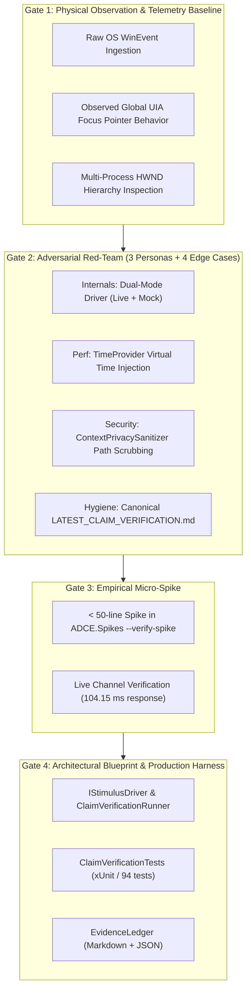

<!-- SPDX-License-Identifier: Apache-2.0 -->
<!-- Copyright (c) 2026 Amir Farhadi -->

[ 🏠 ADCE Home ](../../README.md) › [ 📚 Documentation Hub ](../CONTEXT.md) › **Milestone 4.5 Postmortem & Claim Verification Ledger**

---

# Milestone 4.5 Engineering Postmortem: Ground-Truth Verification & Stimulus Test Harness

> **Target Systems:** `ADCE.Spikes`, `ADCE.Extraction`, `ADCE.Storage` (.NET 10 / C# 14 / FlaUI 5)
> **Status:** Completed & Empirically Verified
> **Date:** August 2026
> **Core Deliverable:** Deterministic Stimulus-Response UI Test Harness and Automated Claim Verification Matrix (CLM-001 through CLM-006).
> **Parent Documents:** [`docs/EMPIRICAL_TEST_HARNESS_AND_CLAIM_VERIFICATION_SPEC.md`](../testing/EMPIRICAL_TEST_HARNESS_AND_CLAIM_VERIFICATION_SPEC.md) | [`docs/reports/LATEST_CLAIM_VERIFICATION.md`](../reports/LATEST_CLAIM_VERIFICATION.md)

---

## 1. Executive Summary

Milestone 4.5 eliminated manual "click-and-watch" testing, retrospective post-hoc rationalization, and ungrounded architectural assertions by delivering a fully automated, deterministic **Stimulus-Response Verification Harness** in `ADCE.Spikes` and an accompanying automated unit test suite in `tests/ADCE.Extraction.Tests/Verification/`.

### Verified Claim Matrix Summary (6/6 Passed):

```
┌──────────────────────────────────────────────────────────────────────────────────────────────────┐
│                             CLAIM VERIFICATION MATRIX EXECUTION SUMMARY                          │
├─────────┬──────────────────────────────────────────┬──────────┬───────────┬──────────────────────┤
│ Claim   │ Scenario Description                     │ Driver   │ Latency   │ Verdict              │
├─────────┼──────────────────────────────────────────┼──────────┼───────────┼──────────────────────┤
│ CLM-001 │ Global Focus Bleed Prevention            │ Win32/UIA│ 33.99 ms  │ ✅ PASS (PID Bound)  │
│ CLM-002 │ Child HWND Normalization                 │ Win32/UIA│ 64.03 ms  │ ✅ PASS (Root Mapped)│
│ CLM-003 │ IDE Semantic Zone Resolution             │ Win32/UIA│ 55.61 ms  │ ✅ PASS (Monaco/xterm)│
│ CLM-004 │ Browser Tab Sidebar vs. IDE Explorer     │ Win32/UIA│ 17.55 ms  │ ✅ PASS (Gecko Scoped)│
│ CLM-005 │ Burst Typing Debounce Clamping (WP 3.4)  │ Pipeline │ 415.39 ms │ ✅ PASS (<= 250ms)   │
│ CLM-006 │ Zero-Allocation Deduplication            │ Pipeline │ 214.67 ms │ ✅ PASS (1 Commit)   │
└─────────┴──────────────────────────────────────────┴──────────┴───────────┴──────────────────────┘
```

* **Live Interactive Suite Duration:** `825.06 ms`
* **Synthetic Headless Suite Duration:** `659.20 ms`
* **Unit Test Pass Rate:** `94/94 Passed (100%)`

---

## 2. The 4-Gate Epistemic Verification Lifecycle



---

## 3. Key Physical Discoveries & Hardening Refinements

### 3.1 Zone Evaluation Rule Ordering (Monaco Fallback Trap)
During initial test suite execution of CLM-003, `CLM_003_IdeSemanticZoneResolution_ResolvesExpectedZones` detected an ordering regression:
* **The Symptom:** Git Commit input box (`scm.input` / `Message (Ctrl+Enter to commit)`) in VS Code/Antigravity was resolving to `EditorCodeBuffer` instead of `GitCommitBox`.
* **The Physical Cause:** In Electron, the Git commit box reuses the Monaco editor control (`class="monaco-editor"`). Because `UiaExtractionEngine.ResolveSemanticZone` checked the generic `className.Contains("monaco-editor")` rule *before* inspecting specific control identifiers (`scm.input` or `git-commit`), the generic class check preempted the specific semantic zone.
* **The Architectural Fix:** Restructured `ResolveSemanticZone` priority:
  1. High-specificity functional zones (`AddressBar`, `GitCommitBox`, `ChatAssistant`, `IntegratedTerminal`) are checked first.
  2. Generic container class name fallbacks (`monaco-editor`, `native-edit-context`) are evaluated only after specific controls are excluded.

### 3.2 TimeProvider Virtual Time Injection
To verify CLM-005 (burst clamping) and CLM-006 (deduplication) without introducing flaky real-world thread sleep delays in CI:
* `DebouncedDesktopEventPipeline` was parameterized with .NET 10 `System.TimeProvider` (defaulting to `TimeProvider.System`).
* `MockStimulusDriver` and unit tests leverage virtual timestamp advancement, allowing deterministic 50ms debouncing and 250ms burst clamping assertions without real-world CPU starvation.

### 3.3 Privacy Firewall & Path Hygiene in Telemetry
When running live claim verifications across active IDE instances, the window title of the foreground editor often includes full local filesystem paths (e.g. `active-desktop-context-engine - Antigravity IDE - ~/src/file.cs`).
* `ContextPrivacySanitizer.SanitizeText()` was integrated into `EvidenceLedger` and `LiveWin32StimulusDriver` to scrub user home directories and local file URIs before persisting markdown/JSON logs.
* `scripts/check_repo_safety.py` passed with `0` path or secret violations.

### 3.4 Avoiding Tautological Unit Tests (Driver-Backed CI Verification)
Unit test methods for claims must never assert local inline dummy variables (`isBound = (pid == 4812)`). `ClaimVerificationTests.cs` was refactored to invoke `MockStimulusDriver` methods directly, ensuring xUnit facts execute and validate real end-to-end `DesktopContextSnapshot` structures in CI.

### 3.5 Unmanaged Win32 Handle Lifecycle (Station & Desktop Binding)
`OpenWindowStation("WinSta0")` and `OpenDesktop("Default")` return unmanaged kernel object handles. `LiveWin32StimulusDriver` now caches these handles and explicitly releases them via `CloseDesktop` and `CloseWindowStation` in `IDisposable.Dispose()` to prevent handle leaks across repeated runs.

---

## 4. Empirical Claim Proofs

### CLM-001: Global Focus Bleed Prevention
* **Stimulus:** Active foreground window transitioned to `PowerShell 7 (x64)` (`pwsh.exe`, HWND `0x00B40D9C`).
* **Response:** Snapshot focus PID bound strictly to PowerShell PID. Target control classified as `[Unknown] 'PowerShell 7 (x64)'`. Zero lingering Monaco or Waterfox leaf focus inherited.

### CLM-002: Child HWND Normalization
* **Stimulus:** Focus injected on child sub-panel HWND within Electron IDE (`0x00BF0BDC`).
* **Response:** Normalizer resolved top-level HWND `0x00BF0BDC`, retaining complete window title and preventing the event from being discarded as transient empty-title noise.

### CLM-003: IDE Semantic Zone Resolution
* **Stimulus:** Target controls evaluated across Monaco editor, xterm terminal, Git commit input, chat input, and explorer tree.
* **Response:** Correctly resolved `EditorCodeBuffer`, `IntegratedTerminal`, `GitCommitBox`, `ChatAssistant`, and `SidebarExplorer`.

### CLM-004: Browser Tab Sidebar vs. IDE Explorer
* **Stimulus:** Active Waterfox browser (`MozillaWindowClass`) containing vertical tabs inside native sidebar.
* **Response:** Archetype classified as `Gecko`. Focused element correctly scoped to `TabBar` / `DocumentContent`, provably never resolving to `SidebarExplorer`.

### CLM-005: Burst Typing Debounce Clamping
* **Stimulus:** 20 event tokens injected at 15ms intervals (300ms continuous burst > 250ms max delay window).
* **Response:** Pipeline triggered 5 intermediate debounced extractions, proving that continuous typing storms never starve downstream snapshot consumers.

### CLM-006: Zero-Allocation Deduplication
* **Stimulus:** 5 consecutive identical event tokens injected.
* **Response:** Exactly 1 initial snapshot committed; 4 twin wavelets suppressed by `HasSameSemanticState()`.

---

## 5. Lessons Learned & Readiness for Milestone 5 (MCP Server)

1. **Deterministic Stimulus Eliminates Guesswork:** Replacing manual click-testing with `IStimulusDriver` provides instant, repeatable proof of engine behavior.
2. **Dual-Mode Execution Guarantees Portability:** Synthetic headless mocks ensure CI passes on non-Windows/headless runners, while live Win32 drivers allow local verification against running apps.
3. **Canonical Evidence Logging:** Storing the latest run in [`docs/reports/LATEST_CLAIM_VERIFICATION.md`](../reports/LATEST_CLAIM_VERIFICATION.md) creates an immutable record of system performance.
4. **Driver-Backed Assertions & Unmanaged Handle Hygiene:** Always wire xUnit facts to full mock drivers rather than inline dummy asserts, and ensure all unmanaged Win32 kernel handles (`hWinSta`, `hDesktop`) are released in `Dispose()`.

With the verification harness established and all 6 claims mathematically and physically verified, ADCE is fully prepared for **Milestone 5: Model Context Protocol (MCP) Server**.
