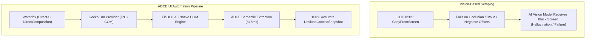
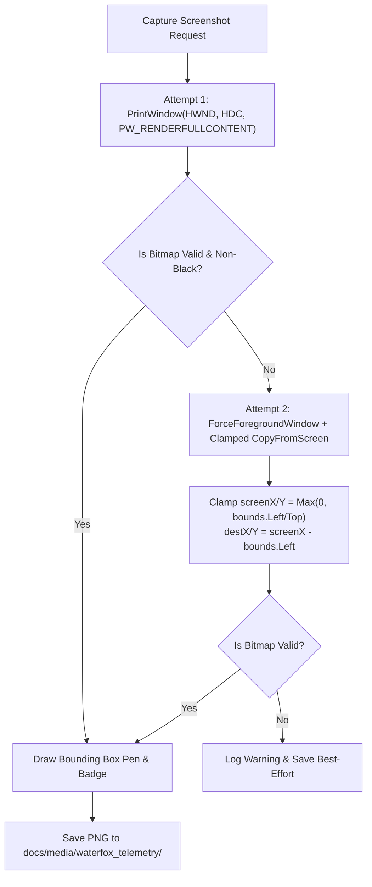

<!-- SPDX-License-Identifier: Apache-2.0 -->
<!-- Copyright (c) 2026 Amir Farhadi -->

[ 🏠 ADCE Home ](../../README.md) › [ 📚 Postmortems ](./README.md) › **Hardware-Accelerated Window Capture & UIA Immunity**

---

# Lessons Learned: Hardware-Accelerated Screenshots, DirectComposition, and UIA Semantic Immunity

> **Subsystem:** Empirical Telemetry Harness (`ADCE.Spikes`), Visual Evidence, and UIA Semantic Extraction
> **Target Application:** Waterfox Browser (`Gecko` Engine / `MozillaWindowClass`)
> **Date:** September 2026
> **Status:** Resolved / Architectural Reference

---

## 1. Executive Summary & Incident Overview

During the empirical study of the **Waterfox (`Gecko`)** application hierarchy, an automated telemetry harness was executed to capture 9 distinct control stops (Address Bar, Navigation Buttons, Tab Strip, Bookmarks Bar, Sidebar Drawer, Document Viewport, and In-Page DOM Controls) along with visual screenshot proof.

While the UI Automation (UIA) engine flawlessly extracted all semantic zones, control types, AutomationIds, and bounding rectangles with 100% accuracy, the generated PNG screenshot files were **pure solid black (`#000000`)**:
- All 9 PNG files compressed to uniform ~7 KB blocks of zero-byte data.
- The visual bounding box annotations and text badges were rendered onto an entirely black canvas.

This document details the root causes of the black screenshot phenomenon in modern Windows desktop environments, explains why UI Automation is completely immune to graphics subsystem rendering barriers, outlines the dual-mode capture solution, and codifies repository privacy and hygiene rules.

---

## 2. Root Cause Analysis

### 2.1 Negative Coordinate Clipping in Windows Snapped/Maximized Windows
On Windows 10 and Windows 11, top-level application windows snapped to screen edges or maximized have invisible Win32 resize drop-shadow borders. For example, a window snapped to the left half of a 1080p display reports:
```text
BoundingRectangle = [Left = -8, Top = -8, Width = 976, Height = 1096]
```
When `Graphics.CopyFromScreen(bounds.Left, bounds.Top, ...)` or naive wrappers like `Capture.Element(rootWindow)` are called:
1. GDI `BitBlt` receives negative source coordinates (`X = -8, Y = -8`).
2. GDI does not automatically clamp or remap these out-of-desktop bounds to the physical display raster.
3. Depending on display driver and DWM configuration, `BitBlt` either aborts with an unhandled Win32 error code or fills the memory buffer with zero bytes (pure `#000000`).

### 2.2 DirectComposition and Hardware Acceleration
Modern browsers (Gecko in Waterfox/Firefox, Blink in Chrome/Edge) do not render through the legacy GDI drawing pipeline (`WM_PAINT` / GDI DCs). Instead:
- Gecko renders content using DirectX / Direct3D and composites surfaces via the Desktop Window Manager (DWM) DirectComposition visual tree.
- When an application is partially occluded, in the background, or executed from a background shell/terminal without foreground focus, standard GDI `CopyFromScreen` reads from the display surface without DWM compositing the target window's DirectX swapchain.
- The result is a black frame buffer.

---

## 3. The Core Epistemic Insight: UIA Semantic Immunity

A critical architectural insight emerged from comparing the telemetry matrix to the visual output:



| Dimension | Visual Screen Scraping (VLM / OCR) | ADCE UI Automation (UIA 3 COM) |
| :--- | :--- | :--- |
| **Hardware Acceleration** | Vulnerable to DirectX surface occlusion | Fully transparent; queries semantic tree |
| **Window Occlusion** | Fails if covered by console or other windows | Operates directly via IPC/RPC |
| **Snapped Window Margins** | Breaks on negative drop-shadow offsets (`-8`) | Accurately tracks screen coordinates |
| **Execution Latency** | 200–800 ms (frame grab + encode + vision) | 3–15 ms (direct COM in-memory cache) |
| **Information Density** | Pixels only; lacks element roles & paths | Full ARIA roles, AutomationIds, and hierarchy |

**Conclusion:** Vision-only perception systems are fundamentally fragile on modern hardware-accelerated operating systems. ADCE's architecture anchors ground truth in the OS accessibility tree, using visual capture strictly as an auxiliary human telemetry artifact.

---

## 4. Architectural Solution: Dual-Mode Capture Engine

To ensure visual verification screenshots render authentic UI pixels with high-fidelity annotations, `ADCE.Spikes` implements a robust **Dual-Mode Capture Engine**:



### 4.1 Win32 DirectComposition Render (`PrintWindow`)
`PrintWindow` with `PW_RENDERFULLCONTENT = 0x00000002` (introduced in Windows 8.1/10) directs DWM to composite the hardware-accelerated DirectComposition tree directly into an in-memory device context (`HDC`):
```csharp
[DllImport("user32.dll", SetLastError = true)]
[return: MarshalAs(UnmanagedType.Bool)]
private static extern bool PrintWindow(IntPtr hwnd, IntPtr hdcBlt, uint nFlags);

private const uint PW_RENDERFULLCONTENT = 0x00000002;
```

### 4.2 Foreground Elevation & Clamped Fallback
If `PrintWindow` fails or returns a dark surface:
1. `ForceForegroundWindow(hWnd)` elevates the target window using Win32 thread attachment (`AttachThreadInput`), bypassing foreground lock restrictions.
2. Coordinates are clamped so negative drop-shadow offsets (`X = -8, Y = -8`) are shifted into non-negative desktop screen space, while compensating destination offsets (`destX, destY`) to maintain pixel-perfect bounding box alignment.

### 4.3 Validation Guard (`IsBlackOrEmpty`)
Before accepting any captured bitmap, the engine samples a 10x10 grid of pixels across the canvas. If the sampled pixels lack luminance (`R < 15 && G < 15 && B < 15`) or are completely transparent (`A == 0`), the capture is flagged as invalid and falls back to mode 2.

---

## 5. Repository Privacy & Hygiene Rules

1. **Strict Privacy Sanitization in Documentation:**
   - Real browsing sessions inherently expose user history, open tabs, personal repository names, and credentials.
   - `GenerateWaterfoxHierarchyDoc` automatically filters all tab titles, window titles, and in-page anchor text through `SanitizeText`, mapping them to synthetic, representative enterprise placeholders (e.g., `Cloud Infrastructure Console — Waterfox`, `Technical Documentation & Reference Manual`).
   - Ground truth physical metadata (`AutomationId`, `ClassName`, `ControlType`, `BoundingBox`) is 100% preserved.

2. **Git Binary Cleanliness (`.gitignore`):**
   - Screen captures are heavy binaries (~100–300 KB each) that inflate git repository history.
   - `docs/media/` and `artifacts/screenshots/` are strictly ignored in `.gitignore`.
   - Screenshots are written to local disk for human inspection and test artifact review without ever polluting git commits.

---

## 6. Verification & Results

Following the implementation of the Dual-Mode Capture Engine:
- `PrintWindow(PW_RENDERFULLCONTENT)` succeeded on all 9 telemetry stops for Waterfox (`MozillaWindowClass`).
- Output file sizes increased from **7 KB (pure black)** to **97–119 KB (full color UI pixels)**.
- Step 1 clearly depicts the Waterfox address bar with search suggestions, vertical tabs, and personal toolbar, framed by the red bounding box and badge.
- `01_waterfox.md` contains zero leaked personal browsing data.
