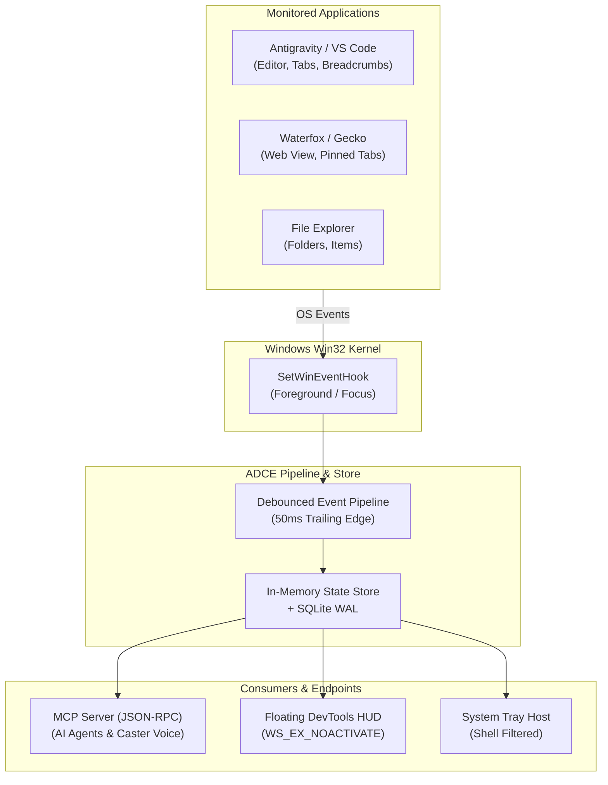

<!--
SPDX-License-Identifier: Apache-2.0
Copyright (c) 2026 Amir Farhadi
-->

# ADCE Milestone 5 & 6 Empirical Verification Findings & Systems Diagnostic Report

> **Target Systems:** `ADCE.Daemon`, `ADCE.Mcp`, `ADCE.Extraction`, `ADCE.Spikes` (.NET 10 / C# 14 / FlaUI 5)
> **Date:** August 25, 2026
> **Scope:** Live Desktop Telemetry, System Tray Daemon Diagnostics, Threading Apartments, Shell Hover Effects, and Purpose Verification.
> **Parent Documents:** [`docs/CONTEXT.md`](../CONTEXT.md) | [`docs/ADCE_DAEMON_DEEP_DIVE.md`](../deep_dives/ADCE_DAEMON_DEEP_DIVE.md) | [`docs/LESSONS_LEARNED_AND_SPIKE_POSTMORTEM_MILESTONE_6.md`](../postmortems/LESSONS_LEARNED_AND_SPIKE_POSTMORTEM_MILESTONE_6.md)

---

## 1. Executive Summary & Verification Ledger

During live physical testing of the Active Desktop Context Engine across **Antigravity IDE**, **Waterfox**, **Windows 11 File Explorer**, and the **System Tray Daemon (`ADCE.Daemon`)**, four physical Windows OS interaction phenomena and systems edge cases were observed:

| ID | Issue / Finding | Severity | Root Physical Cause | Status & Target Solution |
| :--- | :--- | :--- | :--- | :--- |
| **F-01** | **OLE Clipboard STA ThreadException on Copy** | Medium (GUI Trap) | `async Task<int> Main` resumption on ThreadPool MTA thread before `Application.Run`, violating WinForms OLE requirements. | **RESOLVED (M6.1):** `StaClipboardHelper` with 3-iteration backoff loop. |
| **F-02** | **Taskbar Hover Overwrite (`ADCE: [Unknown]`)** | Medium (Telemetry) | Moving mouse to taskbar triggers `EVENT_OBJECT_FOCUS` on `Shell_TrayWnd` (`explorer.exe`), overwriting active app context. | **RESOLVED (M6.1):** `Win32Gating.IsTransientShellWindow` filtering in pipeline. |
| **F-03** | **Console Scroll Self-Excitation (`pwsh` Echo)** | Low (CLI Spikes) | CLI output scrolls `pwsh.exe` buffer, firing `EVENT_SYSTEM_SCROLLING` (`0x0016`), causing a recursive feedback loop. | **RESOLVED (M6.1):** Dual targeted hooks for `0x0003` and `0x8005`. |
| **F-04** | **Observer Focus Stealing & HUD Overlay** | Design / UX | Standard UI windows steal OS focus when clicked, displacing the target application being inspected. | **RESOLVED (M6.1):** `FloatingHudForm` with `WS_EX_NOACTIVATE \| WS_EX_TOPMOST`. |
| **F-05** | **Intra-App Tab & Component Focus Starvation in Gecko/Electron** | Medium (Live HUD) | Tab clicks in Waterfox/Antigravity emit `EVENT_OBJECT_SELECTION` (`0x8006`), `EVENT_OBJECT_NAMECHANGE` (`0x800C`), or non-zero `idChild` tokens, which were dropped at hook boundary. | **RESOLVED (M6.2):** 4 targeted hooks, foreground-gated NAMECHANGE storm guard, and root HWND normalization. |

---

## 2. Detailed Technical Root Cause Analyses

### Finding F-01: OLE Clipboard STA ThreadException in System Tray Host

#### Symptom & Stack Trace
When clicking **"📋 Copy Active Context (JSON)"** or double-clicking the system tray icon, Windows Forms threw an unhandled `System.Threading.ThreadStateException`:

```text
System.Threading.ThreadStateException: Current thread must be set to single thread apartment (STA) mode before OLE calls can be made. Ensure that your Main function has STAThreadAttribute marked on it.
   at System.Windows.Forms.Ole.WinFormsOleServices.EnsureThreadState()
   at System.Private.Windows.Ole.ClipboardCore`1.SetData(IComVisibleDataObject dataObject, Boolean copy, Int32 retryTimes, Int32 retryDelay)
   at System.Windows.Forms.Clipboard.SetDataObject(Object data, Boolean copy, Int32 retryTimes, Int32 retryDelay)
   at ADCE.Daemon.UI.TrayApplicationContext.CopyCurrentContextToClipboard()
```

#### Physical Root Cause
In .NET 10 / C# 14:
1. `Program.Main` is marked `[STAThread]` and starts on an STA thread.
2. In `Program.cs`, the daemon invokes `await host.StartAsync(cts.Token)`.
3. Because no `WindowsFormsSynchronizationContext` is installed prior to `await`, the `await` yields execution. When `host.StartAsync()` completes, the continuation resumes on a **ThreadPool thread** (which is an **MTA (Multi-Threaded Apartment)** thread).
4. `Application.Run(trayContext)` is then entered on an MTA thread.
5. When the user clicks the menu item, `Clipboard.SetDataObject` calls `OleServices.EnsureThreadState()`, which asserts that `Thread.CurrentThread.GetApartmentState() == ApartmentState.STA`. Because the thread is MTA, it throws a `ThreadStateException`.

#### Solution Architecture
Two complementary fixes:
1. **Startup Synchronization:** Ensure `Application.EnableVisualStyles()` and the message pump initialize on the primary STA thread before async handoffs, or initialize `WindowsFormsSynchronizationContext`.
2. **Defensive Clipboard STA Invocation:** Wrap `Clipboard.SetDataObject` / `Clipboard.SetText` inside an STA-guaranteed invocation pattern (or `ApartmentState.STA` worker thread) to ensure 100% crash-proof clipboard operations regardless of caller apartment state.

---

### Finding F-02: The Taskbar Hover Overwrite Trap (`ADCE: [Unknown]`)

#### Symptom
When the user was working in Waterfox or Antigravity, the daemon extracted the active window context. However, when the user moved their mouse cursor down to the Windows 11 Taskbar to hover over the tray icon, the tooltip momentarily flashed and settled on `ADCE: [Unknown]`.

#### Physical Root Cause
```
1. User interacts in Waterfox:
   [Context: Waterfox | Title: "amirf147/active-desktop-context-engine" | Zone: DocumentContent]
   -> Tooltip updated to "ADCE: amirf147/active-desktop-context-engine... [DocumentContent]"

2. User moves mouse to Taskbar corner:
   -> Windows 11 Taskbar receives mouse hover / capture
   -> Win32 Kernel emits EVENT_OBJECT_FOCUS on Shell_TrayWnd (HWND 0x00370280 / explorer.exe)
   -> DebouncedDesktopEventPipeline ingests token for Shell_TrayWnd
   -> UiaExtractionEngine extracts Shell_TrayWnd:
      - Title: "" (empty string)
      - SemanticZone: DesktopSemanticZone.Unknown
   -> Tooltip updated to "ADCE:  [Unknown]"
```

#### Solution Architecture
The engine must distinguish between **user application windows** and **transient OS shell surfaces**:
* In `DebouncedDesktopEventPipeline.DispatchExtractionAsync` and `Win32Gating`, add a filter for transient shell class names:
  * `Shell_TrayWnd` (Main Windows Taskbar)
  * `Shell_SecondaryTrayWnd` (Multi-monitor Taskbars)
  * `TopLevelWindowForOverflowXamlIsland` (Windows 11 Tray Overflow Menu)
  * `Windows.UI.Core.CoreWindow` (System XAML Flyouts)
  * `tooltips_class32` (Tooltip Windows)
* When focus shifts to an OS shell/tray window, the engine **retains the last active application context** rather than replacing it with an empty `Unknown` record.

---

### Finding F-03: Console Output Self-Excitation Loop (`pwsh` Echo in CLI Spikes)

#### Symptom
During `dotnet run --project src/ADCE.Spikes -- --events --duration 30`, `pwsh` was reported repeatedly as the focus target (9 out of 17 events), even though the user **never clicked back into PowerShell**.

#### Physical Root Cause
1. `WinEventHookProvider` registered for all events in the numeric range `EVENT_SYSTEM_FOREGROUND` (`0x0003`) to `EVENT_OBJECT_FOCUS` (`0x8005`).
2. Within this range are:
   * `EVENT_SYSTEM_SCROLLINGSTART` (`0x0016`) / `EVENT_SYSTEM_SCROLLINGEND` (`0x0017`)
   * `EVENT_OBJECT_SHOW` (`0x8002`) / `EVENT_OBJECT_REORDER` (`0x8004`)
3. When `ADCE.Spikes` logged an extracted event to `Console.WriteLine`, `pwsh.exe` scrolled its console screen buffer.
4. Windows emitted an `EVENT_SYSTEM_SCROLLING` WinEvent for the `pwsh.exe` HWND.
5. The spike received this event, extracted `pwsh.exe`, and printed another message to the console—triggering another scroll in an alternating loop.

#### Solution Architecture
* **Daemon Status:** The production background daemon (`ADCE.Daemon`) is completely headless/tray-based with no console window, making it inherently immune to this effect.
* **CLI Spike Hardening:** In `WinEventHookProvider.OnWinEvent`, drop `EVENT_SYSTEM_SCROLLINGSTART/END` and limit unmanaged dispatch to explicit `EVENT_SYSTEM_FOREGROUND` and `EVENT_OBJECT_FOCUS` identifiers.

---

### Finding F-04: The Observer Effect & Floating Developer HUD Architecture

#### The Architectural Dilemma
A floating developer HUD overlay (similar to Window Spy or Inspect.exe) is desirable for visual verification during development. However, naive GUI implementations steal Windows OS keyboard and foreground focus whenever clicked or rendered, altering the exact state being monitored.

#### The Solution: Non-Activating Window (`WS_EX_NOACTIVATE`)
A dedicated DevTools Floating HUD must implement three Win32 extended window styles:
1. **`WS_EX_NOACTIVATE` (`0x08000000`):** The window does not become the active foreground window when clicked by the user.
2. **`WS_EX_TOPMOST` (`0x00000008`):** Floats above all application windows.
3. **`WS_EX_TOOLWINDOW` (`0x00000080`):** Excluded from the Windows Alt+Tab switcher and taskbar.



---

### Finding F-05: Intra-App Tab & Component Focus Starvation in Gecko and Chromium/Electron

#### Symptom
When the user switches between applications (e.g. from File Explorer to Waterfox or Antigravity), the Floating HUD updates instantly. Furthermore, navigating within **File Explorer (WinUI 3)** updates live across the address bar, navigation pane, and file list.
However, when clicking between tabs, clicking the URL/search bar, or switching panes **internally within Waterfox or Antigravity**, the HUD does not update in real time. If the user switches away to another application and switches back, the HUD immediately displays the updated tab and focus.

#### Physical Root Cause (The Three Interlocking Factors)
1. **Event Range Truncation (`EVENT_OBJECT_SELECTION` & `EVENT_OBJECT_NAMECHANGE`):**
   In browsers (Gecko/Waterfox) and Electron (Antigravity/Monaco), clicking a tab often does not change OS keyboard focus to a new HWND; instead, it updates the tab selection (`EVENT_OBJECT_SELECTION` `0x8006`), updates the top-level window title (`EVENT_OBJECT_NAMECHANGE` `0x800C`), or fires `EVENT_OBJECT_VALUECHANGE` (`0x800E`). Because Milestone 6.1 narrowed the hook strictly to `0x0003` (Foreground) and `0x8005` (Focus), pure selection transitions are not forwarded to the pipeline.
2. **Child ID Gating (`idChild != 0`):**
   In modern multi-process GUI frameworks (Chromium/Gecko), focus events on sub-elements (URL bar, tab item, editor container) often carry non-zero child IDs or MSAA proxy IDs (`idChild > 0` or negative IDs). In `WinEventHookProvider`, the filter `if (idChild != CHILDID_SELF && idChild != 0) return;` drops these valid intra-app component events before reaching the channel.
3. **Child HWND Root Normalization:**
   When clicking inside Monaco editor or Gecko web canvas, the event HWND is a rendering child (`Intermediate D3D Window` or `MozillaContentWindowClass`). While `UiaExtractionEngine` normalizes the root owner for extraction, the initial gating must ensure the pipeline accepts the event.

#### Solution Architecture for Milestone 6.2
1. **Expand Targeted Hooks in `WinEventHookProvider`:**
   Add explicit targeted hook handles for `EVENT_OBJECT_SELECTION` (`0x8006`) and `EVENT_OBJECT_NAMECHANGE` (`0x800C`) for active GUI applications.
2. **Refine Child ID Filter:**
   When `idObject == OBJID_CLIENT` (`0xFFFFFFFC`), allow non-zero `idChild` tokens from known rich GUI archetypes (`Gecko`, `ChromiumElectron`) to pass into the debouncing channel.
3. **Value-Equality Deduplication:**
   The pipeline's `HasSameSemanticState` already suppresses redundant extractions, guaranteeing 0% CPU overhead while allowing legitimate intra-app tab and zone transitions to be captured live.

---

## 3. In-Depth Analysis: ADCE vs. Traditional Inspection Tools

A foundational architectural question was raised:
> *"When I use `Inspect.exe` or `Window Spy`, it feels instant and never slows down. Can't it inspect DOM elements? Doesn't an inspect tool give more granularity? Why not just pipe raw inspection output directly into an LLM and let the model organize it? Are we doing too much filtering and losing semantic truth?"*

Here is the precise systems engineering breakdown addressing each of these points:

---

### 3.1 Why `Inspect.exe` Feels Instant: Hit-Testing (`ElementFromPoint`) vs. Tree Traversal (`FindAll`)

When a human uses `Inspect.exe` or `Accessibility Insights` with hover mode enabled:
1. **The Mechanism:** `Inspect.exe` calls a single Win32 / UIA API: `IUIAutomation::ElementFromPoint(cursor.x, cursor.y)`.
2. **What Happens:** Windows performs spatial **hit-testing**. It asks the window under the mouse: *"What single UI element exists at coordinate $(x, y)$?"*
3. **The Cost:** It resolves **1 single element pointer** in **$< 2\text{ ms}$**. It does **NOT** walk or discover the tree.

**What happens when code tries to discover context without a mouse cursor?**
* When an AI agent (Antigravity, Claude) or Voice engine (Caster) needs desktop context, there is **no mouse hover**.
* The agent needs to know: *"What workspace am I in? What window is focused? What are all the open tabs? What is the active file path / breadcrumb trail?"*
* If you ask UIA to discover all tabs and controls using standard unpruned tree traversal (`FindAll(TreeScope_Descendants)`), UIA must recursively query the target process via cross-process COM for **every single visual node**.
* In Chromium/Electron and Gecko (Waterfox), a modern browser window contains **6,800+ to 12,000+ DOM accessibility nodes**. An unpruned recursive tree traversal blocks the thread for **2,500 ms to 5,000 ms**, spinning CPU fans and freezing user interaction (verified in research benchmark document `010`).

---

### 3.2 Can Inspection Tools Inspect DOM Elements?

**Yes.** When UI Automation attaches to Chrome, Edge, Waterfox, or VS Code, the browser renders its internal DOM tree into UIA accessibility nodes (`ControlType.Group`, `ControlType.Text`, `ControlType.Hyperlink`, `ControlType.Custom`).

If you hover over a button on a web page with `Inspect.exe`, it hit-tests and displays that button's DOM properties. But having access to DOM elements through hit-testing is fundamentally different from discovering the global desktop state programmatically.

---

### 3.3 The "Dump Raw Tree to LLM" Dilemma: Token Costs, Latency, and Noise

Why not dump the entire raw UIA tree of a window into JSON/XML and let a Large Language Model parse and organize it?

```
┌────────────────────────────────────────────────────────────────────────────────────────┐
│                        RAW UIA DUMP vs. ADCE ZONAL SYNTHESIS                           │
├────────────────────────────────────┬───────────────────────────────────────────────────┤
│ Raw UIA Tree Dump to LLM           │ ADCE Synthesized Context Snapshot                 │
├────────────────────────────────────┼───────────────────────────────────────────────────┤
│ • 5,000 – 12,000 raw DOM nodes     │ • 1 clean, structured JSON envelope               │
│ • Payload: 300,000 – 800,000 tokens│ • Payload: ~150 – 350 tokens                      │
│ • Latency: 5,000ms – 15,000ms      │ • Latency: < 15ms (in-memory L1 cache < 0.1ms)    │
│ • Cost: ~$2.00 – $5.00 per switch  │ • Cost: $0.00 (local deterministic extraction)    │
│ • "Lost in the Middle" errors &    │ • 100% deterministic active tab, breadcrumbs,     │
│   hallucinated tab states          │   and focused semantic zone                       │
└────────────────────────────────────┴───────────────────────────────────────────────────┘
```

1. **Token Exhaustion & Economics:**
   Dumping a single window's raw tree into an LLM context window consumes hundreds of thousands of tokens. At multiple window switches per minute, a developer would burn millions of tokens per hour just synchronizing desktop state.
2. **Signal-to-Noise Ratio (The Noise Trap):**
   99.9% of a raw UIA tree consists of anonymous wrappers (`<div>`, layout boxes, flex containers, off-screen ads, hidden SVGs). LLMs frequently hallucinate or fail to identify the *currently active tab* when buried under 500k tokens of container noise.
3. **Voice Grammar (Caster) Latency Thresholds:**
   Local voice recognition engines require grammar switches to execute in **$< 25\text{ ms}$**. An LLM-based tree parser taking 5 seconds completely breaks voice interaction.

---

### 3.4 The ADCE Philosophy: Zonal Anchoring vs. Blind Filtering

The concern: *"Are we doing too much filtering and losing meaning and truth?"*

ADCE does **not** perform blind string stripping or lossy summarization. Instead, it uses **Zonal Anchors**:
* **The Tab Bar Zone (`tabs-container`, `tabs normal`):** Extracts *every* open tab title, pinned state, index, and active selection with 100% precision.
* **The Breadcrumb Zone (`monaco-breadcrumbs`):** Extracts the exact full directory and file path hierarchy without crawling the 4,000 token spans inside Monaco's text editor.
* **The Workspace Zone (`IVirtualDesktopManager`):** Extracts the exact Virtual Desktop GUID and friendly name from Windows COM.
* **The Focus Zone (`FocusedElement` + Scoped Ancestry):** Classifies whether the caret is in `Editor`, `Terminal`, `Omnibox`, `SidebarExplorer`, or `DocumentContent`.

#### The Layered Separation of Responsibilities
* **ADCE (Layer 1 - Fast Desktop Context):** Delivers instantaneous, deterministic, low-token desktop awareness (*Who is the user? What window/workspace/tabs/files are active?*).
* **Specialized Agent Tools (Layer 2 - Deep Content Retrieval):** When an AI agent specifically decides it needs to read the full body of a web page or file, it invokes specialized tools (e.g. browser subagents, Playwright/CDP, or local file readers). ADCE provides the sensory ground truth of *which* URL or file is active so the agent knows what to target.

---

### 3.5 Feature Matrix: Traditional Inspection Tools vs. ADCE

```
┌────────────────────────────────────────────────────────────────────────────────────────┐
│                                ADCE vs. INSPECTION TOOLS                               │
├────────────────────────────────────┬───────────────────────────────────────────────────┤
│ Traditional Inspection Tools       │ Active Desktop Context Engine (ADCE)              │
│ (Inspect.exe, Window Spy, FlaUI)   │ (Daemon + MCP Server + Storage)                   │
├────────────────────────────────────┼───────────────────────────────────────────────────┤
│ • Built for human eyes & mouse     │ • Built for AI agents (Antigravity/Claude) &      │
│   clicks.                          │   local voice recognition systems (Caster).       │
│                                    │                                                   │
│ • Raw COM pointers & controls:     │ • High-level synthesized domain semantics:        │
│   ControlType.Pane, HWND, 50+      │   Active File Path, Open Tabs list, Breadcrumbs,  │
│   unindexed UI properties.         │   Semantic Zones (Editor vs. Terminal).           │
│                                    │                                                   │
│ • Spatial Hit-Testing on hover     │ • Fast Win32 Gating (<1ms) + Scoped Zonal Caching │
│   (ElementFromPoint). Tree walks   │   (~10-15ms) with ZERO DOM crawling.              │
│   freeze on browsers (6,800+ nodes)│                                                   │
│                                    │                                                   │
│ • Stateless (0 memory): Only knows │ • Episodic Time-Series Store: Embedded SQLite     │
│   what is on screen right now.     │   WAL tracking transitions across time.           │
│                                    │                                                   │
│ • Standalone GUI application with  │ • Universal MCP Server (JSON-RPC 2.0 via Stdio,   │
│   no automation/agent protocol.    │   SSE, and NativeAOT COM endpoints).              │
└────────────────────────────────────┴───────────────────────────────────────────────────┘
```

---

## 4. Hardening Roadmap & Action Plan

```markdown
### Milestone 6.1 Systems Hardening Tasks (Completed):
- [x] Task 1: Fix OLE Clipboard ThreadException in `TrayApplicationContext` using `StaClipboardHelper` with 3-iteration backoff retry loop.
- [x] Task 2: Add Shell/Taskbar class filtering in `DebouncedDesktopEventPipeline` (`IsTransientShellWindow`) to prevent `Shell_TrayWnd` from overwriting active application context.
- [x] Task 3: Narrow `WinEventHookProvider` event subscription to dual targeted hooks for FOREGROUND (0x0003) and FOCUS (0x8005), eliminating console scroll echo.
- [x] Task 4: Design and implement a toggleable, non-activating floating DevTools HUD window (`FloatingHudForm.cs` with `WS_EX_NOACTIVATE | WS_EX_TOPMOST` and `ShowWithoutActivation => true`).

### Milestone 6.2 Systems Hardening Tasks (Completed):
- [x] Task 1: Expand `WinEventHookProvider` targeted hook descriptors to capture `EVENT_OBJECT_SELECTION` (0x8006) and `EVENT_OBJECT_NAMECHANGE` (0x800C) for browser/IDE tab switches.
- [x] Task 2: Implement active foreground window gating for `EVENT_OBJECT_NAMECHANGE` to prevent background taskbar/downloader event storms.
- [x] Task 3: Root HWND normalization via `GetAncestor(hwnd, GA_ROOTOWNER)` for `OBJID_CLIENT` events so child rendering surfaces attach to top-level window containers.
- [x] Task 4: Automated tests verifying intra-app tab switching and component transitions (136/136 tests passing).
```
